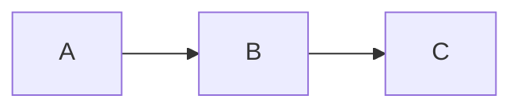

# Eclipse Muto 2.0 — Documentation

The official documentation for [Eclipse Muto](https://projects.eclipse.org/projects/automotive.muto), built with [Docusaurus 3](https://docusaurus.io/).

## Documentation Structure

| Section | Description |
|---------|-------------|
| **Introduction** | What Muto is, the problem it solves, component overview |
| **Concepts** | Orchestration, ROS 2 primer, bundles, A/B slots, vehicle modes, health monitoring, security |
| **Getting Started** | Installation and first deployment walkthrough |
| **Architecture** | Deep dives into daemon, agent, core, CLI, composer, dashboard, gRPC |
| **Guides** | Authoring bundles, deploying, managing modes, health, rollback, CLI reference |
| **Developer Guide** | Project structure, building from source, proto definitions, writing probes |
| **Reference** | Manifest schema, gRPC API, configuration |

## Prerequisites

- Node.js >= 18.0
- npm >= 9

## Local Development

```bash
npm install
npm start
```

This starts a local dev server at `http://localhost:3000/docs/` with hot reload.

## Build

```bash
npm run build
```

Generates static content into the `build/` directory.

## Serve Production Build

```bash
npm run serve
```

Serves the built site locally for testing before deployment.

## Docker

```bash
npm run docker:build
npm run docker:run
```

Serves the documentation on port 8080 via nginx.

## Editing Documentation

All documentation lives in `docs/` as Markdown files. The sidebar is auto-generated from the directory structure:

```
docs/
├── intro.md                    # Introduction
├── concepts/                   # Core concepts (7 pages)
├── getting-started/            # Installation & first deployment
├── architecture/               # Component deep dives (8 pages)
├── guides/                     # How-to guides (6 pages)
├── developer-guide/            # Developer documentation (5 pages)
└── reference/                  # Schema, API, config reference (3 pages)
```

Ordering is controlled by `sidebar_position` in each file's frontmatter and `_category_.json` files in each directory.

### Mermaid Diagrams

Mermaid is enabled globally. Use fenced code blocks:

````markdown

````

### Adding a New Page

1. Create a `.md` file in the appropriate directory
2. Add frontmatter with `sidebar_position` and `sidebar_label`
3. The sidebar updates automatically

```markdown
---
sidebar_position: 3
sidebar_label: My New Page
---

# My New Page

Content here.
```

## License

Eclipse Public License 2.0 (EPL-2.0)
