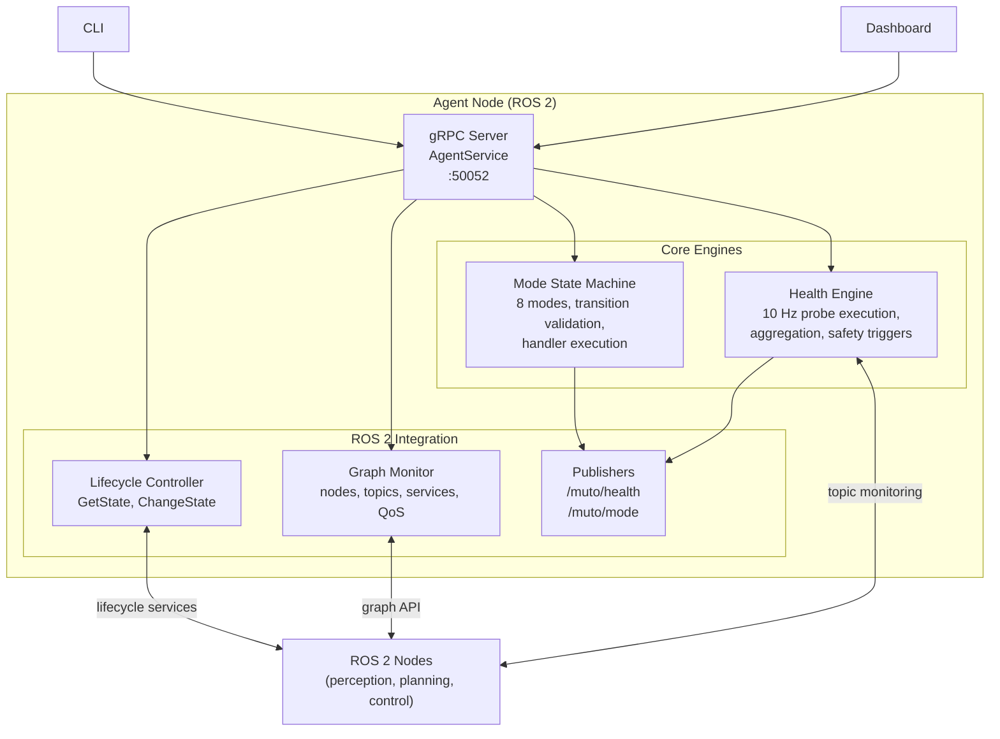
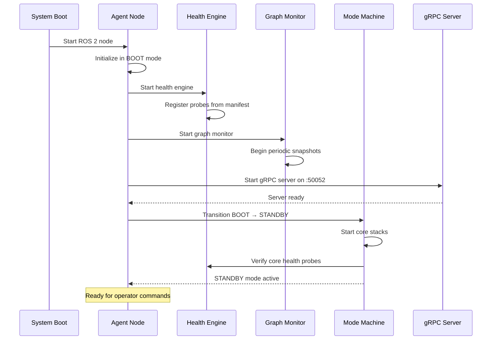
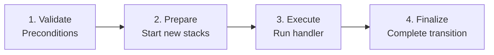
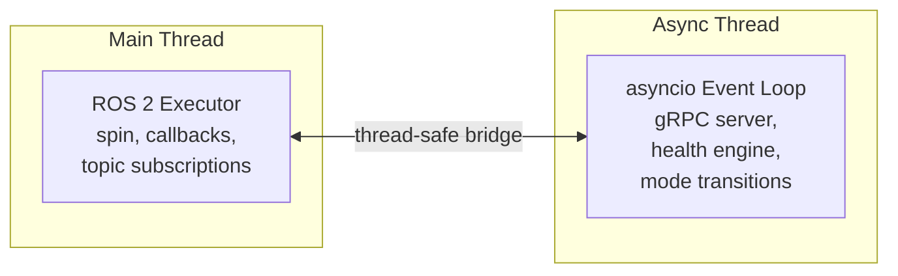

# Agent

The **agent** (`muto_agent`) is the ROS 2-aware runtime component of Eclipse Muto. While the daemon handles deployment and system-level concerns, the agent manages the **live runtime**: vehicle modes, health monitoring, component lifecycles, and ROS 2 graph topology. It is a ROS 2 node itself, deeply integrated with the ROS ecosystem.

## Responsibilities

| Responsibility | What It Does |
|---------------|-------------|
| **Mode Management** | Runs the vehicle mode state machine (BOOT → STANDBY → AUTONOMOUS, etc.) |
| **Health Engine** | Executes health probes at 10 Hz, aggregates results, triggers safety actions |
| **Lifecycle Control** | Manages ROS 2 lifecycle nodes (configure, activate, deactivate) |
| **Graph Monitoring** | Captures snapshots of the ROS 2 computation graph (nodes, topics, services, QoS) |
| **Stack Control** | Starts, stops, and restarts component stacks |
| **gRPC Server** | Exposes AgentService for CLI and dashboard interaction |
| **ROS 2 Publishing** | Publishes health and mode state on ROS 2 topics |

## Architecture



## Startup Sequence

When the agent starts, it follows a careful initialization sequence:



The agent only transitions out of BOOT once all core systems are verified.

## Mode State Machine

The mode state machine is the agent's central coordinator. It:

1. **Validates transitions** against the allowed transition map
2. **Executes multi-step transitions** with rollback on failure
3. **Manages handlers** for each (from_mode, to_mode) pair
4. **Maintains history** of all transitions
5. **Supports forced transitions** for safety-critical situations (e.g., SAFE_STOP)

### Transition Execution

Each mode transition goes through four steps:



If any step fails, the transition is rolled back to the previous mode. The exception is `force_safe_stop()`, which bypasses validation and forces an immediate transition to SAFE_STOP — because safety overrides everything.

### Custom Handlers

Developers can register custom handlers for specific transitions:

```python
async def handle_standby_to_autonomous(agent):
    """Custom logic when entering autonomous mode."""
    await agent.start_stack("perception")
    await agent.start_stack("planning")
    await agent.start_stack("control")
    await agent.verify_health(["localization_health", "perception_health"])

state_machine.register_handler(
    from_mode=VehicleMode.STANDBY,
    to_mode=VehicleMode.AUTONOMOUS,
    handler=handle_standby_to_autonomous,
)
```

## Health Engine

The health engine runs as a background async task:

1. **Probe Loop** — Every 100 ms (10 Hz), execute all registered health probes
2. **Result Collection** — Each probe returns a `ProbeResult` with state, message, timestamp, and optional numeric value
3. **Aggregation** — Results are aggregated per-stack and overall using the worst-case rule (any FAILED → system FAILED)
4. **Change Detection** — When the aggregate state changes (e.g., HEALTHY → DEGRADED), listeners are notified
5. **Critical Failure** — If a probe listed in `required_health` fails, the critical failure callback fires, triggering SAFE_STOP

The engine supports dynamic probe registration — probes are added when stacks start and removed when stacks stop.

## Lifecycle Controller

The lifecycle controller manages ROS 2 **managed lifecycle nodes**. These are nodes that support the standard ROS 2 lifecycle state machine (Unconfigured → Inactive → Active → Finalized).

The controller provides two operations:

| Operation | ROS 2 Service Called | Purpose |
|-----------|---------------------|---------|
| `GetState` | `/<node>/get_state` | Query a node's current lifecycle state |
| `ChangeState` | `/<node>/change_state` | Request a lifecycle transition (configure, activate, etc.) |

This enables coordinated startup: the agent can configure all nodes, verify they are ready, and then activate them in the correct order.

## Graph Monitor

The graph monitor periodically captures a snapshot of the entire ROS 2 computation graph:

```json
{
  "timestamp_unix_ms": 1708444800000,
  "nodes": [
    {
      "name": "camera_driver",
      "namespace": "/perception",
      "lifecycle_state": "ACTIVE",
      "published_topics": ["/camera/image_raw"],
      "subscribed_topics": [],
      "services": ["/camera_driver/get_state"]
    }
  ],
  "topics": [
    {
      "name": "/camera/image_raw",
      "type": "sensor_msgs/msg/Image",
      "publishers": ["/perception/camera_driver"],
      "subscribers": ["/perception/detector"],
      "qos": { "reliability": "best_effort", "durability": "volatile", "depth": 1 }
    }
  ],
  "services": [
    {
      "name": "/camera_driver/get_state",
      "type": "lifecycle_msgs/srv/GetState",
      "server_node": "/perception/camera_driver"
    }
  ]
}
```

This gives operators and the dashboard a real-time view of the ROS 2 system topology, including:
- What nodes are running and in what namespace
- What topics exist and who publishes/subscribes to them
- QoS profiles for each topic
- Available services and their providers

## gRPC Service: AgentService

The agent exposes 11 RPC methods:

### Mode Control

| RPC | Description |
|-----|-------------|
| `GetMode` | Returns current mode, previous mode, mode duration, and transition status |
| `RequestMode` | Requests a mode transition with a reason, returns a transition ID |
| `GetModeTransitionStatus` | Returns detailed status of a transition (steps, progress, errors) |

### Stack Control

| RPC | Description |
|-----|-------------|
| `ListStacks` | Returns all stacks with their state, components, health, and start time |
| `StartStack` | Starts a named stack |
| `StopStack` | Stops a named stack |
| `RestartStack` | Restarts a named stack |

### Lifecycle Control

| RPC | Description |
|-----|-------------|
| `GetLifecycleState` | Returns a node's lifecycle state and available transitions |
| `SetLifecycleState` | Requests a lifecycle state change for a node |

### Health

| RPC | Description |
|-----|-------------|
| `GetHealthSummary` | Returns overall health, per-stack health, critical probes, and degraded probes |
| `StreamHealth` | Server-streaming — sends health events as they occur, with optional critical-only filter |
| `RunProbe` | Manually triggers a specific health probe and returns the result |

### Graph

| RPC | Description |
|-----|-------------|
| `GetGraphSnapshot` | Returns the current ROS 2 graph (nodes, topics, services, QoS) |

## ROS 2 Topics Published

The agent publishes on two ROS 2 topics:

| Topic | Type | Frequency | Content |
|-------|------|-----------|---------|
| `/muto/health` | `HealthSummary` | On change | Aggregate health state and probe results |
| `/muto/mode` | `ModeState` | On change | Current mode, previous mode, transition status |

These topics allow other ROS 2 nodes to react to Muto state changes without going through gRPC.

## Threading Model

The agent runs a hybrid threading model:



- The **main thread** runs the ROS 2 executor, handling ROS callbacks and publications
- A **separate thread** runs an asyncio event loop for the gRPC server, health engine, and mode state machine
- Communication between threads uses thread-safe primitives

This design ensures the ROS 2 executor is never blocked by gRPC operations and vice versa.
