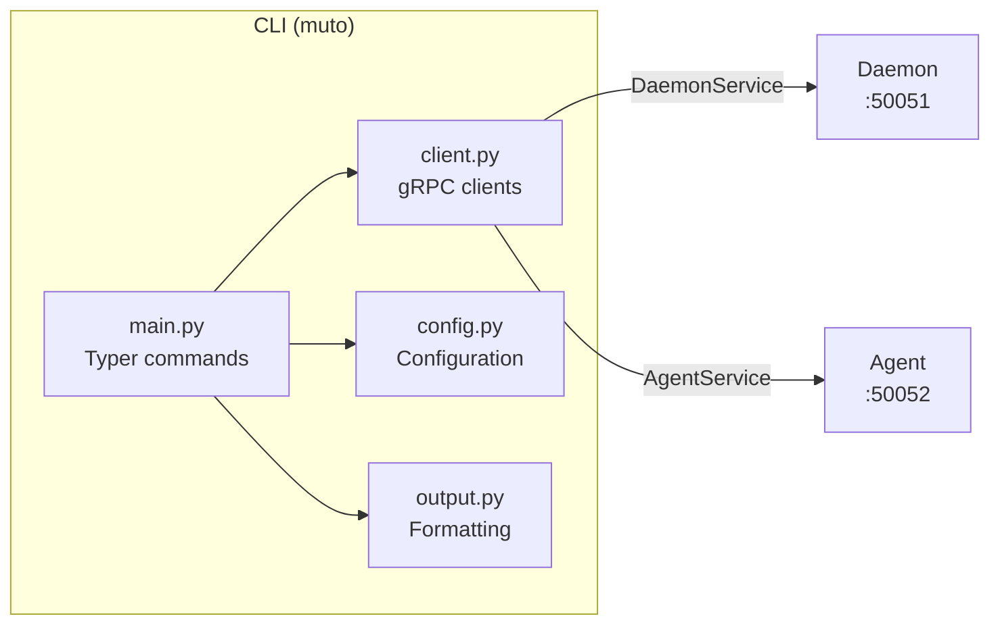

# CLI (muto)

The **CLI** (`muto`) is the command-line interface for interacting with the Muto daemon and agent. Built with [Typer](https://typer.tiangolo.com/), it provides a developer-friendly way to query status, deploy bundles, manage modes, stream logs, and more — all from your terminal.

## Architecture



The CLI is a thin layer that:
1. Parses command-line arguments with Typer
2. Loads configuration (daemon/agent addresses, timeouts)
3. Creates gRPC client connections
4. Calls the appropriate RPC method
5. Formats and displays the response

## Command Reference

### Daemon Commands

| Command | Description | Example |
|---------|-------------|---------|
| `muto info` | Show daemon system information | `muto info` |
| `muto status` | Show deployment status (both A/B slots) | `muto status` |
| `muto deploy <path>` | Deploy a bundle to the daemon | `muto deploy bundle.tar.gz` |
| `muto rollback --reason <text>` | Rollback to the previous slot | `muto rollback --reason "regression"` |
| `muto bundles` | List installed bundles across both slots | `muto bundles` |
| `muto logs [--source] [--tail N] [--follow]` | Stream daemon logs | `muto logs --follow` |

### Agent Commands

| Command | Description | Example |
|---------|-------------|---------|
| `muto health` | Show agent health summary | `muto health` |
| `muto graph` | Show ROS 2 graph snapshot | `muto graph` |
| `muto mode get` | Get current vehicle mode | `muto mode get` |
| `muto mode set <MODE> --reason <text>` | Request mode transition | `muto mode set AUTONOMOUS --reason "start mission"` |
| `muto stacks list` | List all stacks and their state | `muto stacks list` |
| `muto stacks start <name>` | Start a named stack | `muto stacks start perception` |
| `muto stacks stop <name>` | Stop a named stack | `muto stacks stop perception` |
| `muto stacks restart <name>` | Restart a named stack | `muto stacks restart perception` |

## Configuration

The CLI reads its configuration from a YAML file:

**Default location:** `~/.config/muto/cli.yaml`

```yaml
daemon_address: "localhost:50051"
agent_address: "localhost:50052"
daemon_socket: "/var/run/muto/daemon.sock"
use_unix_socket: false
timeout_seconds: 30.0
output_format: "rich"
```

| Setting | Default | Description |
|---------|---------|-------------|
| `daemon_address` | `localhost:50051` | TCP address for daemon gRPC |
| `agent_address` | `localhost:50052` | TCP address for agent gRPC |
| `daemon_socket` | `/var/run/muto/daemon.sock` | Unix socket path for daemon |
| `use_unix_socket` | `false` | Whether to connect via Unix socket instead of TCP |
| `timeout_seconds` | `30.0` | gRPC call timeout |
| `output_format` | `rich` | Output format (`rich` for colored terminal, `json` for machine-readable) |

## gRPC Clients

The CLI uses two gRPC client classes with automatic connection management:

```python
# Context manager ensures clean connection lifecycle
with daemon_client(config) as client:
    info = client.get_info()
    print(f"Daemon version: {info.daemon_version}")
    print(f"Active slot: {info.active_slot}")

with agent_client(config) as client:
    health = client.get_health_summary()
    print(f"Overall health: {health.overall}")
```

Both clients:
- Connect lazily (on first use) via the `stub` property
- Handle gRPC errors and wrap them in typed exceptions (`ConnectionError`, `RPCError`)
- Support configurable timeouts
- Clean up channels on close

## Error Handling

The CLI wraps gRPC errors into a hierarchy:

```
MutoClientError
├── ConnectionError    # Failed to connect to daemon/agent
└── RPCError           # RPC call failed
    └── .code          # Optional ResultCode from the response
```

When a command fails, the CLI displays a user-friendly error message rather than a raw gRPC traceback.
