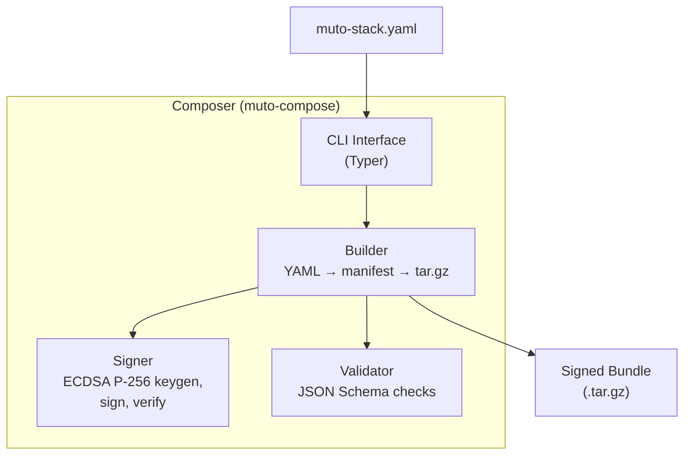
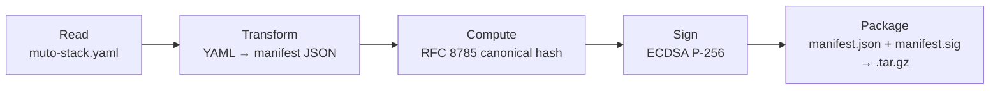

# Composer (muto-compose)

The **Composer** (`muto-compose`) is the bundle authoring toolkit. It transforms human-readable stack YAML definitions into signed, verified, deployable bundles. Think of it as the "build system" for Muto deployments.

## Architecture



## Commands

### `keygen` — Generate Signing Keys

Creates an ECDSA P-256 key pair for bundle signing:

```bash
muto-compose keygen --output ./keys
```

Options:
- `--output <dir>` — Directory to write keys (created if it doesn't exist)
- `--name <name>` — Key file prefix (default: `muto`)
- `--password` — Prompt for a password to encrypt the private key

Output:
- `<name>.key` — Private key in PEM format
- `<name>.pub` — Public key in PEM format

The command also prints the public key **fingerprint** (SHA-256 of the public key bytes), which can be used to identify keys without sharing the full key.

### `build` — Build a Bundle

Transforms a stack YAML directory into a signed bundle:

```bash
muto-compose build ./examples \
    --key ./keys/muto.key \
    --output ./bundles
```

The build process:



Options:
- `--key <path>` — Private key file for signing (optional — bundles can be unsigned)
- `--password` — Prompt for key password if encrypted
- `--output <dir>` — Output directory for the bundle file

Output: `<name>-<version>.tar.gz`

### `sign` — Sign a Manifest

Sign an existing manifest file:

```bash
muto-compose sign manifest.json --key ./keys/muto.key
```

Output: `manifest.sig` (base64-encoded ECDSA signature)

### `verify` — Verify a Bundle or Manifest

Verify a bundle's signature against a public key:

```bash
muto-compose verify bundle.tar.gz --key ./keys/muto.pub
```

This:
1. Extracts the manifest and signature from the bundle
2. Recomputes the canonical hash of the manifest
3. Verifies the signature against the public key
4. Reports success or failure

### `validate` — Validate Against Schema

Validate a manifest or stack YAML against the JSON schema:

```bash
muto-compose validate bundle.tar.gz
muto-compose validate manifest.json
muto-compose validate muto-stack.yaml
```

Reports schema errors with field paths and descriptions.

### `inspect` — Inspect Bundle Contents

Display a human-readable summary of a bundle:

```bash
muto-compose inspect bundle.tar.gz
```

Output includes:
- Bundle name, version, and ID
- Target platforms (ROS distros, architectures, OS)
- Signature status
- Stacks and their components
- Health probes and restart policies

## The Build Pipeline in Detail

### YAML Transformation

The builder reads `muto-stack.yaml` and transforms it to the manifest JSON format:

```yaml
# Input: muto-stack.yaml
name: example-autonomy-stack
version: 1.0.0
target:
  ros_distro: [humble, iron]
  arch: [amd64, arm64]
  os: [ubuntu22.04]
runtime:
  rmw: rmw_cyclonedds_cpp
  ros_domain_id: 42
modes:
  STANDBY:
    enabled_stacks: [core]
    on_fail: SAFE_STOP
stacks:
  core:
    entrypoint: ros2 launch muto_core core.launch.py
    components:
      - name: state_manager
        type: process
        lifecycle: true
```

The transformation:
1. Copies all fields into the manifest JSON structure
2. Adds `schema_version: "1.0"` if not present
3. Adds `build` metadata (timestamp, builder info)
4. Sets `security.signature_alg` to `"ecdsa-p256-sha256"` if signing

### Canonical Hashing

The manifest hash is computed using RFC 8785 JSON Canonicalization:

1. **Exclude** `bundle_id` and `security` fields from the manifest
2. **Canonicalize** the remaining JSON (deterministic key ordering, minimal whitespace, standard encoding)
3. **Hash** the canonical bytes with SHA-256
4. **Format** as `sha256:<64 hex chars>`

This hash becomes both the `bundle_id` and `security.manifest_hash`.

### Signing

If a private key is provided:

1. Load the ECDSA P-256 private key from PEM file
2. Compute the canonical hash bytes (not the hex string — the raw SHA-256 bytes)
3. Sign with ECDSA using SHA-256
4. Encode the signature as base64
5. Write to `manifest.sig`

### Packaging

The final step packages everything into a gzip-compressed tar archive:

```
example-autonomy-stack-1.0.0.tar.gz
├── manifest.json    # The complete manifest with bundle_id, security, etc.
└── manifest.sig     # Base64-encoded ECDSA signature (if signed)
```

## Signer Module

The signer module (`signer.py`) provides the cryptographic primitives:

| Function | Purpose |
|----------|---------|
| `generate_keypair()` | Generate ECDSA P-256 key pair |
| `load_private_key(path, password)` | Load a private key from PEM file |
| `load_public_key(path)` | Load a public key from PEM file |
| `sign_manifest(manifest_bytes, private_key)` | Sign manifest hash with ECDSA |
| `verify_manifest_signature(manifest_bytes, signature, public_key)` | Verify signature |
| `get_public_key_fingerprint(public_key)` | SHA-256 fingerprint of public key |

All cryptography uses Python's [`cryptography`](https://cryptography.io/) library, which wraps OpenSSL.

## Validator Module

The validator checks manifests and stack YAMLs against the JSON schema:

```python
class ValidationResult:
    valid: bool
    errors: list[str]     # Schema violations
    warnings: list[str]   # Non-fatal issues
```

The schema is defined in `schemas/manifest.schema.json` using JSON Schema Draft 2020-12. See the [Manifest Schema Reference](../reference/manifest-schema) for the complete schema.
