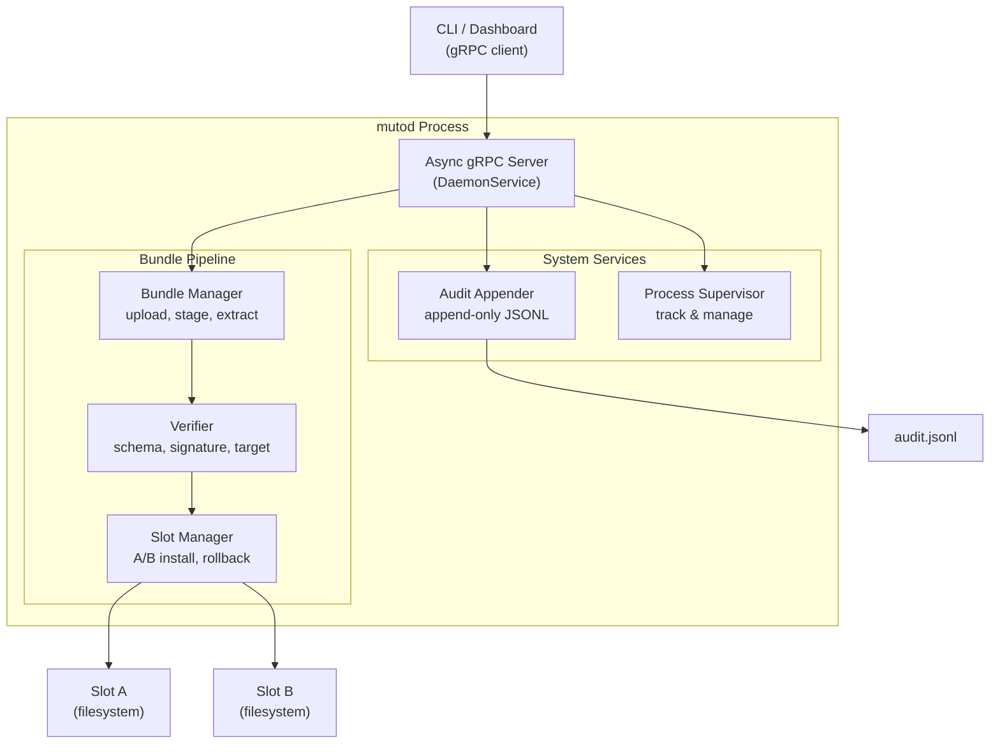
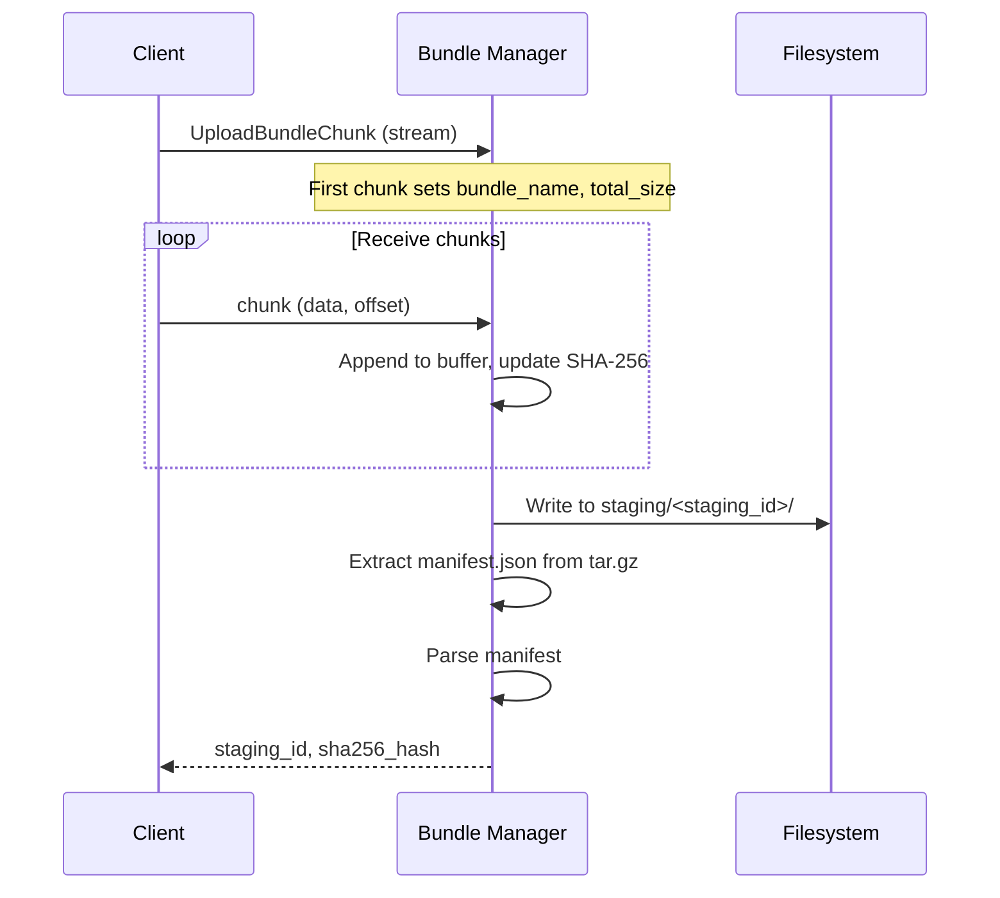
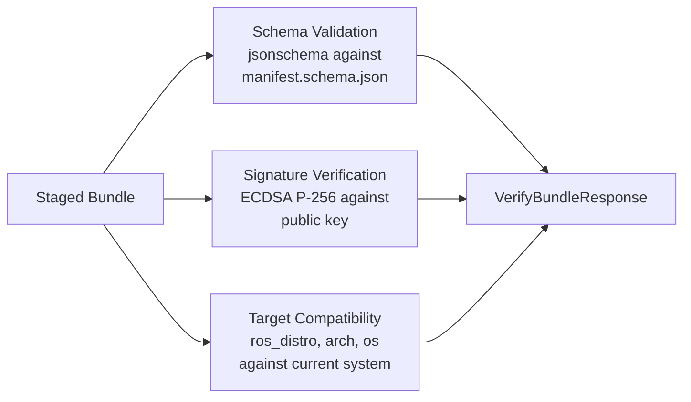

# Daemon (mutod)

The **daemon** (`mutod`) is the privileged system service at the heart of Muto's deployment infrastructure. It runs on every vehicle, manages bundle lifecycles, maintains A/B deployment slots, supervises processes, and keeps a tamper-proof audit log. It has **no dependency on ROS 2**, making it lightweight and always available — even when the ROS stack is down.

## Responsibilities

| Responsibility | What It Does |
|---------------|-------------|
| **Bundle Management** | Receives uploaded bundles, stages them, extracts manifests |
| **Verification** | Validates manifest schema, verifies ECDSA signatures, checks target compatibility |
| **Slot Management** | Installs bundles into A/B slots, manages symlinks, handles rollback |
| **Process Supervision** | Tracks running processes, reports status (stub implementation, extensible) |
| **Audit Logging** | Records every mutating action in an append-only, hash-chained log |
| **System Info** | Reports daemon version, OS info, uptime, TPM presence |
| **Resource Monitoring** | Reports CPU, memory, and disk usage |
| **Log Streaming** | Streams log events to connected clients |
| **Artifact Management** | Manages snapshots, logs, and other artifacts |

## Architecture



## gRPC Service: DaemonService

The daemon exposes 16 RPC methods organized into five groups:

### System Info

| RPC | Description |
|-----|-------------|
| `GetInfo` | Returns daemon version, OS version, active slot, device ID, TPM status, uptime |

### Bundle Lifecycle

| RPC | Description |
|-----|-------------|
| `UploadBundle` | Client-streaming — receives bundle data in 64 KB chunks, returns staging ID and SHA-256 hash |
| `VerifyBundle` | Validates schema against JSON schema, checks ECDSA signature, verifies target compatibility |
| `InstallBundle` | Installs staged bundle into the inactive A/B slot, atomically switches symlink |
| `GetDeploymentStatus` | Returns both slots' status (active/inactive/empty), bundle ID, version, install timestamp |
| `Rollback` | Switches active slot back to the previously active slot, records reason in audit log |
| `ListBundles` | Returns all installed bundles across both slots |

### Process Management

| RPC | Description |
|-----|-------------|
| `GetProcessList` | Returns running processes with PID, state, uptime, restart count, CPU%, memory |
| `RestartProcess` | Restarts a named process |
| `StopProcess` | Stops a named process |
| `GetResourceUsage` | Returns system CPU%, memory used/total, disk used/total |

### Logging & Artifacts

| RPC | Description |
|-----|-------------|
| `StreamLogs` | Server-streaming — sends log events with optional source filter and follow mode |
| `CaptureSnapshot` | Creates a diagnostic snapshot with a reason |
| `ListArtifacts` | Lists artifacts by type (snapshot, bag, log) with size and creation time |

### Audit

| RPC | Description |
|-----|-------------|
| `StreamAuditEvents` | Server-streaming — sends audit events with optional since-timestamp and follow mode |
| `GetAuditEvent` | Returns a specific audit event by ID |

## Bundle Manager

The bundle manager handles the upload and staging pipeline:



Key implementation details:
- **Streaming upload** — Large bundles are sent in 64 KB chunks, avoiding memory pressure
- **SHA-256 on-the-fly** — The hash is computed incrementally as chunks arrive
- **Staging isolation** — Each upload gets a unique staging directory, preventing conflicts
- **Automatic cleanup** — Staging directories are cleaned up after installation or timeout

## Slot Manager

The slot manager implements the A/B deployment strategy:

```
/var/lib/mutod/
├── slots/
│   ├── A/
│   │   ├── manifest.json
│   │   ├── manifest.sig
│   │   └── slot_meta.json
│   └── B/
│       ├── manifest.json
│       ├── manifest.sig
│       └── slot_meta.json
├── current → slots/B      # Symlink to active slot
└── staging/
    └── <staging_id>/      # Temporary upload area
```

The install process:
1. Determine the inactive slot
2. Extract the bundle contents to the slot directory
3. Write `slot_meta.json` with bundle ID, version, timestamp, and state
4. Atomically rename the `current` symlink to point to the new slot
5. Record the installation in the audit log

The `os.rename()` call for the symlink is atomic on Linux — the switch from one slot to another is instantaneous and cannot leave the system in an inconsistent state.

## Verification Pipeline

When `VerifyBundle` is called, three independent checks run:



Each check is independent and reported separately in the response:
- `schema_valid` — Does the manifest conform to the JSON schema?
- `signature_valid` — Is the ECDSA signature valid against the configured public key?
- `target_compatible` — Is this bundle compatible with the current vehicle's platform?

:::note
Verification is **advisory** — the daemon reports results but does not block installation. This is a deliberate design choice: in emergency situations, operators may need to deploy a bundle even if verification fails (e.g., deploying a fix to a signature verification bug).
:::

## Audit Log

Every mutating action is recorded in an append-only JSONL (JSON Lines) file:

```json
{"audit_id": "evt-001", "action": "upload_bundle", "target": {"bundle": "stack-1.0.0.tar.gz"}, "result_code": "RESULT_OK", "prev_hash": "0000..."}
{"audit_id": "evt-002", "action": "install_bundle", "target": {"slot": "B"}, "result_code": "RESULT_OK", "prev_hash": "a1b2..."}
{"audit_id": "evt-003", "action": "rollback", "target": {"reason": "regression"}, "result_code": "RESULT_OK", "prev_hash": "c3d4..."}
```

Each entry includes a `prev_hash` — the SHA-256 hash of the previous entry. This creates a **hash chain** (like a simplified blockchain): if any entry is tampered with, the chain breaks and the modification is detectable.

## Configuration

The daemon is configured through command-line flags and an optional YAML config file:

| Option | Default | Description |
|--------|---------|-------------|
| `--data-dir` | `/var/lib/mutod` | Root directory for slots, staging, and audit |
| `--listen` | `localhost:50051` | TCP address for gRPC server |
| `--socket` | `/var/run/mutod.sock` | Unix domain socket path |
| `--schema-path` | `schemas/manifest.schema.json` | Path to manifest JSON schema |
| `--log-level` | `INFO` | Logging level (DEBUG, INFO, WARNING, ERROR) |
| `--no-json-logs` | `false` | Disable structured JSON logging (use human-readable format) |

## Running as a System Service

In production, the daemon runs as a systemd service:

```ini
[Unit]
Description=Eclipse Muto Daemon
After=network.target

[Service]
Type=simple
User=root
ExecStart=/usr/bin/python3 -m mutod \
    --data-dir /var/lib/mutod \
    --listen localhost:50051 \
    --socket /var/run/mutod.sock \
    --schema-path /etc/mutod/manifest.schema.json
Restart=on-failure
RestartSec=5

[Install]
WantedBy=multi-user.target
```

The daemon starts at boot and is always available, regardless of whether the ROS 2 stack is running.
