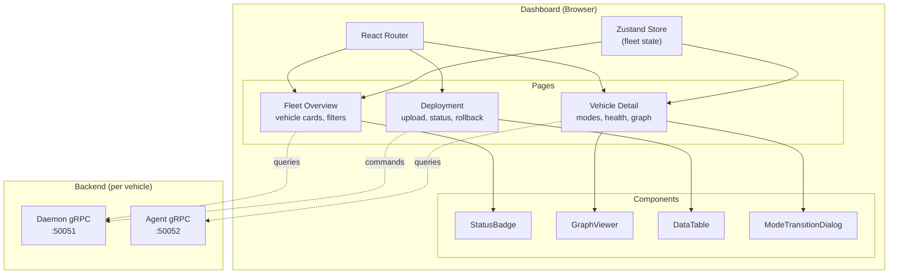

# Dashboard

The **Dashboard** is a React-based web application for monitoring and managing a fleet of Muto-equipped vehicles. It provides real-time visibility into vehicle health, deployment status, mode transitions, and ROS 2 graph topology — all through an intuitive browser interface.

## Tech Stack

| Technology | Role |
|-----------|------|
| **React 19** | UI framework |
| **TypeScript** | Type-safe development |
| **Vite** | Build tool and dev server |
| **Tailwind CSS** | Utility-first styling |
| **shadcn/ui** (Radix UI) | Accessible component primitives |
| **Zustand** | Lightweight state management |
| **React Router 7** | Client-side routing |
| **Lucide React** | Icon library |

## Architecture



## Pages

### Fleet Overview

The main landing page showing all vehicles in the fleet:

- **Stats bar** — Total vehicles, healthy/degraded/failed counts
- **Search and filter** — Filter by health state, vehicle mode, or name
- **Vehicle cards** — Grid of cards showing each vehicle's status at a glance

Each card displays:
- Vehicle name and ID
- Current mode (color-coded badge)
- Health state (green/yellow/red indicator)
- Active bundle version
- Uptime

### Vehicle Detail

Detailed view of a single vehicle with multiple sections:

- **Mode Controls** — Current mode display with transition buttons and confirmation dialogs
- **Health Dashboard** — Overall health, per-stack health breakdown, individual probe results with history
- **Stack Status** — List of stacks with component details (PID, lifecycle state, restart count)
- **ROS 2 Graph** — Interactive visualization of the computation graph showing nodes, topics, and connections
- **Resource Usage** — CPU, memory, and disk usage charts
- **Log Viewer** — Real-time log stream with source and level filtering

### Deployment

Deployment management interface:

- **Bundle Upload** — Drag-and-drop or file picker for uploading bundles
- **Deployment Status** — Current A/B slot status with bundle details
- **Rollback Controls** — One-click rollback with reason input

## State Management

The dashboard uses Zustand for global state:

```typescript
interface FleetStore {
  // Fleet data
  vehicles: Vehicle[];

  // Filters
  searchQuery: string;
  healthFilter: HealthState | null;
  modeFilter: VehicleMode | null;

  // Actions
  setSearchQuery: (query: string) => void;
  setHealthFilter: (filter: HealthState | null) => void;
  setModeFilter: (filter: VehicleMode | null) => void;
}
```

Page-level data (vehicle details, deployment status) is fetched on-demand and managed locally.

## Type System

The dashboard defines TypeScript types that mirror the proto definitions:

```typescript
enum HealthState {
  UNKNOWN = "UNKNOWN",
  HEALTHY = "HEALTHY",
  DEGRADED = "DEGRADED",
  FAILED = "FAILED",
}

enum VehicleMode {
  BOOT = "BOOT",
  STANDBY = "STANDBY",
  AUTONOMOUS = "AUTONOMOUS",
  TELEOP = "TELEOP",
  DIAGNOSTIC = "DIAGNOSTIC",
  SAFE_STOP = "SAFE_STOP",
  UPDATE = "UPDATE",
}

interface Vehicle {
  id: string;
  name: string;
  mode: VehicleMode;
  health: HealthState;
  bundleVersion: string;
  uptime: number;
  stacks: Stack[];
  probes: ProbeResult[];
}
```

A helper `MODE_TRANSITIONS` constant encodes the allowed transition graph, enabling the UI to show only valid mode transitions in the controls.

## Development

### Running Locally

```bash
cd dashboard
npm install
npm run dev
```

The dev server starts on `http://localhost:5173` with hot module replacement.

### Building for Production

```bash
cd dashboard
npm run build
```

Output is in `dashboard/dist/`, ready to be served by any static file server.

### Mock Data

The dashboard includes mock data (`lib/mock-data.ts`) for development without a running backend. The mock data simulates a fleet of vehicles with various health states, modes, and deployment configurations.
