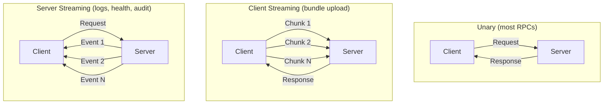

# gRPC & Protobuf Communication

All inter-component communication in Muto uses **gRPC** (Google Remote Procedure Call) with **Protocol Buffers** (protobuf) for message serialization. This page explains why gRPC was chosen, how the proto definitions are organized, and how communication flows between components.

## Why gRPC?

When building a system where a CLI, dashboard, daemon, and agent all need to communicate, the choice of communication protocol has significant implications:

| Feature | REST/JSON | gRPC/Protobuf | Why It Matters |
|---------|-----------|---------------|----------------|
| **Type safety** | None (strings everywhere) | Full (compile-time checked) | Prevents field name typos and type mismatches |
| **Serialization** | Text-based (JSON) | Binary (protobuf) | 3-10x smaller payloads, faster parsing |
| **Streaming** | Requires WebSocket | Built-in (4 patterns) | Essential for bundle upload, log streaming, health events |
| **Code generation** | Manual client code | Auto-generated stubs | Clients are always in sync with the server |
| **Schema evolution** | Informal (hope for the best) | Formal (field numbers, backward compat) | Safe API evolution without breaking clients |

### Streaming Patterns Used

gRPC supports four communication patterns. Muto uses three of them:



| Pattern | Used For | Example |
|---------|----------|---------|
| **Unary** | Simple request/response | `GetInfo`, `VerifyBundle`, `GetMode` |
| **Client streaming** | Sending large data in chunks | `UploadBundle` (64 KB chunks) |
| **Server streaming** | Receiving continuous events | `StreamLogs`, `StreamHealth`, `StreamAuditEvents` |

## Proto Organization

The protobuf definitions are organized into three files under the `proto/` directory:

```
proto/
└── muto/
    ├── shared/v1/
    │   └── common.proto        # Shared types used by both services
    ├── daemon/v1/
    │   └── daemon.proto        # DaemonService definition
    └── agent/v1/
        └── agent.proto         # AgentService definition
```

### common.proto — Shared Types

Defines types used across both services:

**Enums:**

| Enum | Values | Purpose |
|------|--------|---------|
| `ResultCode` | OK, ERROR, INVALID_ARGUMENT, UNAUTHORIZED, FORBIDDEN, NOT_FOUND, CONFLICT, TIMEOUT, PRECONDITION_FAILED, UNAVAILABLE | Standard API result codes |
| `HealthState` | UNKNOWN, HEALTHY, DEGRADED, FAILED | Component health states |
| `VehicleMode` | UNKNOWN, BOOT, STANDBY, AUTONOMOUS, TELEOP, DIAGNOSTIC, SAFE_STOP, UPDATE | Vehicle operational modes |
| `LifecycleState` | UNKNOWN, UNCONFIGURED, INACTIVE, ACTIVE, FINALIZED | ROS 2 lifecycle states |

**Messages:**

| Message | Fields | Purpose |
|---------|--------|---------|
| `ApiResponse` | code, message, request_id | Standard response envelope for all RPCs |
| `Timestamp` | unix_ms | Millisecond-precision timestamp |
| `ArtifactRef` | artifact_id, version, channel | Reference to a versioned artifact |
| `AuditEvent` | audit_id, request_id, timestamp, actor, action, target, result_code, evidence | Immutable audit record |
| `AuditEvidence` | type, value | Supporting evidence for audit events |
| `ProbeResult` | probe_id, state, message, timestamp, value | Health probe execution result |

### daemon.proto — DaemonService

Defines 16 RPC methods organized into five groups:

```protobuf
service DaemonService {
  // System info
  rpc GetInfo(GetInfoRequest) returns (GetInfoResponse);

  // Bundle lifecycle
  rpc UploadBundle(stream UploadBundleChunk) returns (UploadBundleResponse);
  rpc VerifyBundle(VerifyBundleRequest) returns (VerifyBundleResponse);
  rpc InstallBundle(InstallBundleRequest) returns (InstallBundleResponse);
  rpc GetDeploymentStatus(GetDeploymentStatusRequest) returns (GetDeploymentStatusResponse);
  rpc Rollback(RollbackRequest) returns (RollbackResponse);
  rpc ListBundles(ListBundlesRequest) returns (ListBundlesResponse);

  // Process management
  rpc GetProcessList(GetProcessListRequest) returns (GetProcessListResponse);
  rpc RestartProcess(RestartProcessRequest) returns (RestartProcessResponse);
  rpc StopProcess(StopProcessRequest) returns (StopProcessResponse);
  rpc GetResourceUsage(GetResourceUsageRequest) returns (GetResourceUsageResponse);

  // Logging & artifacts
  rpc StreamLogs(StreamLogsRequest) returns (stream LogEvent);
  rpc CaptureSnapshot(CaptureSnapshotRequest) returns (CaptureSnapshotResponse);
  rpc ListArtifacts(ListArtifactsRequest) returns (ListArtifactsResponse);

  // Audit
  rpc StreamAuditEvents(StreamAuditEventsRequest) returns (stream AuditEvent);
  rpc GetAuditEvent(GetAuditEventRequest) returns (GetAuditEventResponse);
}
```

### agent.proto — AgentService

Defines 11 RPC methods organized into five groups:

```protobuf
service AgentService {
  // Mode control
  rpc GetMode(GetModeRequest) returns (GetModeResponse);
  rpc RequestMode(RequestModeRequest) returns (RequestModeResponse);
  rpc GetModeTransitionStatus(GetModeTransitionStatusRequest)
      returns (GetModeTransitionStatusResponse);

  // Stack control
  rpc ListStacks(ListStacksRequest) returns (ListStacksResponse);
  rpc StartStack(StartStackRequest) returns (StartStackResponse);
  rpc StopStack(StopStackRequest) returns (StopStackResponse);
  rpc RestartStack(RestartStackRequest) returns (RestartStackResponse);

  // Lifecycle control
  rpc GetLifecycleState(GetLifecycleStateRequest) returns (GetLifecycleStateResponse);
  rpc SetLifecycleState(SetLifecycleStateRequest) returns (SetLifecycleStateResponse);

  // Health
  rpc GetHealthSummary(GetHealthSummaryRequest) returns (GetHealthSummaryResponse);
  rpc StreamHealth(StreamHealthRequest) returns (stream HealthEvent);
  rpc RunProbe(RunProbeRequest) returns (RunProbeResponse);

  // Graph monitoring
  rpc GetGraphSnapshot(GetGraphSnapshotRequest) returns (GetGraphSnapshotResponse);
}
```

## Code Generation

Proto stubs are generated using `grpcio-tools`:

```bash
make proto
```

This runs `grpc_tools.protoc` and generates Python files in `generated/python/`:

```
generated/python/
└── muto/
    ├── __init__.py
    ├── shared/v1/
    │   ├── __init__.py
    │   ├── common_pb2.py          # Message classes
    │   ├── common_pb2_grpc.py     # Service stubs (empty for shared)
    │   └── common_pb2.pyi         # Type stubs for IDE support
    ├── daemon/v1/
    │   ├── __init__.py
    │   ├── daemon_pb2.py          # Message classes
    │   ├── daemon_pb2_grpc.py     # DaemonServiceStub + DaemonServiceServicer
    │   └── daemon_pb2.pyi         # Type stubs
    └── agent/v1/
        ├── __init__.py
        ├── agent_pb2.py
        ├── agent_pb2_grpc.py
        └── agent_pb2.pyi
```

### Importing Generated Stubs

The generated stubs are added to the Python path. Each module handles this slightly differently:

```python
# Common pattern used across all modules
import sys
from pathlib import Path

# Navigate from the current file to the generated directory
_GENERATED_PATH = Path(__file__).resolve().parents[2] / "generated" / "python"
sys.path.insert(0, str(_GENERATED_PATH))

# Now imports work
from muto.daemon.v1 import daemon_pb2, daemon_pb2_grpc
from muto.agent.v1 import agent_pb2, agent_pb2_grpc
from muto.shared.v1 import common_pb2
```

## Transport Configuration

### Unix Domain Socket (Production)

In production, the daemon listens on a Unix domain socket for zero-overhead local communication:

```
unix:///var/run/mutod.sock
```

Benefits:
- No TCP overhead (no SYN/ACK, no Nagle)
- Filesystem permissions for access control
- Invisible to the network (local-only by design)

### TCP (Development / Remote)

For development or remote access, the daemon also listens on TCP:

```
localhost:50051    # Daemon
localhost:50052    # Agent
```

The CLI's `use_unix_socket` configuration option controls which transport to use.

## API Response Envelope

Every RPC response includes an `ApiResponse` envelope:

```protobuf
message ApiResponse {
  ResultCode code = 1;    // RESULT_OK, RESULT_ERROR, etc.
  string message = 2;     // Human-readable description
  string request_id = 3;  // Unique ID for tracing
}
```

This provides consistent error handling across all RPCs. Clients can check `response.code == RESULT_OK` to determine success.

## Schema Versioning

The proto package paths include a version segment (`v1`):

```
muto.daemon.v1
muto.agent.v1
muto.shared.v1
```

When a breaking change is needed, a `v2` version can be introduced while maintaining backward compatibility with `v1`. The Go package option also includes versioning:

```protobuf
option go_package = "github.com/eclipse-muto/muto/gen/go/muto/daemon/v1;daemonv1";
```

This enables future multi-language support (Go, Rust, etc.) from the same proto definitions.
