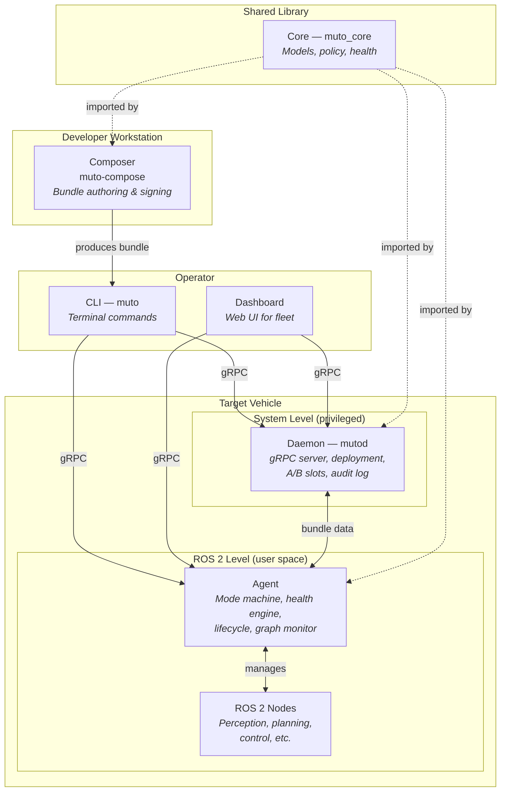
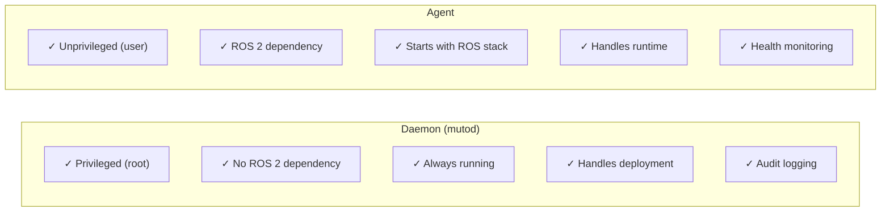
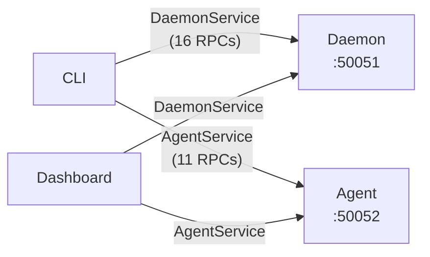
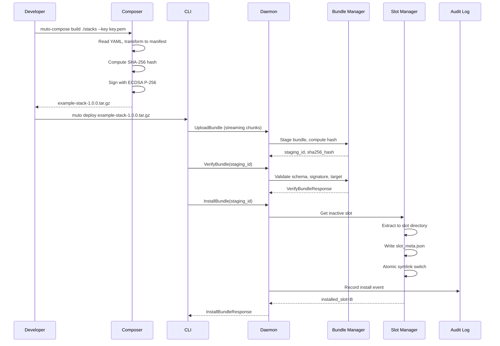
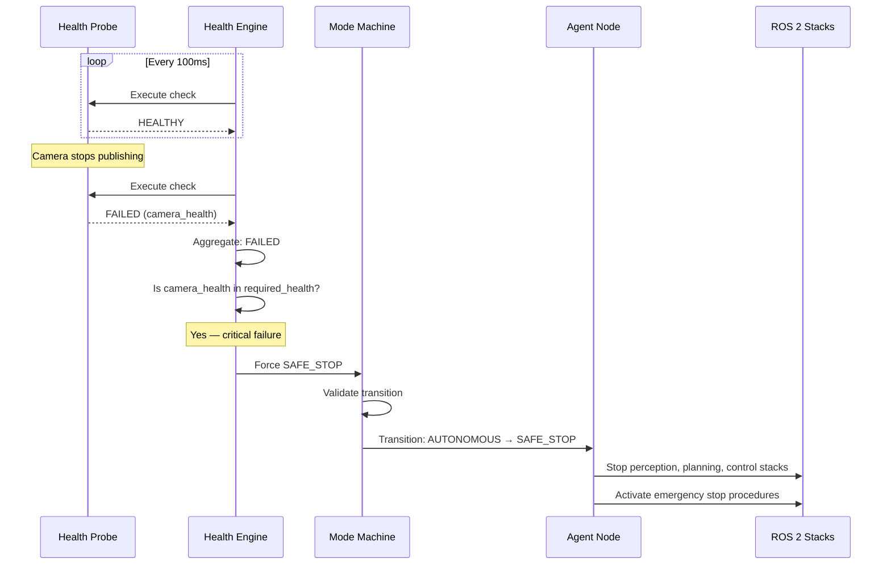
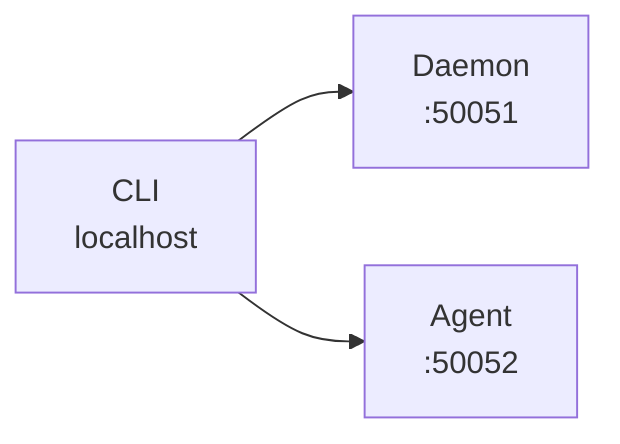
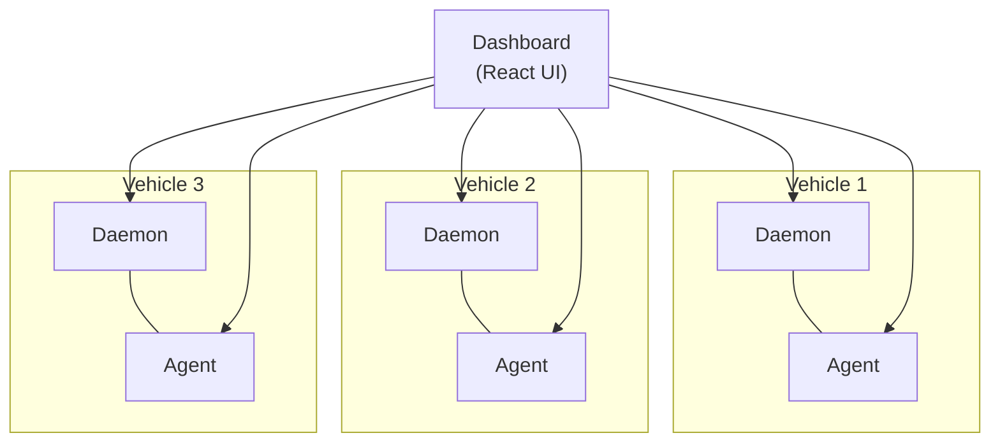

# System Overview

Eclipse Muto is composed of six primary components, each with a distinct role and clear boundaries. This separation of concerns is a deliberate architectural decision — it makes the system more reliable, testable, and adaptable to different deployment scenarios.

## The Full Picture



## Component Responsibilities

| Component | Role | ROS 2 Dependency | Runs As |
|-----------|------|-------------------|---------|
| **Daemon** (`mutod`) | Bundle deployment, A/B slots, process supervision, audit log | None | System service (root) |
| **Agent** (`muto_agent`) | Mode management, health probes, lifecycle control, graph monitoring | Yes (rclpy) | ROS 2 node (user) |
| **Core** (`muto_core`) | Shared data models, policy logic, health primitives | None | Python library |
| **CLI** (`muto`) | Operator commands for daemon and agent | None | Terminal tool |
| **Composer** (`muto-compose`) | Bundle authoring, signing, validation | None | Terminal tool |
| **Dashboard** | Fleet monitoring, deployment management | None | Web application |

## Why Separate the Daemon and Agent?

This is the most important architectural decision in Muto. The daemon and agent are separate processes with different privilege levels and dependencies:



### Rationale

1. **Reliability** — If the ROS 2 stack crashes (which happens more often than we'd like), the daemon keeps running. You can still deploy new software to fix the problem.

2. **Security** — The daemon runs as root because it needs to manage system-level resources (slots on disk, process supervision). The agent runs as a regular user because it only needs to interact with ROS 2. Minimizing the privileged attack surface is a security best practice.

3. **Independence** — The daemon can be developed, tested, and deployed without any ROS 2 installation. This makes CI/CD much simpler and allows the daemon to run on non-ROS platforms.

4. **Startup Order** — The daemon starts at boot (via systemd). The agent starts later, once the ROS 2 environment is ready. Deployment can happen before ROS 2 is even running.

## Communication Architecture

All inter-component communication uses **gRPC** (Google Remote Procedure Call) with Protocol Buffers for serialization:



### Why gRPC?

| Feature | Why It Matters |
|---------|---------------|
| **Strongly typed** | Proto definitions enforce correct message structure at compile time |
| **Streaming** | Bundle uploads use client-streaming (sending data in 64 KB chunks) |
| **Bidirectional** | Health events and logs use server-streaming |
| **Efficient** | Binary encoding is 3-10x smaller than JSON |
| **Language agnostic** | Proto definitions generate stubs for Python, Go, TypeScript, etc. |
| **Unix socket support** | Daemon listens on `/var/run/mutod.sock` for local, zero-overhead communication |

### Proto Organization

The gRPC interface is defined in three proto files:

```
proto/
├── muto/
│   ├── shared/v1/
│   │   └── common.proto      # Shared enums and messages
│   ├── daemon/v1/
│   │   └── daemon.proto       # DaemonService (16 RPCs)
│   └── agent/v1/
│       └── agent.proto        # AgentService (11 RPCs)
```

The `shared/v1/common.proto` defines types used by both services: `ResultCode`, `HealthState`, `VehicleMode`, `LifecycleState`, `AuditEvent`, and `ProbeResult`.

## Data Flow: End-to-End Deployment

Here is what happens when an operator deploys a bundle to a vehicle:



## Data Flow: Health-Triggered Mode Change

Here is what happens when a health probe failure triggers an automatic mode change:



## Deployment Topology

Muto supports different deployment topologies depending on your needs:

### Single Vehicle (Development)



Everything runs on one machine. Ideal for development and testing.

### Fleet with Dashboard



The dashboard connects to each vehicle's daemon and agent for fleet-wide monitoring and management.

## Next Steps

Dive deeper into each component:
- [Daemon](daemon) — The privileged system service
- [Agent](agent) — The ROS 2 runtime manager
- [Core](core) — The shared library
- [CLI](cli) — The command-line interface
- [Composer](composer) — The bundle authoring tool
- [Dashboard](dashboard) — The fleet monitoring UI
- [gRPC & Protobuf](grpc-communication) — The communication layer
