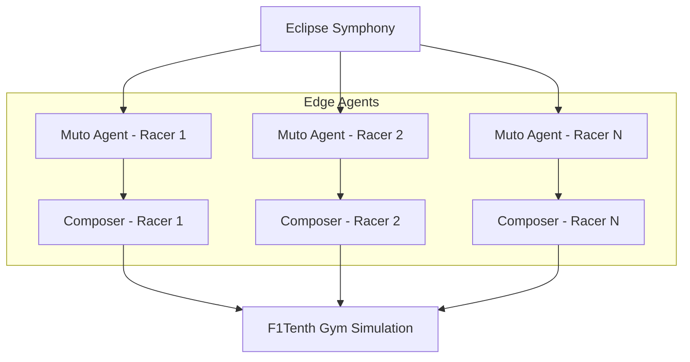

# ROS Racer Blueprint

An Eclipse SDV Blueprint showcasing multi-agent autonomous racers running [F1Tenth.org](https://f1tenth.org/) software, orchestrated by Eclipse Muto.

## Overview

The ROS Racer blueprint demonstrates how Eclipse Muto can orchestrate multiple autonomous racing agents in a simulated environment. Each racer runs an independent ROS 2 navigation stack, and Muto manages the deployment, configuration, and lifecycle of these stacks across multiple simulated vehicles.

**Key capabilities demonstrated:**
- Multi-vehicle orchestration with Eclipse Muto
- F1Tenth gym simulation environment
- Over-the-air stack deployment to multiple agents
- Real-time telemetry and monitoring via digital twins

## Architecture



Each racer agent runs:
- **Muto Agent**: Receives stack definitions from the cloud
- **Muto Composer**: Deploys and manages the racing algorithm stack
- **Racing Node**: The actual F1Tenth racing algorithm (e.g., gap follower, wall follower)

## Prerequisites

- ROS 2 Humble or later
- Docker and Docker Compose
- Eclipse Muto installed and configured
- F1Tenth gym simulator (`pip install f1tenth-gym`)

## Quick Start

### 1. Clone the Repository

```bash
git clone https://github.com/eclipse-muto/ros-racer.git
cd ros-racer
```

### 2. Start the Simulation Environment

Launch the F1Tenth gym simulation with Docker Compose:

```bash
docker compose up -d
```

### 3. Deploy Racing Stacks

Use Muto to deploy racing algorithms to each agent:

```bash
ros2 launch launch/muto.launch.py \
    vehicle_namespace:=org.eclipse.muto.racer \
    vehicle_name:=racer-001
```

### 4. Monitor the Race

Open the F1Tenth visualization to watch the racers:

```bash
# Open RViz or the F1Tenth web visualizer
ros2 launch f1tenth_gym_ros gym_bridge_launch.py
```

## Stack Definitions

### Gap Follower Racer

```json
{
  "metadata": {
    "name": "gap-follower-racer",
    "description": "F1Tenth gap follower racing algorithm",
    "content_type": "stack/json",
    "version": "1.0.0"
  },
  "launch": {
    "node": [
      {
        "name": "gap_follower",
        "pkg": "gap_follower",
        "exec": "reactive_node",
        "param": [
          {"name": "max_speed", "value": "5.0"},
          {"name": "disparity_threshold", "value": "0.5"}
        ]
      }
    ]
  }
}
```

### Wall Follower Racer

```json
{
  "metadata": {
    "name": "wall-follower-racer",
    "description": "F1Tenth wall follower racing algorithm",
    "content_type": "stack/json",
    "version": "1.0.0"
  },
  "launch": {
    "node": [
      {
        "name": "wall_follower",
        "pkg": "wall_follower",
        "exec": "wall_follow_node",
        "param": [
          {"name": "desired_distance", "value": "1.0"},
          {"name": "velocity", "value": "3.0"}
        ]
      }
    ]
  }
}
```

## Multi-Agent Orchestration

The ROS Racer blueprint demonstrates Muto's ability to manage multiple agents simultaneously:

1. **Fleet Registration**: Each racer registers as a separate device with its own digital twin
2. **Independent Deployment**: Different racing algorithms can be deployed to different racers
3. **Live Swapping**: Switch racing algorithms on-the-fly during simulation
4. **Centralized Monitoring**: Monitor all racers through a single dashboard

## Deployment Options

| Option | Description |
|--------|-------------|
| **Docker Compose** | Full simulation environment in containers |
| **Native** | Build from source with local ROS 2 installation |
| **Hybrid** | Simulation in Docker, Muto running natively |

## Related Resources

- [F1Tenth.org](https://f1tenth.org/) - Autonomous racing platform
- [Gap Follower OTA Demo](./gap-follower) - Single-agent OTA update demo
- [Getting Started Guide](../muto-edge/getting-started) - Muto setup instructions
- [Agent Documentation](../muto-edge/agent) - Communication bridge details
