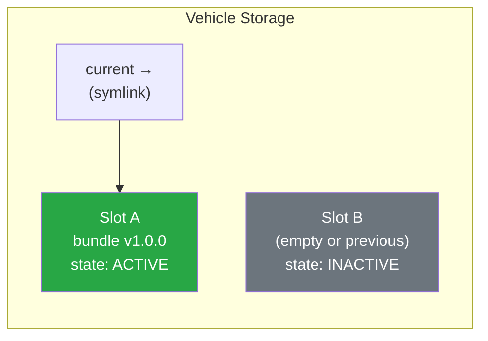
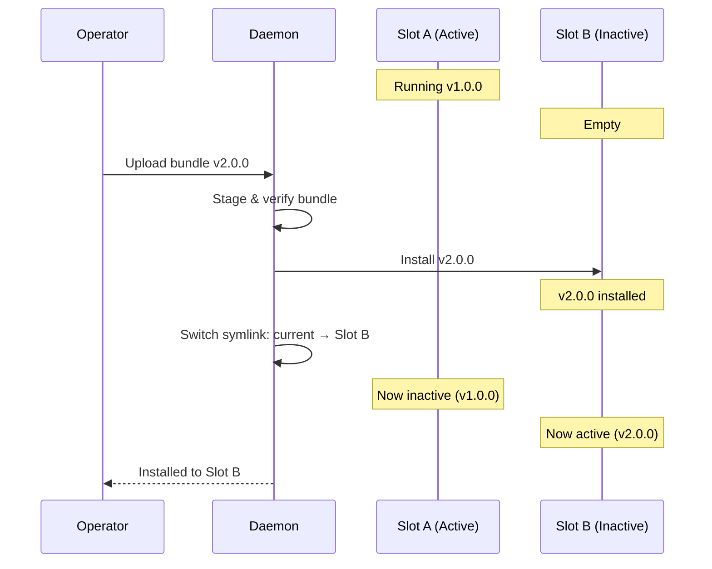
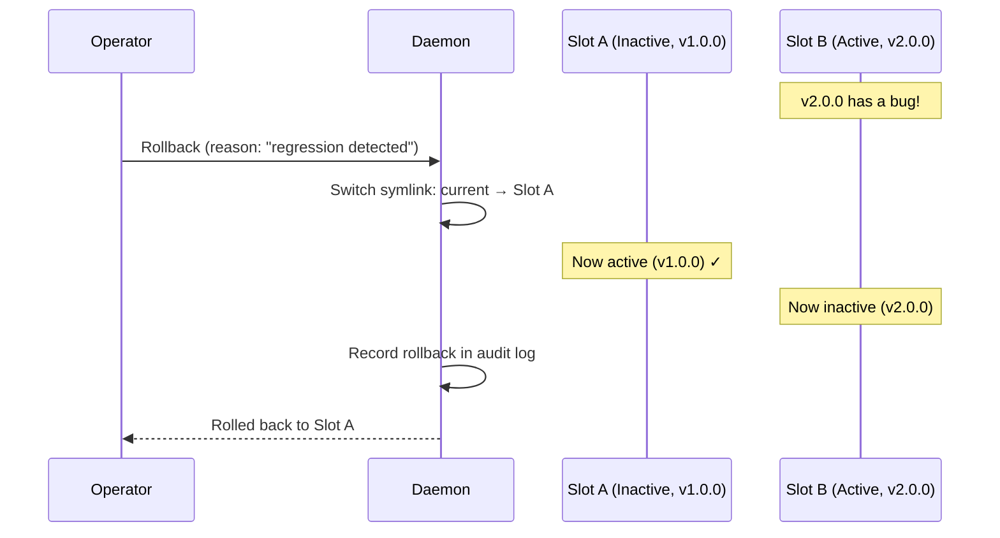

# A/B Slot Deployment

When you update the software on a robot, the worst possible outcome is a "brick" — a device stuck in a broken state that cannot recover. A/B slot deployment is a strategy that makes this impossible.

## The Core Idea

Instead of updating software in place (overwriting the running version), Muto maintains **two separate deployment slots** on each vehicle:



At any time:
- **One slot is active** — This is the version currently running
- **One slot is inactive** — This holds the previous version (or is empty for the first deployment)

When you deploy a new bundle, it is installed into the **inactive** slot. Then the system atomically switches which slot is active.

## How a Deployment Works



1. The operator uploads bundle v2.0.0
2. The daemon verifies the bundle (signature, schema, target compatibility)
3. The bundle is installed into **Slot B** (the inactive slot)
4. The `current` symlink is atomically switched from Slot A to Slot B
5. Slot B is now active with v2.0.0, and Slot A becomes inactive with v1.0.0

## Why Symlinks Matter

The switch between slots uses a **filesystem symlink** — a pointer that says "current means Slot B now." Symlink operations are **atomic** on Linux, meaning the switch is instantaneous and cannot be interrupted. There is no moment where the system is in an undefined state.

```
/var/lib/mutod/
├── slots/
│   ├── A/          # Contains bundle v1.0.0
│   └── B/          # Contains bundle v2.0.0
├── current → slots/B    # Symlink pointing to active slot
└── staging/        # Temporary upload area
```

## Instant Rollback

If something goes wrong after deploying v2.0.0, rollback is trivial:



The rollback:
- **Switches the symlink** from Slot B back to Slot A
- **Takes milliseconds** — no file copying, no downloads, no reinstallation
- **Is recorded** in the tamper-proof audit log with the reason provided

## Slot Metadata

Each slot maintains a `slot_meta.json` file tracking its state:

```json
{
  "bundle_id": "sha256:a1b2c3d4e5f6...",
  "bundle_version": "1.0.0",
  "installed_at_unix_ms": 1708444800000,
  "state": "active"
}
```

The possible states are:
- **`active`** — This slot is currently in use
- **`inactive`** — This slot holds a previous deployment, available for rollback
- **`empty`** — This slot has never been used

## How Successive Deployments Work

Here is what happens across multiple deployments:

| Action | Slot A | Slot B | Active |
|--------|--------|--------|--------|
| Initial state | empty | empty | none |
| Deploy v1.0.0 | empty | **v1.0.0** | **B** |
| Deploy v2.0.0 | **v2.0.0** | v1.0.0 | **A** |
| Deploy v3.0.0 | v2.0.0 | **v3.0.0** | **B** |
| Rollback | **v2.0.0** | v3.0.0 | **A** |

Each new deployment goes to the inactive slot and becomes active. The previous active slot becomes inactive and available for rollback. Note that only **one previous version** is retained — deploying three times means v1.0.0 is lost.

## Comparison to Other Strategies

| Strategy | Rollback Speed | Disk Usage | Risk |
|----------|---------------|------------|------|
| **In-place update** | Minutes (must re-download old version) | Low | High (no fallback if update corrupts) |
| **A/B slots** (Muto) | Milliseconds (symlink switch) | 2x per bundle | Very low (always have a fallback) |
| **Rolling update** | Varies | Low | Medium (partial fleet in mixed state) |

A/B slot deployment doubles the disk usage per bundle, but bundles are small (just metadata), so this is negligible. The safety guarantee — that you can always roll back instantly — is worth the trade-off.

## Real-World Analogy

A/B slot deployment works like having two identical rooms in a house. You live in Room A. When you want to redecorate, you set up Room B exactly how you want it, verify everything looks good, and then just move your stuff over. If you hate it, you walk back to Room A, which is exactly as you left it.

**Next:** [Vehicle Modes](vehicle-modes) — Learn how Muto manages different operational states.
