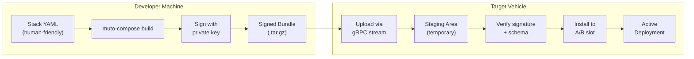

# Bundles

A **bundle** is Muto's unit of deployment. It is a compressed archive (`.tar.gz`) that contains everything the system needs to know about a software deployment — what to run, on which hardware, under what conditions, and with what safety constraints.

Think of it like a shipping container for robot software: standardized, sealed, verified, and ready to be installed on any compatible vehicle.

## What is Inside a Bundle?

A bundle contains two files:

```
example-autonomy-stack-1.0.0.tar.gz
├── manifest.json    # Declares everything about this deployment
└── manifest.sig     # ECDSA P-256 digital signature
```

### manifest.json

The manifest is the heart of the bundle. It is a JSON file that describes:

- **Identity** — Name, version, and a unique `bundle_id` (a SHA-256 hash)
- **Target constraints** — Which ROS 2 distributions, CPU architectures, and operating systems this bundle supports
- **Security** — The signature algorithm and manifest hash for tamper detection
- **Runtime** — DDS middleware configuration
- **Modes** — Which stacks to enable in each vehicle mode (STANDBY, AUTONOMOUS, TELEOP, etc.)
- **Stacks** — Groups of components with entrypoints, health probes, restart policies, and resource limits

Here is a simplified example:

```json
{
  "schema_version": "1.0",
  "bundle_id": "sha256:a1b2c3d4e5f6...",
  "name": "example-autonomy-stack",
  "version": "1.0.0",
  "target": {
    "ros_distro": ["humble", "iron"],
    "arch": ["amd64", "arm64"],
    "os": ["ubuntu22.04"]
  },
  "security": {
    "signature_alg": "ecdsa-p256-sha256",
    "manifest_hash": "sha256:f6e5d4c3b2a1..."
  },
  "runtime": {
    "rmw": "rmw_cyclonedds_cpp",
    "ros_domain_id": 42
  },
  "modes": {
    "STANDBY": {
      "enabled_stacks": ["core"],
      "on_fail": "SAFE_STOP"
    },
    "AUTONOMOUS": {
      "enabled_stacks": ["core", "perception", "planning", "control"],
      "required_health": ["localization_health", "perception_health"],
      "on_fail": "SAFE_STOP"
    }
  },
  "stacks": {
    "core": {
      "entrypoint": "ros2 launch muto_core core.launch.py",
      "components": [
        {
          "name": "state_manager",
          "type": "process",
          "lifecycle": true,
          "health_probes": [
            {
              "probe_id": "state_manager_health",
              "type": "process_health",
              "timeout_ms": 5000
            }
          ],
          "restart_policy": {
            "max_restarts": 3,
            "window_sec": 60,
            "backoff": "exponential"
          }
        }
      ]
    }
  }
}
```

### manifest.sig

A binary file containing the ECDSA P-256 digital signature of the manifest. This proves:
1. The manifest was created by someone with the private signing key
2. The manifest has not been modified since it was signed

## The Bundle Lifecycle

A bundle goes through a well-defined lifecycle from creation to deployment:



1. **Write** — The developer creates a `muto-stack.yaml` file describing the desired deployment
2. **Build** — The `muto-compose build` command transforms the YAML into a manifest, computes hashes, and packages it into a `.tar.gz`
3. **Sign** — If a private key is provided, the manifest is signed with ECDSA P-256
4. **Upload** — The CLI or dashboard streams the bundle to the daemon via gRPC
5. **Stage** — The daemon stores the bundle in a temporary staging area and computes its SHA-256 hash
6. **Verify** — The daemon checks the signature against the public key, validates the manifest against the JSON schema, and checks target compatibility
7. **Install** — The bundle is atomically installed into the inactive A/B slot
8. **Active** — The slot becomes active, and the agent starts managing the described stacks

## From YAML to Manifest

Developers write their stack definitions in a human-friendly YAML format. The Composer tool transforms this into the machine-readable `manifest.json`. Here is the relationship:

```yaml
# muto-stack.yaml (what you write)
name: example-autonomy-stack
version: 1.0.0

target:
  ros_distro: [humble, iron]
  arch: [amd64, arm64]
  os: [ubuntu22.04]

stacks:
  perception:
    entrypoint: ros2 launch perception perception.launch.py
    components:
      - name: camera_driver
        type: process
        lifecycle: true
        health_probes:
          - probe_id: camera_health
            type: topic_frequency
            topic: /camera/image_raw
            min_frequency_hz: 25
```

The Composer:
1. Reads this YAML
2. Generates the full manifest JSON (adding `schema_version`, `security` fields, etc.)
3. Computes the canonical hash using [RFC 8785](https://tools.ietf.org/html/rfc8785) JSON canonicalization
4. Sets `bundle_id` to `sha256:<hash>`
5. Signs if a key is provided
6. Archives into a `.tar.gz`

## Bundle Identity

Every bundle has a unique identity computed from its contents:

- **`bundle_id`** — `sha256:<64 hex chars>` — The SHA-256 hash of the canonical JSON representation of the manifest (excluding the `bundle_id` and `security` fields themselves). This means two bundles with identical content always have the same ID.
- **`name`** — A human-readable name like `example-autonomy-stack`
- **`version`** — A semantic version like `1.0.0`

The `bundle_id` is content-addressed: if you change anything in the manifest, the ID changes. This makes bundles **immutable** — you cannot modify a bundle without changing its identity.

## What Bundles Do Not Contain

Bundles contain **metadata**, not the actual software binaries. They describe what to run, not the binaries themselves. The actual ROS 2 packages are expected to already be installed on the target vehicle (via apt, Docker containers, or other mechanisms).

This is a deliberate design choice:
- Bundles stay small (kilobytes, not gigabytes)
- The same bundle can target multiple architectures
- Software installation and configuration management are separate concerns

**Next:** [A/B Slot Deployment](ab-slot-deployment) — Learn how bundles are safely installed on vehicles.
