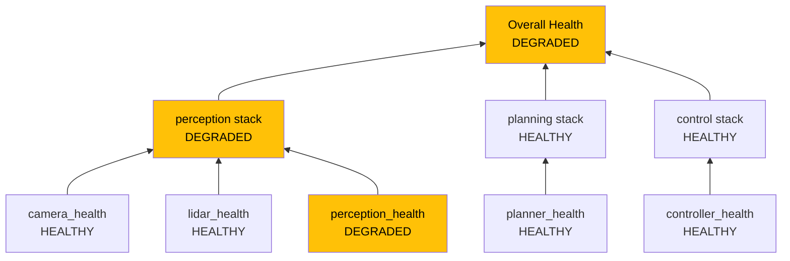
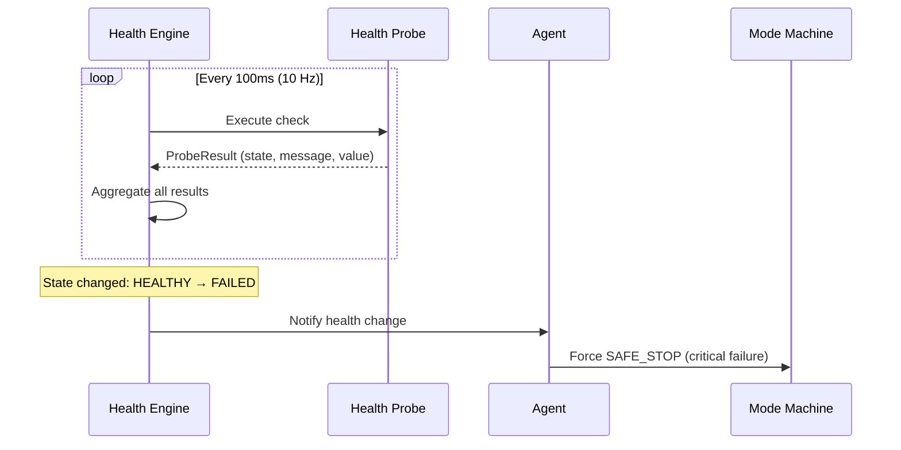

# Health Monitoring

A software component can be "running" but completely useless. A camera driver process might be alive but producing no images. A path planner might be running but stuck in an infinite loop. **Health monitoring** goes beyond "is the process running?" to answer the real question: "is this component actually doing its job?"

Muto's health system continuously evaluates the state of every component using **probes** — automated checks that run at configurable frequencies and report whether each component is healthy, degraded, or failed.

## Health States

Every component, stack, and the overall system has one of four health states:

| State | Meaning | Example |
|-------|---------|---------|
| **HEALTHY** | Everything is working as expected | Camera publishing images at 30 Hz |
| **DEGRADED** | Working but not optimally — attention needed | Camera publishing at 20 Hz instead of 30 Hz |
| **FAILED** | Not working — immediate action required | Camera publishing no images at all |
| **UNKNOWN** | Not enough data to determine health | Probe just started, no results yet |

## Probe Types

Muto supports four types of health probes, each designed for a different kind of check:

### Topic Frequency

Checks that a ROS 2 topic is publishing messages at a minimum rate:

```yaml
health_probes:
  - probe_id: camera_health
    type: topic_frequency
    topic: /camera/image_raw
    min_frequency_hz: 25
```

This probe monitors the `/camera/image_raw` topic and reports FAILED if the publishing rate drops below 25 Hz. This catches scenarios where the camera driver is running but has stopped producing data.

### Topic Staleness

Checks that the most recent message on a topic is not too old:

```yaml
health_probes:
  - probe_id: perception_health
    type: topic_staleness
    topic: /perception/detections
    max_staleness_ms: 200
```

This is different from frequency. A topic might publish one message per second (low frequency), but as long as the latest message is fresh (less than 200 ms old), it is healthy. This is useful for components that publish at variable rates.

### Process Health

Checks that a process is alive and responsive:

```yaml
health_probes:
  - probe_id: state_manager_health
    type: process_health
    timeout_ms: 5000
```

If the process has not responded within 5000 ms, it is considered failed. This catches hung processes that are technically alive but not doing useful work.

### Custom Script

Runs a custom shell script for application-specific checks:

```yaml
health_probes:
  - probe_id: gpu_health
    type: custom_script
    script: /opt/muto/checks/gpu_temp.sh
    timeout_ms: 3000
```

The script should exit with code 0 for healthy, 1 for degraded, and 2 for failed. This allows you to check anything — GPU temperature, disk space, network connectivity, hardware-specific diagnostics.

## Aggregation

Individual probe results are aggregated up through the system hierarchy:



The aggregation rule is simple and conservative:
- If **any** probe is **FAILED** → the aggregate is **FAILED**
- If **any** probe is **DEGRADED** → the aggregate is **DEGRADED**
- If **all** probes are **HEALTHY** → the aggregate is **HEALTHY**

This means a single degraded component makes the entire system appear degraded. This is intentional — the operator should always see the worst-case assessment.

## The Health Engine

The health engine is a background process in the agent that:

1. **Runs probes** at a configurable frequency (default: 10 Hz)
2. **Collects results** from each probe
3. **Aggregates** results per-stack and overall
4. **Notifies listeners** when health state changes
5. **Triggers safety actions** when critical probes fail



## Critical vs. Non-Critical Probes

Not all health checks are equally important. A logging component being degraded is annoying but not dangerous. A vehicle controller being failed is immediately dangerous.

In Muto's mode definitions, the `required_health` field specifies which probes are **critical** for that mode:

```yaml
AUTONOMOUS:
  enabled_stacks: [core, perception, planning, control]
  required_health:
    - localization_health     # Critical - must know where we are
    - perception_health       # Critical - must see obstacles
  on_fail: SAFE_STOP
```

If `perception_health` fails while in AUTONOMOUS mode:
1. The health engine detects the failure
2. It triggers the `critical_failure_callback`
3. The agent forces a mode transition to SAFE_STOP
4. The vehicle comes to a safe stop

Non-critical probes (those not listed in `required_health`) are still monitored and reported, but they do not trigger automatic mode changes.

## Restart Policies

When a component fails, Muto can automatically attempt to restart it before escalating. Each component can define a restart policy:

```yaml
restart_policy:
  max_restarts: 3       # Maximum restart attempts
  window_sec: 60        # Time window for counting restarts
  backoff: exponential   # How long to wait between restarts
```

| Backoff Strategy | Behavior |
|-----------------|----------|
| `none` | Restart immediately |
| `linear` | Wait 1s, 2s, 3s between restarts |
| `exponential` | Wait 1s, 2s, 4s, 8s between restarts |

If the component exhausts its restart budget (3 restarts within 60 seconds), it is marked as permanently FAILED and the health system escalates.

## Resource Limits

Components can also declare resource limits to prevent runaway processes:

```yaml
resource_limits:
  memory_limit_bytes: 4294967296   # 4 GB
  cpu_shares: 2048
  pids_limit: 100
```

If a component exceeds its memory limit, the system can detect and handle this through the health monitoring pipeline.

**Next:** [Security & Signing](security-signing) — Learn how Muto ensures bundle integrity.
