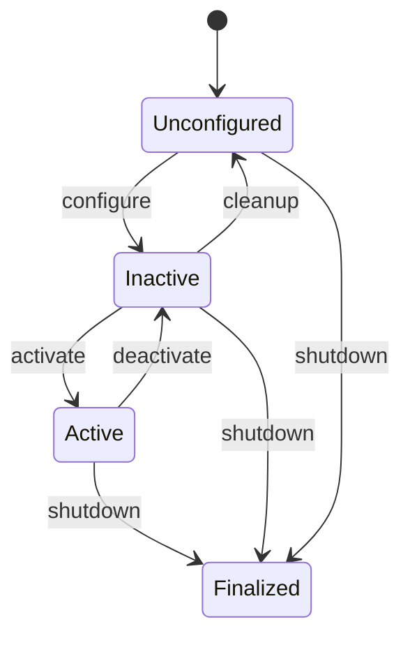

# ROS 2 Primer

**ROS 2** (Robot Operating System 2) is the standard open-source framework for building robot software. Despite its name, it is not an operating system — it is a set of libraries and tools that provide the plumbing robots need: communication between components, hardware abstraction, device drivers, and much more.

Muto orchestrates ROS 2-based software stacks. This page covers the ROS 2 concepts you need to understand how Muto works. If you are already familiar with ROS 2, feel free to skip to [Bundles](bundles).

## Nodes

A **node** is a single process that performs one specific task. In a self-driving car, you might have:

- A `camera_driver` node that reads images from the camera hardware
- A `detector` node that runs object detection on those images
- A `planner` node that computes a safe path
- A `controller` node that sends steering and throttle commands

Each node is an independent process. This is powerful because:
- If one node crashes, the others keep running
- Nodes can be written in different languages (Python, C++)
- Nodes can be distributed across multiple computers

## Topics

Nodes communicate by publishing and subscribing to **topics**. A topic is a named channel that carries messages of a specific type.


- The `camera_driver` node **publishes** images to the topic `/camera/image_raw`
- The `detector` node **subscribes** to that topic and receives every image
- The `detector` publishes results to `/perception/detections`
- The `planner` subscribes to detections

This publish/subscribe pattern is **decoupled** — the camera does not know or care who is listening. You can add a logger node that also subscribes to the camera topic without changing any existing code.

## Services

While topics are for continuous data streams, **services** are for request/response interactions. A service has a server (which performs an action) and clients (which request that action).

For example, a `map_server` might provide a service called `/get_map` that returns the current navigation map when called.

## DDS and the Middleware

Under the hood, ROS 2 uses **DDS** (Data Distribution Service), a networking middleware that handles message serialization, discovery, and transport. The specific DDS implementation is configurable — Muto's stack definitions specify which one to use:

- `rmw_cyclonedds_cpp` — CycloneDDS, known for reliability
- `rmw_fastrtps_cpp` — Fast-RTPS, the default

You configure this through the **RMW** (ROS Middleware) setting in your stack definition.

## Lifecycle Nodes

Standard ROS 2 nodes start running immediately. **Lifecycle nodes** (also called managed nodes) add a state machine to control their behavior:



- **Unconfigured** — Node exists but has not loaded its configuration
- **Inactive** — Configured but not processing data
- **Active** — Fully operational, processing data
- **Finalized** — Shut down permanently

Lifecycle nodes are important for Muto because they enable **coordinated startup**. The agent can configure all nodes first, verify they are ready, and then activate them together — instead of having a chaotic race at boot time.

In Muto stack definitions, components can declare `lifecycle: true` to indicate they support lifecycle management.

## Launch Files

A **launch file** is a script that starts multiple nodes together with their parameters and configuration. Instead of starting each node manually:

```bash
# Without launch file — tedious and error-prone
ros2 run nav2_map_server map_server --ros-args -p yaml_filename:=/maps/warehouse.yaml &
ros2 run nav2_planner planner_server &
ros2 run nav2_controller controller_server &
```

You write a launch file:

```python
# navigation.launch.py
from launch import LaunchDescription
from launch_ros.actions import Node

def generate_launch_description():
    return LaunchDescription([
        Node(package='nav2_map_server', executable='map_server',
             parameters=[{'yaml_filename': '/maps/warehouse.yaml'}]),
        Node(package='nav2_planner', executable='planner_server'),
        Node(package='nav2_controller', executable='controller_server'),
    ])
```

In Muto, each stack has an **entrypoint** that is typically a ROS 2 launch command:

```yaml
stacks:
  perception:
    entrypoint: ros2 launch perception perception.launch.py
```

## QoS (Quality of Service)

ROS 2 allows you to configure how messages are delivered through **QoS profiles**:

- **Reliability**: `reliable` (guarantees delivery, retransmits if lost) vs `best_effort` (fire and forget, lower latency)
- **Durability**: `volatile` (only delivers to current subscribers) vs `transient_local` (late subscribers get the last published message)
- **Depth**: How many messages to queue

Safety-critical data (control commands) typically uses `reliable`, while high-frequency sensor data (camera frames) uses `best_effort` to avoid blocking.

Muto's graph monitor captures QoS profiles for every topic, giving operators visibility into the communication configuration.

## Why Orchestrating ROS 2 is Hard

ROS 2 is powerful but managing it at scale presents challenges:

1. **Interconnected dependencies** — Nodes depend on each other through topics. Starting them in the wrong order causes failures.
2. **No built-in deployment system** — ROS 2 tells you how to build and run software, not how to deploy it to vehicles in the field.
3. **Health is implicit** — A node can be "running" but producing stale data. You need explicit health probes.
4. **Multi-mode operation** — A robot in STANDBY mode should run different software than in AUTONOMOUS mode. ROS 2 has no concept of modes.
5. **Updates are risky** — Replacing a running ROS 2 stack requires careful coordination to avoid crashes.

Muto addresses every one of these challenges with its bundle system, mode state machine, health engine, and A/B slot deployment.

**Next:** [Bundles](bundles) — Learn about Muto's deployment unit.
