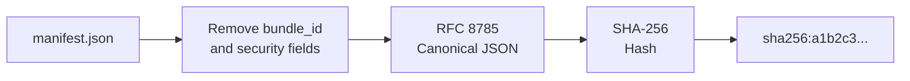
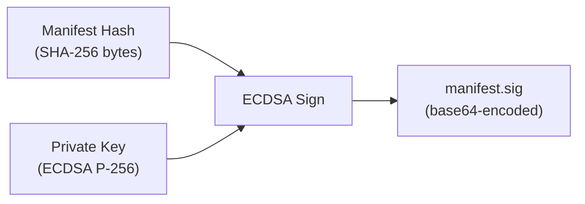
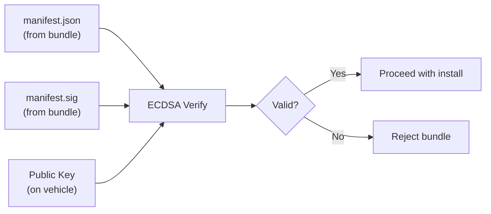

# Security & Signing

When you deploy software to a vehicle that drives through city streets, you need to be absolutely certain that the software has not been tampered with. A compromised autonomous vehicle is not just a software bug — it is a safety hazard.

Muto uses **cryptographic signing** to ensure that every bundle is authentic (created by a trusted party) and intact (not modified since it was created).

## The Problem

Without signing, an attacker could:

1. **Intercept** a bundle during transfer and modify its contents
2. **Create** a malicious bundle and claim it is an official update
3. **Modify** a bundle on the vehicle's filesystem after deployment

Signing prevents all three scenarios by creating a mathematical proof that the bundle contents are exactly what the developer intended.

## How It Works: A Simplified Explanation

Imagine you are sending a sealed letter. You:
1. Write the letter (the manifest)
2. Create a unique fingerprint of the letter (the hash)
3. Stamp the fingerprint with your personal signet ring (the signature)
4. Send both the letter and the stamped fingerprint

The recipient:
1. Creates their own fingerprint of the letter they received
2. Uses your publicly known signet ring pattern to verify the stamp
3. If the fingerprints match and the stamp is valid, the letter is authentic and unmodified

Muto does exactly this, but with mathematics instead of signet rings.

## The Algorithm: ECDSA P-256

Muto uses **ECDSA P-256** (Elliptic Curve Digital Signature Algorithm with the P-256 curve), combined with **SHA-256** hashing. Here is what that means in plain terms:

| Component | What It Is | What It Does |
|-----------|-----------|-------------|
| **ECDSA** | A digital signature algorithm based on elliptic curve mathematics | Creates signatures that are small (64 bytes) but extremely hard to forge |
| **P-256** | A specific elliptic curve approved by NIST | Provides 128-bit security (would take billions of years to break) |
| **SHA-256** | A cryptographic hash function | Creates a unique 256-bit fingerprint of any data |

### Why ECDSA P-256?

- **Industry standard** — Used by TLS (HTTPS), code signing, and most modern security systems
- **Compact** — Signatures are only 64 bytes (vs. 256+ bytes for RSA)
- **Fast** — Signing and verification are computationally cheap, important for embedded devices
- **Well-supported** — Implemented in Python's `cryptography` library, OpenSSL, and hardware TPMs

## The Signing Process

### Step 1: Generate a Key Pair

First, generate a private/public key pair:

```bash
muto-compose keygen --output ./keys
```

This creates two files:
- **`muto.key`** — The private key (keep this secret!)
- **`muto.pub`** — The public key (share this with vehicles)

The private key is stored in PEM format and can optionally be password-protected:

```bash
muto-compose keygen --output ./keys --password
# Prompts for password, encrypts the private key
```

### Step 2: Compute the Manifest Hash

Before signing, Muto computes a deterministic hash of the manifest:



1. **Exclude** the `bundle_id` and `security` fields (since these are computed *from* the hash)
2. **Canonicalize** the JSON using [RFC 8785](https://tools.ietf.org/html/rfc8785) — This produces a deterministic byte representation, eliminating differences in whitespace, key ordering, or encoding
3. **Hash** the canonical bytes using SHA-256

The result is a 64-character hex string prefixed with `sha256:`.

**Why RFC 8785?** Two JSON files can look different but mean the same thing: `{"a":1, "b":2}` and `{"b":2,"a":1}` are semantically identical. RFC 8785 canonicalization ensures they produce the same bytes, and therefore the same hash.

### Step 3: Sign the Manifest

The signing process takes the manifest hash and the private key, and produces a signature:



The signature is stored as `manifest.sig` inside the bundle.

### Step 4: Build the Bundle

When building a bundle with a signing key:

```bash
muto-compose build ./examples --key ./keys/muto.key --output ./output
```

The Composer:
1. Reads the stack YAML
2. Transforms it to manifest JSON
3. Computes the canonical hash
4. Signs with the private key
5. Sets `security.signature_alg` to `"ecdsa-p256-sha256"`
6. Sets `security.manifest_hash` to `"sha256:..."`
7. Sets `bundle_id` to `"sha256:..."` (same hash)
8. Packages `manifest.json` and `manifest.sig` into a `.tar.gz`

## The Verification Process

On the receiving end (the daemon), verification works in reverse:

### Schema Validation

First, the daemon validates the manifest against the [JSON Schema](../reference/manifest-schema):

- All required fields are present
- Field types are correct
- Values are within allowed ranges (e.g., `ros_distro` must be one of `humble`, `iron`, `jazzy`, `rolling`)
- Stack and mode definitions are well-formed

### Signature Verification

Then, the daemon verifies the signature:



1. Extract the manifest and signature from the bundle
2. Recompute the canonical hash of the manifest
3. Verify the signature against the hash using the public key
4. If valid, the manifest is authentic and unmodified

### Target Compatibility

Finally, the daemon checks whether the bundle is compatible with the current vehicle:

- Does the vehicle's ROS distribution match one in the `target.ros_distro` list?
- Does the vehicle's CPU architecture match one in `target.arch`?
- Does the vehicle's OS match one in `target.os`?

## Audit Trail

Every verification and installation action is recorded in the daemon's **append-only audit log**. Each audit entry includes:

- A unique audit ID
- The action performed (upload, verify, install, rollback)
- The result (success/failure)
- Evidence (bundle hash, signature status)
- A SHA-256 chain hash linking to the previous entry

The chain hash means that tampering with any audit entry would break the chain, making modifications detectable.

```json
{
  "audit_id": "a1b2c3d4",
  "action": "install_bundle",
  "target": {"slot": "B", "bundle_id": "sha256:..."},
  "result_code": "RESULT_OK",
  "evidence": [
    {"type": "sha256_hash", "value": "a1b2c3..."},
    {"type": "prev_hash", "value": "f6e5d4..."}
  ]
}
```

## Key Management Best Practices

| Practice | Why |
|----------|-----|
| **Never commit private keys to version control** | Anyone with the key can sign bundles |
| **Use CI/CD for signing** | Keep the private key in a secrets manager |
| **Rotate keys periodically** | Limits damage if a key is compromised |
| **Use password protection** | Adds a layer of defense for the private key file |
| **Distribute public keys securely** | Pre-install on vehicles during manufacturing or via a secure channel |

**Next:** Head to [Getting Started](../getting-started/installation) to install Muto, or read the [Architecture Overview](../architecture/system-overview) for a deep technical dive.
