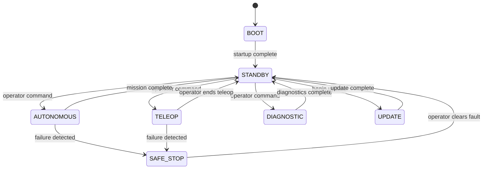
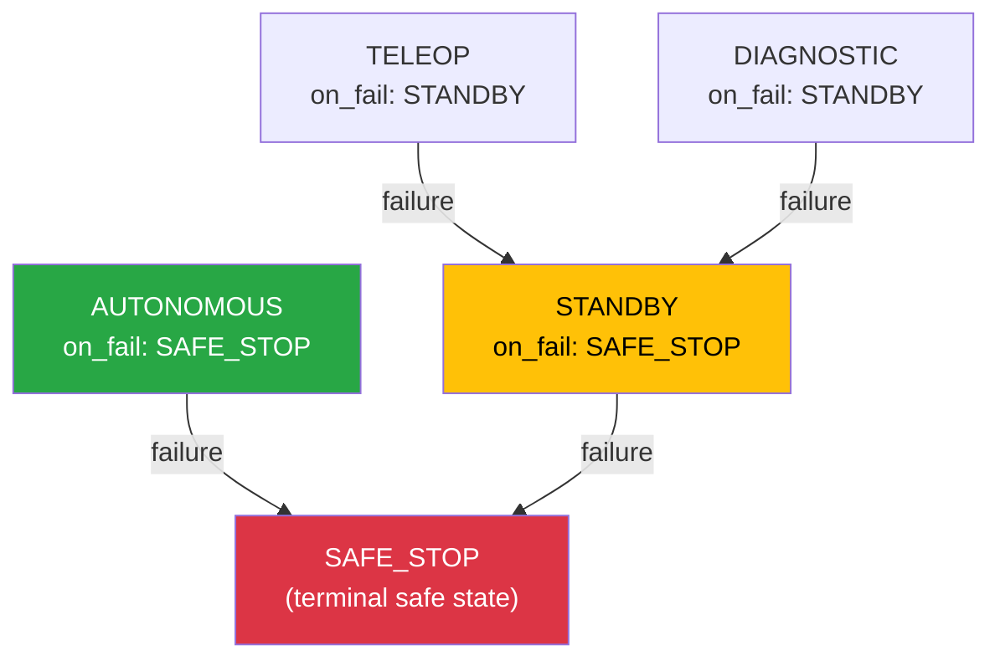
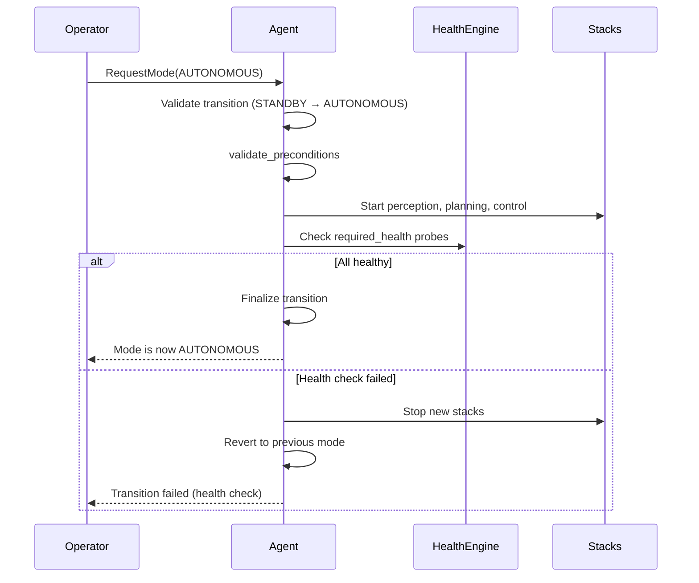

# Vehicle Modes

A robot does not always do the same thing. An autonomous delivery robot waiting for its next delivery runs different software than one actively navigating through traffic. A vehicle being remotely controlled by an operator needs a completely different set of components than one diagnosing a hardware fault.

**Vehicle modes** are Muto's way of managing these different operational states. Each mode defines which software stacks should be running and what health requirements must be met.

## The Mode State Machine

Muto defines eight vehicle modes, connected by a strict set of allowed transitions:



### What Each Mode Means

| Mode | Purpose | Typical Stacks |
|------|---------|---------------|
| **BOOT** | System is starting up. Hardware initializing, components loading. | Minimal — just the boot sequence |
| **STANDBY** | Idle and ready. All critical systems are up but the vehicle is not moving. | Core services (state manager, logger) |
| **AUTONOMOUS** | Full self-driving mode. All perception, planning, and control stacks active. | Core + perception + planning + control |
| **TELEOP** | Human operator is remotely controlling the vehicle. | Core + teleop (joystick input, twist commands) |
| **DIAGNOSTIC** | Running hardware and software diagnostics. | Core + diagnostics (aggregator, rosbag recorder) |
| **UPDATE** | Software update in progress. Vehicle must be stationary. | Minimal — just enough to receive the update |
| **SAFE_STOP** | Emergency fallback. Vehicle brings itself to a safe stop. | Only what is needed to stop safely |
| **UNKNOWN** | Should never be in this state. Indicates a system error. | — |

## Why Restrict Transitions?

Not every mode transition makes sense. You should not jump from BOOT directly to AUTONOMOUS — the vehicle needs to reach STANDBY first and confirm all systems are operational. Similarly, you cannot go from SAFE_STOP to AUTONOMOUS — an operator must clear the fault first.

The state machine enforces these rules:

```
Allowed transitions:
  BOOT       → STANDBY
  STANDBY    → AUTONOMOUS, TELEOP, DIAGNOSTIC, UPDATE, SAFE_STOP
  AUTONOMOUS → STANDBY, SAFE_STOP
  TELEOP     → STANDBY, SAFE_STOP
  DIAGNOSTIC → STANDBY, SAFE_STOP
  UPDATE     → STANDBY, SAFE_STOP
  SAFE_STOP  → STANDBY
```

If someone tries to request an invalid transition (e.g., TELEOP → AUTONOMOUS), the agent rejects it.

## Modes and Stacks

Each mode defines which stacks are **enabled** — meaning those stacks should be running when the vehicle is in that mode:

```yaml
modes:
  STANDBY:
    enabled_stacks:
      - core
    on_fail: SAFE_STOP

  AUTONOMOUS:
    enabled_stacks:
      - core
      - perception
      - planning
      - control
    required_health:
      - localization_health
      - perception_health
    on_fail: SAFE_STOP

  TELEOP:
    enabled_stacks:
      - core
      - teleop
    required_health:
      - joystick_health
    on_fail: STANDBY
```

When the vehicle transitions from STANDBY to AUTONOMOUS:
1. The agent starts the `perception`, `planning`, and `control` stacks
2. It verifies that `localization_health` and `perception_health` probes are passing
3. Only then does the mode transition complete

## Required Health

Some modes have **`required_health`** — a list of health probe IDs that must be healthy for the mode to function. If any required probe fails while in that mode, the vehicle transitions to the **`on_fail`** mode.

For AUTONOMOUS mode, you might require:
- `localization_health` — The vehicle must know where it is
- `perception_health` — The vehicle must be able to see obstacles

If either fails, the vehicle drops to `SAFE_STOP` automatically.

## The on_fail Fallback

Each mode can specify what happens when things go wrong:

| on_fail Value | Behavior |
|---------------|----------|
| `SAFE_STOP` | Bring the vehicle to a complete, safe stop immediately |
| `STANDBY` | Return to idle state (less drastic, for non-safety-critical modes) |
| `DIAGNOSTIC` | Enter diagnostic mode to analyze the problem |

This creates a safety hierarchy:



The system always has a path to safety. Even in the worst case, `SAFE_STOP` is always reachable.

## Mode Transitions in Detail

When a mode transition is requested, it goes through a multi-step process:



1. **Validate** — Check that the transition is allowed by the state machine
2. **Prepare** — Start the stacks required by the new mode
3. **Verify** — Confirm all required health probes are passing
4. **Finalize** — Complete the transition and notify listeners

If anything fails during the transition, the system reverts to the previous mode.

**Next:** [Health Monitoring](health-monitoring) — Learn how Muto continuously verifies system health.
