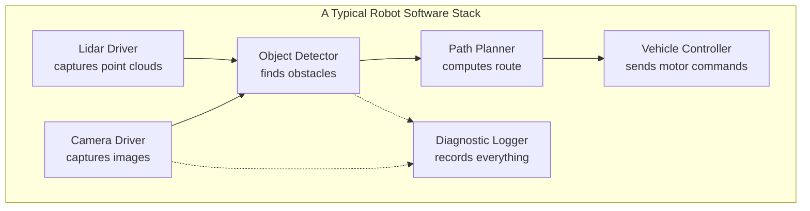
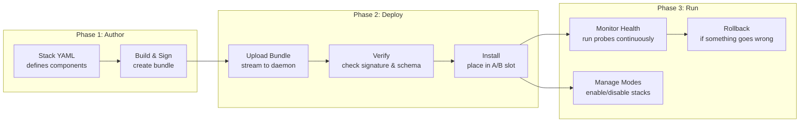

# What is Orchestration?

If you have ever used a streaming service like Netflix, you have benefited from software orchestration without knowing it. Behind the scenes, Netflix runs thousands of small services — one handles video encoding, another manages your watch history, another serves recommendations. An orchestration system decides which services run where, ensures they are healthy, replaces failed ones, and rolls out updates without interrupting your movie.

**Software orchestration** is the automated coordination of multiple software components across multiple machines. Instead of manually installing, starting, and monitoring software on each machine, you describe what you want to run and the orchestrator makes it happen.

## Why Robots Need Orchestration

A modern autonomous vehicle or robot is essentially a computer on wheels. It runs many software components simultaneously:

Now multiply this by a fleet of 200 robots. Without orchestration, you face these challenges:

| Challenge | Without Orchestration | With Orchestration |
|-----------|----------------------|-------------------|
| **Deploying updates** | SSH into each robot, copy files, restart services | Push a bundle once, it deploys everywhere |
| **Handling failures** | Robot stops working until someone notices and fixes it | Automatic health detection, restart policies, safe fallback modes |
| **Rolling back** | Manually restore old files, pray nothing breaks | Atomic rollback to previous known-good version in milliseconds |
| **Auditing** | "Who changed what and when?" — nobody knows | Every action recorded in tamper-proof audit log |
| **Version management** | Mix of versions across fleet, impossible to track | Every robot reports its exact bundle version |

## Orchestration in the Cloud vs. on Robots

If you have heard of **Kubernetes** (the most popular cloud orchestration system), Muto shares some of the same philosophy:

- **Declarative configuration** — You describe the desired state, and the system converges to it
- **Health monitoring** — Components are continuously checked and restarted if unhealthy
- **Rolling updates** — New versions are deployed without downtime
- **Rollback** — Bad updates can be reverted instantly

However, robots present unique challenges that Kubernetes was never designed for:

| Aspect | Cloud (Kubernetes) | Robots (Muto) |
|--------|-------------------|---------------|
| **Network** | Always connected, high bandwidth | Intermittent, low bandwidth, possibly satellite |
| **Safety** | A crashed web server is annoying | A crashed controller can cause physical harm |
| **Hardware** | Homogeneous server racks | Heterogeneous: ARM, x86, different sensors |
| **Real-time** | Milliseconds don't matter for web requests | Camera frames must arrive at 30 Hz, control loops at 50+ Hz |
| **Updates** | Restart a container in seconds | Must ensure vehicle is safely stopped before updating |
| **Middleware** | HTTP/REST/gRPC | ROS 2 with DDS, topic-based pub/sub |

Muto is purpose-built for this environment. It understands ROS 2, respects real-time constraints, handles intermittent connectivity, and prioritizes safety above all else.

## How Muto Orchestrates

Muto's orchestration follows a three-phase lifecycle:

1. **Author** — A developer writes a YAML file describing what software should run, groups components into stacks, defines vehicle modes, and sets up health probes
2. **Deploy** — The Composer tool builds a signed bundle. The daemon on the target vehicle receives it, verifies the signature and manifest schema, and atomically installs it into a deployment slot
3. **Run** — The agent monitors the running system, executes health probes at configurable frequencies, manages mode transitions, and can trigger automatic safety actions if something goes wrong

## Key Takeaway

Orchestration is about replacing manual, error-prone processes with automated, reliable ones. Muto brings this discipline to the world of robotics and autonomous vehicles, where the stakes are higher and the constraints are tighter than in traditional cloud computing.

**Next:** [ROS 2 Primer](ros2-primer) — Learn the basics of the Robot Operating System that Muto orchestrates.
