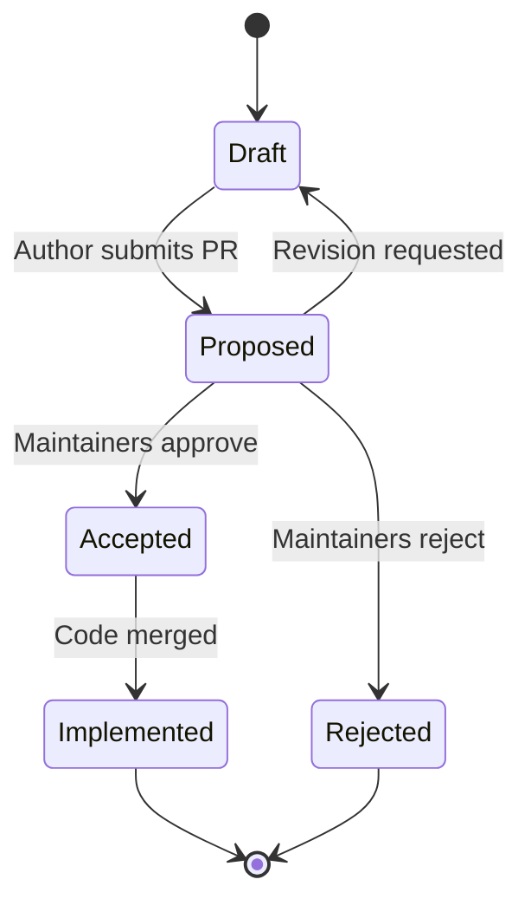

# Muto Enhancement Proposals (MEP)

A **Muto Enhancement Proposal (MEP)** is a design document that describes a significant change, new feature, or architectural decision for Eclipse Muto. MEPs provide a consistent and controlled path for proposing changes, gathering community feedback, and documenting design decisions.

## When to Write a MEP

Not every change needs a MEP. Use the following guidelines:

**MEP required:**
- New Muto components or packages
- Changes to the Agent/Composer plugin architecture
- New protocol support (e.g., Zenoh, uProtocol)
- Changes to the stack definition format
- Modifications to the reconciliation loop behavior
- Cross-component API changes
- Deprecation or removal of existing features

**MEP not required:**
- Bug fixes
- Documentation improvements
- Minor refactors that don't change behavior
- Dependency updates
- Test additions

## MEP Lifecycle



| Status | Description |
|--------|-------------|
| **Draft** | MEP is being written by the author |
| **Proposed** | MEP is submitted as a PR for review |
| **Accepted** | MEP is approved and ready for implementation |
| **Rejected** | MEP is declined with rationale |
| **Implemented** | MEP changes have been merged |

## MEP Template

Create a new file `mep/MEP-NNNN.md` in the [muto](https://github.com/eclipse-muto/muto) repository using this template:

```markdown
# MEP-NNNN: Title

- **Author(s):** Name <email>
- **Status:** Draft
- **Created:** YYYY-MM-DD
- **Updated:** YYYY-MM-DD

## Summary

A one-paragraph description of the proposed change.

## Motivation

Why is this change needed? What problem does it solve?
What use cases does it enable?

## Design

### Overview

High-level description of the proposed design.

### Detailed Design

Technical details of the implementation, including:
- Component changes
- API modifications
- Message/service definitions
- Configuration changes

### Alternatives Considered

What other approaches were evaluated and why were they rejected?

## Compatibility

- **Backward compatibility:** Does this break existing APIs or configurations?
- **Migration path:** How do users transition to the new behavior?

## Implementation Plan

- Estimated scope and affected components
- Proposed milestones or phases

## References

Links to related issues, discussions, or external resources.
```

## How to Submit a MEP

1. **Discuss first**: Open a [GitHub Discussion](https://github.com/eclipse-muto/muto/discussions) to gauge interest before writing a full MEP
2. **Write the MEP**: Use the template above and assign the next available number
3. **Open a PR**: Submit the MEP as a pull request to the `muto` repository
4. **Review period**: MEPs remain open for at least two weeks to collect feedback
5. **Decision**: Maintainers approve, request changes, or reject with rationale

## Existing MEPs

| MEP | Title | Status |
|-----|-------|--------|
| — | *No MEPs submitted yet* | — |

As the project grows, accepted MEPs will be listed here as a reference for design decisions and project history.
