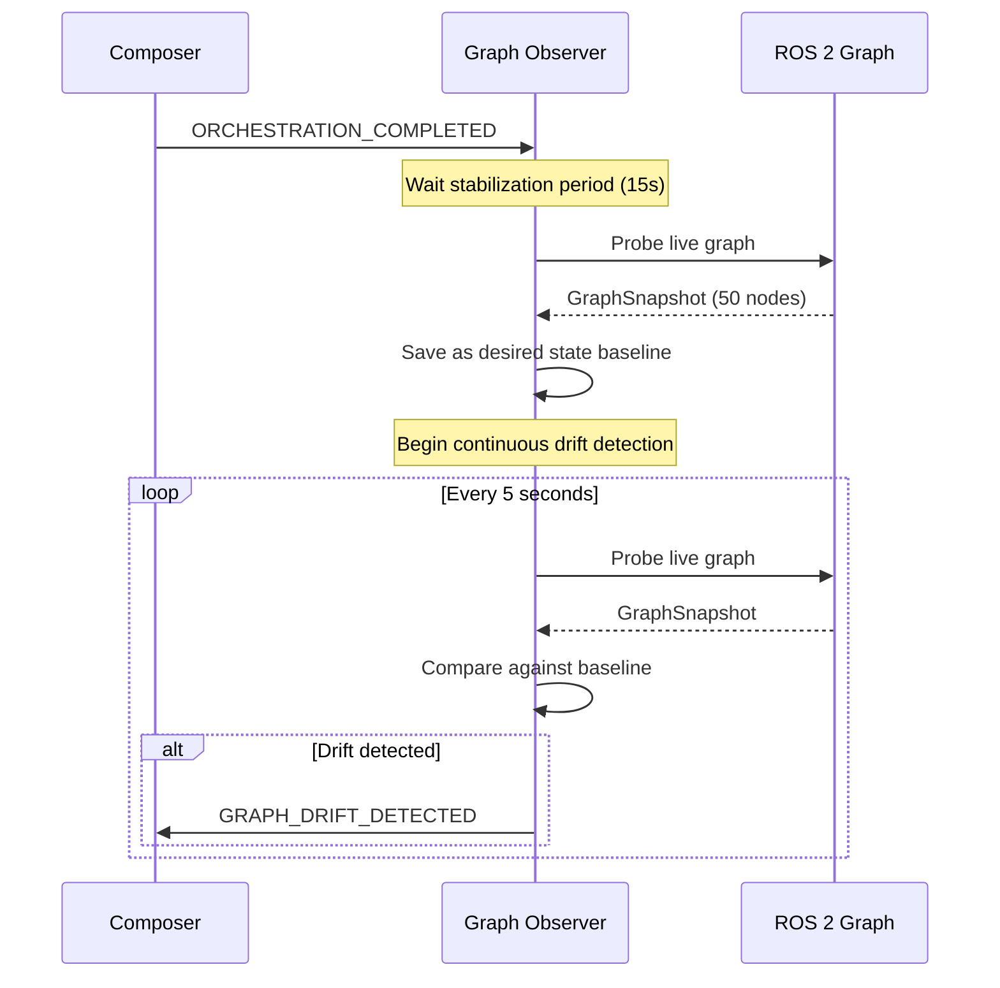
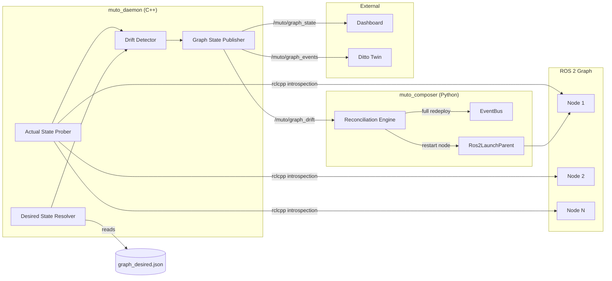
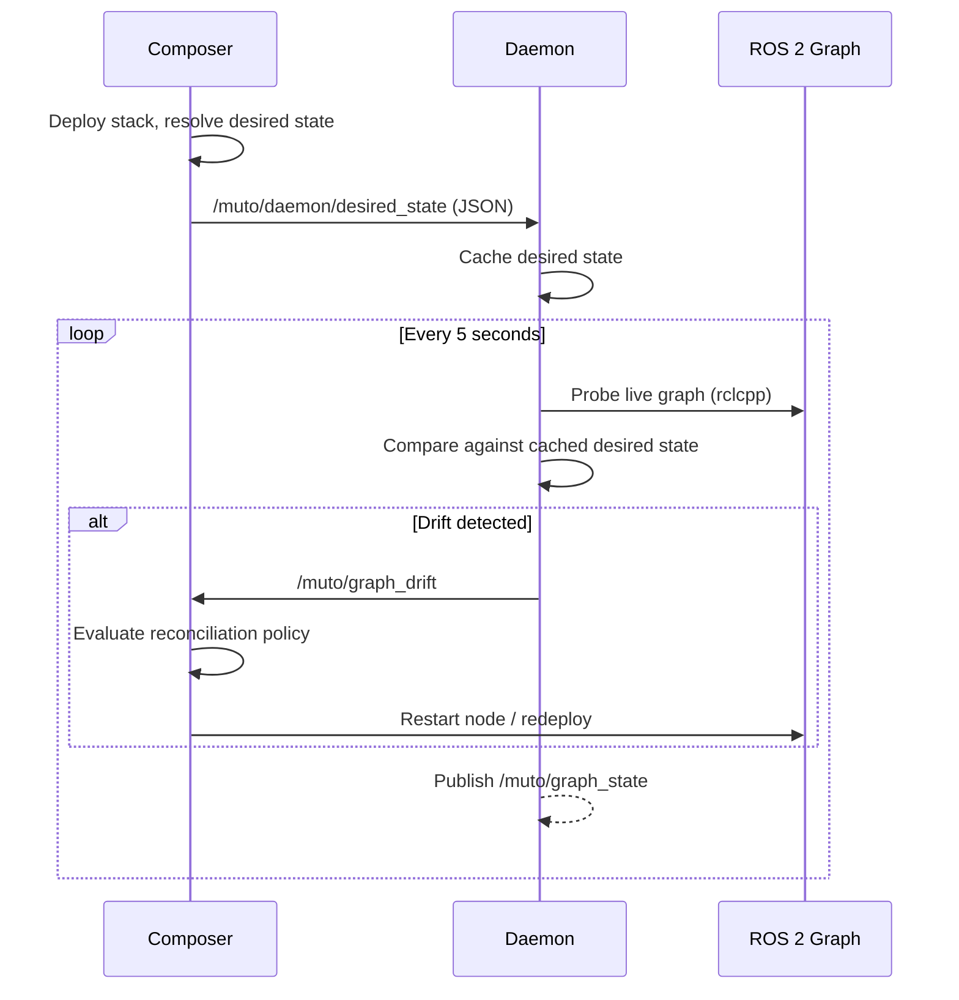
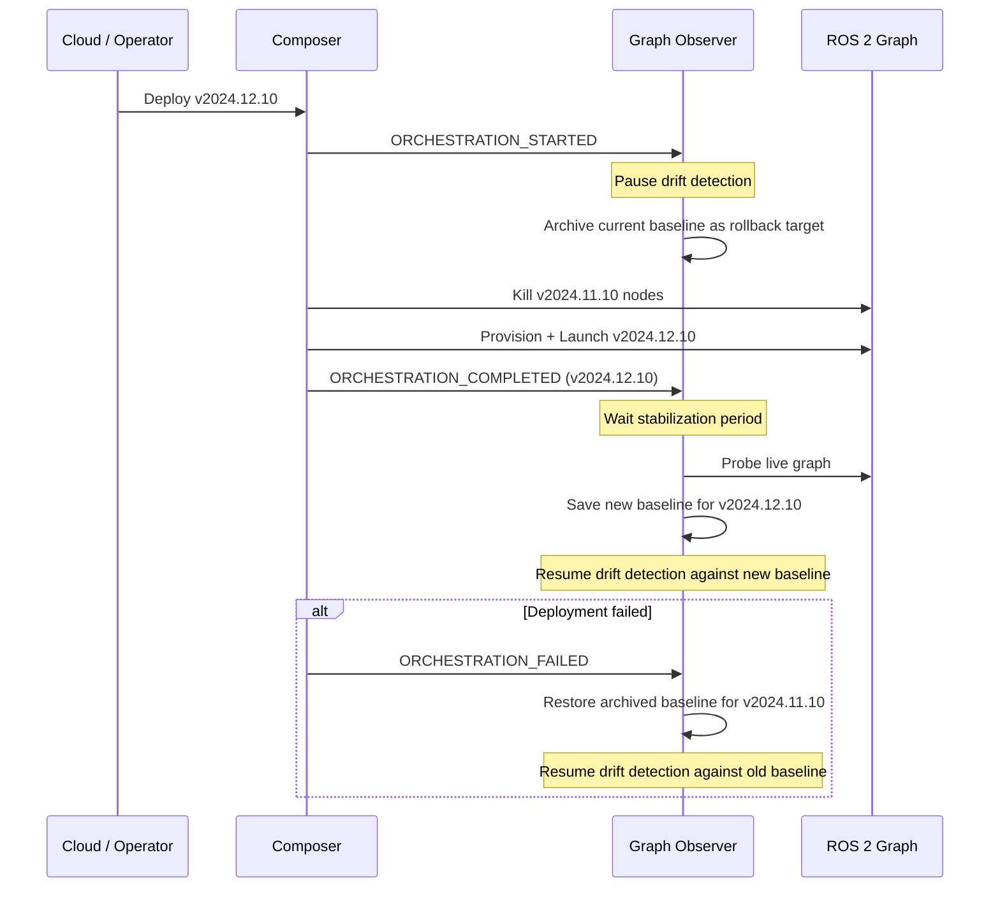

# MEP-0001: Live ROS Graph Orchestration

- **Author(s):** Ibrahim Sel \<ibrahim.sel\@eteration.com\>
- **Status:** Draft
- **Created:** 2026-02-13
- **Updated:** 2026-02-13

## Summary

Extend Eclipse Muto from a one-shot stack deployment system into a continuous graph reconciliation orchestrator. After deployment, Muto will continuously observe the live ROS 2 computational graph, compare it against the declared desired state from the stack manifest, detect drift, and take corrective action. A complete external observability API allows dashboards and third-party tools to subscribe to real-time graph state over standard ROS 2 topics.

The observation loop runs in a new C++ package &mdash; **Muto Daemon** (`muto_daemon`) &mdash; built with rclcpp for deterministic timing on edge devices. Reconciliation decisions remain in the Python-based Composer. The two processes communicate exclusively via ROS topics and services.

This MEP also renames the existing stack content types for clarity, introduces a new `stack/native` type for locally-installed software, defines a "learn from deployment" strategy for resolving desired state from complex launch hierarchies, and introduces node criticality classification for safety-aware reconciliation.

## Motivation

Today, the Muto deployment lifecycle is purely one-shot:

1. Composer receives a `MutoAction`, classifies the stack type, and determines the execution path.
2. The pipeline engine runs compose &rarr; provision &rarr; launch.
3. Stack handlers (`JsonStackHandler`, `ArchiveStackHandler`, `DittoStackHandler`) create `Ros2LaunchParent` instances or shell processes.
4. **After this point, Muto has no visibility into what is actually running.**

This means:

- If a ROS node crashes independently (not the entire process group), Muto may not know.
- There is no comparison between what the manifest declares and what is actually running.
- Dashboards and external tools have no way to visualize the live graph state.
- The only corrective mechanism is full-stack rollback on process crash, with no ability to restart individual nodes.
- Complex software like [Autoware](https://autoware.org/) cannot practically be described node-by-node in a JSON manifest, yet there is no stack type that supports launching locally-installed software with automatic graph tracking.

The existing infrastructure already contains the building blocks needed:

| Existing Component | What it Provides | Current Limitation |
|---|---|---|
| `Stack.get_active_nodes()` | rclpy query for live nodes | Not used after deployment |
| `NodeCommands` (Agent) | Full rclpy graph introspection API | Only on-demand via ROS services |
| `Stack.compare_nodes()` | Diff between two stack manifests | Never compares against live graph |
| `Stack.should_node_run()` | Checks if node is in active list | Only during stack switching |
| Process monitor | Detects shell process crashes | Full-stack rollback only, no individual restart |
| `StatePersistence` | Persists stack state for rollback | No graph state persistence |
| `TwinSynchronizer` | Syncs state to digital twin (Ditto) | No graph state sync |

This MEP closes these gaps by adding a continuous observation and reconciliation loop, new message types for graph state, and a complete external observability API.

## Design

### Stack Type Taxonomy

The current stack content types (`stack/json`, `stack/archive`, `stack/ditto`) are renamed for clarity. A new `stack/native` type is introduced for locally-installed software.

#### Rename Mapping

| Current | Proposed | Rationale |
|---|---|---|
| `stack/json` | `stack/declarative` | Nodes are explicitly declared inline in the manifest. The name describes *what* the manifest contains, not its serialization format. |
| `stack/archive` | `stack/workspace` | A self-contained ROS workspace artifact that is downloaded, extracted, built, and launched. Describes the *content*, not the packaging. |
| `stack/ditto` | `stack/legacy` | Backward-compatible format for older Ditto-style stacks. Marked as deprecated. |
| *(new)* | `stack/native` | Launches locally-installed software via an existing launch file. No provisioning, no inline node declarations &mdash; just a path to a launch file and arguments. |

The old content type strings remain accepted for backward compatibility. The stack handler registry resolves both old and new names to the same handler.

#### `stack/declarative` (formerly `stack/json`)

Nodes and composable nodes are explicitly declared inline in the manifest. Best for lightweight stacks where the operator has full control over the node list.

```json
{
  "metadata": {
    "name": "talker-listener-demo",
    "content_type": "stack/declarative",
    "version": "1.0.0"
  },
  "launch": {
    "node": [
      {
        "name": "talker",
        "pkg": "demo_nodes_cpp",
        "exec": "talker",
        "namespace": "/demo",
        "output": "screen",
        "param": [
          {"name": "frequency", "value": "2.0"}
        ]
      },
      {
        "name": "listener",
        "pkg": "demo_nodes_cpp",
        "exec": "listener",
        "namespace": "/demo",
        "output": "screen"
      }
    ]
  }
}
```

**Desired state resolution:** Nodes are extracted directly from `manifest["launch"]` using `Stack.flatten_nodes()` and `Stack.flatten_composable()`. This is deterministic &mdash; the manifest *is* the desired state.

#### `stack/workspace` (formerly `stack/archive`)

A complete ROS workspace distributed as a compressed artifact. Muto downloads the archive, extracts it, runs `colcon build`, and launches the specified launch file. Best for distributing self-contained applications that need to be built on the target device.

```json
{
  "metadata": {
    "name": "autoware-perception",
    "content_type": "stack/workspace",
    "version": "2024.11.0"
  },
  "artifact": {
    "url": "https://artifacts.example.com/autoware-perception-v2024.11.0.tar.gz",
    "checksum": "sha256:a1b2c3d4e5f6...",
    "flatten": true
  },
  "launch": {
    "file": "autoware_launch/launch/perception.launch.xml",
    "args": {
      "vehicle_model": "sample_vehicle",
      "sensor_model": "sample_sensor_kit",
      "pointcloud_container_name": "pointcloud_container"
    }
  },
  "properties": {
    "ignored_packages": ["autoware_testing", "autoware_lint_common"]
  }
}
```

**Desired state resolution:** Complex launch files (like Autoware's deeply nested includes with conditional logic) cannot be fully resolved by static analysis. This type uses the **learn from deployment** strategy: after the first successful launch, the Graph Observer probes the live graph and snapshots it as the desired state baseline. See [Learn from Deployment](#learn-from-deployment-strategy).

#### `stack/native`

Launches locally-installed software via an existing launch file on the device. No archive download, no workspace build &mdash; the software is already installed (e.g., via `apt`, `colcon build` on the device, or a container mount). Best for large software suites like Autoware or Navigation2 that are pre-installed on the target platform.

```json
{
  "metadata": {
    "name": "autoware-full-stack",
    "content_type": "stack/native",
    "version": "2024.11.0"
  },
  "launch": {
    "file": "/opt/autoware/share/autoware_launch/launch/autoware.launch.xml",
    "args": {
      "map_path": "/data/maps/sample_map",
      "vehicle_model": "sample_vehicle",
      "sensor_model": "sample_sensor_kit"
    }
  },
  "source": {
    "setup_files": [
      "/opt/autoware/setup.bash"
    ]
  }
}
```

**Desired state resolution:** Like `stack/workspace`, this type uses the **learn from deployment** strategy. Writing a node-by-node manifest for a system like Autoware (50+ nodes with conditional includes) would be impractical. Instead, the live graph after first successful launch becomes the desired state baseline.

**Handler implementation:** A new `NativeStackHandler` extends the existing handler pattern:
- `can_handle()` &mdash; matches `content_type == "stack/native"`
- `PROVISION` &mdash; validates that the launch file exists on disk, sources setup files
- `START` &mdash; launches via `ros2 launch` (reuses `LaunchPlugin._launch_via_ros2()`)
- `KILL` &mdash; terminates the launch process
- `APPLY` &mdash; kill then start

#### `stack/legacy` (formerly `stack/ditto`)

Backward-compatible format for older Ditto-style stacks. Supports script-based stacks (`on_start`/`on_kill`) and inline node arrays without explicit `content_type`.

```json
{
  "name": "legacy-gap-follower",
  "stackId": "org.eclipse.muto.sandbox:gap-follower-01",
  "on_start": "ros2 launch gap_follower gap_follower.launch.py",
  "on_kill": "pkill -f gap_follower"
}
```

**Desired state resolution:** For stacks with `node`/`composable` arrays, uses `Stack.flatten_nodes()`. For script-based stacks (`on_start`/`on_kill`), the desired state is opaque &mdash; only process-level health monitoring is possible.

:::note
`stack/legacy` is deprecated. New stacks should use `stack/declarative`, `stack/workspace`, or `stack/native`.
:::

### Learn from Deployment Strategy

For `stack/workspace` and `stack/native` types, the desired state cannot always be determined statically from the manifest. Complex launch files may contain:

- Conditional includes based on arguments or environment variables
- Deeply nested launch hierarchies (Autoware has 10+ levels of includes)
- Dynamic node composition based on runtime configuration
- Python launch files with arbitrary logic

Instead of requiring operators to enumerate every expected node, Muto uses a **learn from deployment** approach:

1. After `ORCHESTRATION_COMPLETED` fires, the Graph Observer waits for a configurable **stabilization period** (default: 15 seconds) to allow all nodes to finish starting.
2. The `ActualStateProber` probes the live graph and captures a full `GraphSnapshot`.
3. This snapshot is saved as the **desired state baseline** at `~/.muto/state/_active/graph_desired.json`.
4. All subsequent drift detection compares the live graph against this learned baseline.
5. If the stack is redeployed (same manifest), the baseline is re-learned after the new deployment succeeds.



The stabilization period is configurable via the `graph_observer_stabilization_sec` ROS parameter (default: 15.0). For `stack/declarative` stacks where the desired state is known from the manifest, the stabilization period is skipped.

### Daemon Architecture

The graph observation subsystem is split across two processes &mdash; a C++ **Daemon** for the latency-sensitive observation loop, and the existing Python **Composer** for reconciliation decisions.

#### Why C++ for Observation

The observation loop runs every 5 seconds on edge devices that control physical systems. Python's Global Interpreter Lock (GIL) and garbage collector introduce unpredictable latency spikes that are unacceptable in this context:

- **No GC pauses.** A garbage collection cycle during a probe can delay drift detection by tens of milliseconds. C++ provides deterministic timing with no stop-the-world events.
- **rclcpp supports real-time executors.** If a deployment requires the observer on a real-time thread alongside RT workload nodes (e.g., for sub-second drift detection), rclcpp's `StaticSingleThreadedExecutor` with a pre-allocated memory pool can be used. rclpy has no equivalent.
- **Lower resource footprint.** On constrained devices (Jetson Nano, Raspberry Pi), a C++ node uses significantly less memory than a Python interpreter + rclpy runtime &mdash; critical when the observer shares a device with a 50-node Autoware stack.
- **No interpreter startup cost.** The Daemon is a compiled binary. Cold start is < 100ms vs. 1-2 seconds for a Python node with imports.

#### Responsibility Split

| Component | Language | Package | Responsibility |
|---|---|---|---|
| **Muto Daemon** | C++ / rclcpp | `muto_daemon` | **Hot path:** probe graph, load desired state, compute drift, publish snapshots/events/drift, serve `GetGraphState`, sync to Ditto twin. |
| **Muto Composer** | Python / rclpy | `muto_composer` | **Cold path:** subscribe to drift events, evaluate reconciliation policy (criticality, retries, cooldowns), execute corrective actions (launch/kill nodes, param set), serve `ReconcileNow`. |



The Daemon communicates with the Composer exclusively through ROS topics and services &mdash; no shared memory, no Python bindings, no EventBus coupling. This means:

- The Daemon can be deployed independently (e.g., on a device that uses a non-Muto launch system but still wants graph monitoring).
- The Daemon can be upgraded or restarted without affecting the Composer or the managed stack.
- The Composer subscribes to `/muto/graph_drift` and receives drift notifications the same way any external tool would.

#### `muto_daemon` Package Structure

```
muto_daemon/
├── CMakeLists.txt
├── package.xml
├── include/
│   └── muto_daemon/
│       ├── actual_state_prober.hpp
│       ├── desired_state_resolver.hpp
│       ├── drift_detector.hpp
│       ├── graph_state_publisher.hpp
│       └── muto_daemon_node.hpp
├── src/
│   ├── actual_state_prober.cpp
│   ├── desired_state_resolver.cpp
│   ├── drift_detector.cpp
│   ├── graph_state_publisher.cpp
│   ├── muto_daemon_node.cpp
│   └── main.cpp
└── test/
    ├── test_drift_detector.cpp
    └── test_desired_state_resolver.cpp
```

**Dependencies:** `rclcpp`, `muto_msgs`, `std_msgs`, `nlohmann_json` (for desired state file parsing and JSON topic serialization). No Python dependency.

#### Daemon ROS Interface

The Daemon node (`muto_daemon`) exposes:

**Published topics (owned by Daemon):**
- `/muto/graph_state` &mdash; `muto_msgs/GraphSnapshot`
- `/muto/graph_events` &mdash; `muto_msgs/GraphEvent`
- `/muto/graph_drift` &mdash; `muto_msgs/GraphDrift`
- `/muto/graph_state_json` &mdash; `std_msgs/String`

**Services (owned by Daemon):**
- `/muto/get_graph_state` &mdash; `muto_msgs/GetGraphState`

**Subscribed topics (from Composer):**
- `/muto/daemon/desired_state` &mdash; `std_msgs/String` (JSON-encoded desired state, published by Composer after deployment or baseline learning)

**Services (owned by Composer):**
- `/muto/reconcile_now` &mdash; `muto_msgs/ReconcileNow` (stays in Composer since reconciliation requires launch infrastructure)

#### Desired State Flow

The Composer owns desired state resolution (it has access to manifests, `StatePersistence`, `Traverser`, and the learned baseline). After resolving the desired state, it publishes the node list to `/muto/daemon/desired_state` as a JSON-encoded `std_msgs/String`. The Daemon caches this and uses it for drift comparison.



The Daemon also persists the received desired state to `~/.muto/state/_active/graph_desired.json` so it can recover after a restart without waiting for the Composer to re-publish.

### Overview

The system is split across two processes with five core components:

**In `muto_daemon` (C++):**
1. **Actual State Prober** &mdash; Periodically queries the live ROS 2 graph using rclcpp APIs (`get_node_names_and_namespaces()`, `get_publishers_info_by_topic()`, etc.).
2. **Desired State Resolver** &mdash; Caches the desired node list received from the Composer via `/muto/daemon/desired_state`.
3. **Drift Detector** &mdash; Compares desired vs. actual and produces a `GraphDrift`.
4. **Graph State Publisher** &mdash; Publishes snapshots, events, drift, and JSON state to ROS topics. Serves `GetGraphState`.

**In `muto_composer` (Python):**
5. **Reconciliation Engine** &mdash; Subscribes to `/muto/graph_drift`, evaluates criticality and policy, executes corrective actions via `Ros2LaunchParent`. Serves `ReconcileNow`.

### Detailed Design

#### 1. Graph State Model

##### New Message Types (`muto_msgs`)

**`msg/NodeState.msg`** &mdash; Represents a single ROS node:

```
string name
string namespace
string fully_qualified_name
string package_name
string executable
string status
string[] publisher_topics
string[] subscriber_topics
string[] service_names
bool managed_by_muto
```

The `status` field uses the values: `running`, `missing`, `unexpected`, `crashed`.

**`msg/GraphDrift.msg`** &mdash; Diff between desired and actual:

```
string[] missing_nodes
string[] unexpected_nodes
string[] parameter_drifts
builtin_interfaces/Time timestamp
```

**`msg/GraphSnapshot.msg`** &mdash; Complete graph state:

```
builtin_interfaces/Time timestamp
string stack_name
string stack_id
string status
NodeState[] desired_nodes
NodeState[] actual_nodes
GraphDrift drift
```

The `status` field uses: `converged`, `drifted`, `reconciling`, `safety_degraded`, `unknown`.

**`msg/GraphEvent.msg`** &mdash; Published only when state changes:

```
builtin_interfaces/Time timestamp
string event_type
string stack_name
string node_name
string node_namespace
string details
```

Event types: `node_appeared`, `node_disappeared`, `node_crashed`, `safety_node_lost`, `drift_detected`, `drift_resolved`, `reconciliation_started`, `reconciliation_completed`.

##### New Service Types

**`srv/GetGraphState.srv`** &mdash; On-demand graph query:

```
string stack_name
---
GraphSnapshot snapshot
bool success
string error_message
```

**`srv/ReconcileNow.srv`** &mdash; Force reconciliation:

```
string stack_name
bool dry_run
---
GraphDrift detected_drift
string[] actions_taken
bool success
string error_message
```

#### 2. Daemon Probe Cycle

The `muto_daemon` node runs the observation loop as a `rclcpp::TimerBase` callback (every 5 seconds, configurable).

**Probe cycle:**

1. `ActualStateProber::probe()` &mdash; Calls `get_node_names_and_namespaces()` via the Daemon's own rclcpp node handle, then enriches each discovered node with publisher/subscriber/service information via `get_publishers_info_by_topic()` and `get_service_names_and_types_by_node()`. This mirrors the approach in `NodeCommands.get_discovered_nodes()` and `get_node_info()` from the Agent, but uses rclcpp instead of rclpy and runs on a dedicated C++ timer.

2. `DesiredStateResolver::get_desired()` &mdash; Returns the cached desired state received from the Composer via `/muto/daemon/desired_state`. Falls back to the persisted `graph_desired.json` if the Composer has not yet published.

3. `DriftDetector::detect()` &mdash; Computes set differences between desired and actual node fully-qualified names. System nodes (`rosout`, `parameter_events`, `_daemon`, etc.) are filtered out.

4. `GraphStatePublisher::publish()` &mdash; Always publishes the full `GraphSnapshot` to `/muto/graph_state`. If drift is detected, publishes to `/muto/graph_drift` (which the Composer's `ReconciliationEngine` subscribes to). If state changed since last cycle, publishes `GraphEvent` entries to `/muto/graph_events`.

**Out-of-cycle triggers:**
- `GetGraphState` service call &mdash; On-demand probe triggered by any client.
- The Daemon does not subscribe to `ORCHESTRATION_*` EventBus events directly (those are Python-internal). Instead, the Composer signals the Daemon by publishing to `/muto/daemon/desired_state` with a special `"paused": true` field during version transitions, and a new desired state when the transition completes.

#### Composer-Side Integration

The Composer integrates with the Daemon through a new `GraphReconciliationManager` initialized in `MutoComposer._initialize_subsystems()`:

- Subscribes to `/muto/graph_drift` &mdash; receives drift notifications from the Daemon.
- Publishes to `/muto/daemon/desired_state` &mdash; sends resolved desired state after deployment.
- Serves `/muto/reconcile_now` &mdash; triggers corrective actions using `Ros2LaunchParent`.
- Listens to `ORCHESTRATION_STARTED` / `ORCHESTRATION_COMPLETED` / `ORCHESTRATION_FAILED` on the EventBus to coordinate desired state updates and pause/resume signals to the Daemon.

#### 3. Desired State Source of Truth

The desired state is resolved differently depending on stack type:

| Stack Type | Resolution Strategy | Source |
|---|---|---|
| `stack/declarative` | **Manifest extraction** | `Stack(manifest).flatten_nodes([])` + `flatten_composable([])` from `manifest["launch"]` |
| `stack/workspace` | **Learn from deployment** | Live graph snapshot after first successful launch + stabilization period |
| `stack/native` | **Learn from deployment** | Live graph snapshot after first successful launch + stabilization period |
| `stack/legacy` (with nodes) | **Manifest extraction** | `Stack(manifest).flatten_nodes([])` from `manifest["node"]` + `manifest["composable"]` |
| `stack/legacy` (script-based) | **Process-level only** | Opaque; only process exit code monitoring |

The resolved desired state is persisted at `~/.muto/state/_active/graph_desired.json`. This serves as the source of truth for drift detection and survives Composer restarts.

For `stack/workspace` and `stack/native`, the `Traverser.recursively_extract_entities()` is attempted first as a best-effort static analysis. If the traverser produces results, they are used as the initial desired state. If static analysis fails or produces an incomplete result (fewer nodes than actually running), the learn-from-deployment snapshot takes precedence.

#### 4. Reconciliation Loop

When drift is detected, the `ReconciliationEngine` evaluates severity and selects a response:

| Drift Type | Node Criticality | Action |
|---|---|---|
| Single node missing | `standard` | Restart individual node via `Ros2LaunchParent.create_launch_description_for_added_nodes()` |
| Single node missing | `mission` | Restart with caution (respect cooldown, limit retries, notify operator) |
| Single node missing | `safety` | **Do NOT restart.** Emit `safety_node_lost` alert. Enter `safety_degraded` status. |
| Multiple nodes missing (&gt;50%) | any | Full stack redeploy via `StackRequestEvent` |
| All nodes missing | any | Full stack redeploy |
| Unexpected node appeared | any | Log warning, no action (may be external) |
| Parameter drift | `standard` / `mission` | `Stack.change_params_at_runtime()` (uses `ros2 param set`) |
| Parameter drift | `safety` | **Do NOT modify.** Emit alert only. |

**Stack-type-specific behavior:**

- **`stack/declarative`**: Individual node restart is straightforward because the full `Node(package=..., executable=..., ...)` definition is in the manifest.
- **`stack/workspace` / `stack/native`**: Individual node restart requires knowing the node's package and executable, which may not be in the manifest. If the learned baseline includes this information (from rclpy introspection), restart is attempted. Otherwise, the reconciliation engine escalates to full relaunch of the launch file.
- **`stack/legacy`**: For script-based stacks, reconciliation is limited to re-running the `on_start` script.

**Configurable policy (ROS parameters):**

| Parameter | Default | Description |
|---|---|---|
| `reconciliation_enabled` | `true` | Master switch |
| `reconciliation_mode` | `"auto"` | `auto` / `notify_only` / `disabled` |
| `graph_observer_interval` | `5.0` | Seconds between probes |
| `graph_observer_stabilization_sec` | `15.0` | Seconds to wait after deployment before learning desired state |
| `reconciliation_max_retries` | `3` | Max restart attempts per node before escalating |
| `reconciliation_cooldown_sec` | `30.0` | Minimum time between reconciliation attempts |

In `notify_only` mode, drift is detected and published but no corrective action is taken. This is useful for monitoring-only deployments and initial rollout.

**Interaction with existing rollback:** Reconciliation is distinct from rollback. Rollback restores the *previous* stack when a deployment *fails*. Reconciliation corrects drift in a *running* stack. If reconciliation exhausts its retries, it emits `RECONCILIATION_FAILED`, which `DeploymentOrchestrator` can handle to trigger rollback.

#### 5. Stack Version Transitions

When a new stack version arrives (e.g., Autoware `2024.11.10` &rarr; `2024.12.10`), the Graph Observer must coordinate with the deployment pipeline to avoid false drift alerts and ensure the desired state baseline is updated correctly.

**Transition lifecycle:**



**Key behaviors during version transitions:**

1. **Drift detection pauses** between `ORCHESTRATION_STARTED` and `ORCHESTRATION_COMPLETED` (or `ORCHESTRATION_FAILED`). During this window, nodes are being killed and replaced &mdash; reporting drift would be noise.

2. **Baseline archival.** Before the new deployment begins, the current desired state baseline is archived alongside the stack state in `StatePersistence`. If the new version fails and rollback occurs, the archived baseline is restored so drift detection resumes against the correct (previous) version.

3. **Re-learning.** For `stack/workspace` and `stack/native`, the baseline is always re-learned after a version transition, even if the manifest structure hasn't changed. Different versions may spawn different nodes (new features, removed modules, renamed components).

4. **Version tracking.** The `GraphSnapshot` includes the `stack_id` field which carries the version. External tools can observe version transitions in real time:

```json
{
  "stack_name": "autoware-full-stack",
  "stack_id": "org.eclipse.muto.fleet:autoware-v2024.12.10",
  "status": "converged"
}
```

5. **Fleet-wide version transitions.** When updating a fleet, each device transitions independently. The Ditto digital twin reflects per-device version and graph status, enabling operators to monitor rollout progress:

```
GET /api/2/search/things?filter=eq(features/graph/properties/stack_id,"org.eclipse.muto.fleet:autoware-v2024.12.10")
```

This returns all devices that have successfully transitioned to the new version.

#### 6. Real-Time and Safety Constraints

Eclipse Muto targets edge devices that control physical systems &mdash; autonomous vehicles, industrial robots, drones. A crashed perception node on a moving vehicle has real-life consequences. The Graph Observer and Reconciliation Engine must be designed with these constraints in mind.

##### Node Criticality Classification

Not all nodes are equal. The manifest can optionally classify nodes by criticality level:

| Level | Description | Reconciliation Policy | Example Nodes |
|---|---|---|---|
| `safety` | Failure has immediate physical safety consequences | **Never auto-restart.** Emit alert only. Operator or safety system must intervene. | Emergency stop, braking controller, collision avoidance |
| `mission` | Failure degrades core mission capability | **Auto-restart with caution.** Respect cooldown, limit retries, notify operator. | Perception pipeline, localization, path planner |
| `standard` | Failure affects non-critical functionality | **Auto-restart freely.** Default behavior with retry limits. | Telemetry, logging, diagnostics, visualization |

For `stack/declarative` manifests, criticality is declared per-node:

```json
{
  "node": [
    {
      "name": "emergency_stop",
      "pkg": "safety_controller",
      "exec": "emergency_stop_node",
      "criticality": "safety"
    },
    {
      "name": "lidar_processor",
      "pkg": "perception",
      "exec": "lidar_node",
      "criticality": "mission"
    },
    {
      "name": "rviz_bridge",
      "pkg": "visualization",
      "exec": "rviz_bridge_node",
      "criticality": "standard"
    }
  ]
}
```

For `stack/workspace` and `stack/native` (where nodes are not declared inline), criticality can be specified as a node-name-to-level mapping in the manifest:

```json
{
  "metadata": {
    "name": "autoware-full-stack",
    "content_type": "stack/native"
  },
  "criticality_map": {
    "/vehicle/emergency_stop": "safety",
    "/vehicle/brake_controller": "safety",
    "/perception/*": "mission",
    "/planning/*": "mission",
    "/visualization/*": "standard"
  }
}
```

Glob patterns in `criticality_map` keys match against fully-qualified node names. Nodes not matching any pattern default to `standard`.

##### Safety-Critical Node Failure Response

When a `safety`-level node disappears from the graph:

1. The `ReconciliationEngine` does **NOT** attempt to restart it.
2. A `GRAPH_DRIFT_DETECTED` event is emitted with `severity: "safety"`.
3. A `GraphEvent` with `event_type: "safety_node_lost"` is published to `/muto/graph_events`.
4. The graph status changes to `"safety_degraded"` (a new status alongside `converged`, `drifted`, `reconciling`, `unknown`).
5. The Ditto twin is updated immediately so cloud-side safety monitoring systems can trigger alerts or an emergency response.

The rationale: blindly restarting a braking controller or emergency stop node mid-operation could cause transient unsafe states (initialization delay, stale sensor data, uncalibrated actuators). Safety-critical recovery requires domain-specific procedures that are beyond the scope of a generic reconciliation engine.

##### Resource Budget on Edge Devices

The Daemon runs on the same device as the managed ROS stack. It must not degrade the performance of the workload it monitors. Implementing the observation loop in C++ minimizes the Daemon's footprint.

**CPU impact:** Each probe cycle calls `get_node_names_and_namespaces()` and per-node topic/service introspection via rclcpp. These are DDS discovery queries resolved locally. Expected overhead on a Jetson AGX Orin with 50 active nodes: **< 2ms per probe cycle** (vs. ~5ms with rclpy due to Python overhead and GIL contention). At the default 5-second interval, this is < 0.04% CPU utilization.

**Memory impact:** The compiled `muto_daemon` binary with rclcpp runtime uses approximately **8-12 MB RSS** (vs. 30-50 MB for a Python interpreter + rclpy). The `GraphSnapshot` for a 50-node graph is approximately 15 KB serialized. With one snapshot cached (desired baseline) plus one current snapshot, the data overhead is **< 50 KB**.

**Process model:** The Daemon runs as a separate OS process from the Composer. This provides fault isolation &mdash; a Composer crash does not stop graph observation, and a Daemon crash does not affect the managed stack or reconciliation state. The probe runs on a `rclcpp::TimerBase` callback in the Daemon's single-threaded executor. It does **not** create additional threads. It does **not** hold locks during introspection. It does **not** use real-time priority by default &mdash; the Daemon operates at normal scheduler priority and yields to any RT-scheduled workload nodes.

**Real-time executor option:** On systems that require tighter timing guarantees, the Daemon can be configured to use `rclcpp::executors::StaticSingleThreadedExecutor` with a pre-allocated memory pool, pinned to a specific CPU core via `taskset`. This is not the default but is available for deployments where drift detection latency is critical.

**Configurable overhead:** On extremely constrained devices, operators can:
- Increase `graph_observer_interval` to reduce probe frequency (e.g., 30 seconds)
- Set `reconciliation_mode` to `"disabled"` to skip comparison logic entirely
- Set `reconciliation_enabled` to `false` to disable the entire subsystem
- Omit `muto_daemon` from the launch entirely to run without graph observation

##### Timing Guarantees and Limitations

The Graph Observer provides **best-effort** drift detection, not hard real-time guarantees:

- **Detection latency:** A crashed node is detected within one probe interval (default 5 seconds) plus any processing time. This is **not** suitable for safety-critical fault detection where sub-millisecond response is required.
- **Safety-critical fault detection** should be handled by dedicated real-time watchdog mechanisms at the ROS or middleware layer (e.g., DDS liveliness QoS, hardware watchdog timers), not by the Graph Observer.
- The Graph Observer complements &mdash; not replaces &mdash; real-time safety monitoring. Its role is operational visibility and recovery of non-safety-critical nodes.

#### 8. New EventBus Event Types

Added to the `EventType` enum in `events.py`:

```python
# Graph Observation Events
GRAPH_STATE_UPDATED = "graph.state.updated"
GRAPH_DRIFT_DETECTED = "graph.drift.detected"
GRAPH_DRIFT_RESOLVED = "graph.drift.resolved"

# Reconciliation Events
RECONCILIATION_STARTED = "reconciliation.started"
RECONCILIATION_ACTION_TAKEN = "reconciliation.action.taken"
RECONCILIATION_COMPLETED = "reconciliation.completed"
RECONCILIATION_FAILED = "reconciliation.failed"

# Node Lifecycle Events
NODE_APPEARED = "node.appeared"
NODE_DISAPPEARED = "node.disappeared"
NODE_RESTARTED = "node.restarted"
```

#### 9. External Observability API

##### ROS Topics

| Topic | Message Type | QoS | Description |
|---|---|---|---|
| `/muto/graph_state` | `muto_msgs/GraphSnapshot` | Reliable, Transient Local, depth=1 | Full snapshot every probe cycle. Late joiners get last snapshot immediately. |
| `/muto/graph_events` | `muto_msgs/GraphEvent` | Reliable, Keep Last 50 | Published only when state changes. Primary topic for event-driven UIs. |
| `/muto/graph_drift` | `muto_msgs/GraphDrift` | Reliable, Transient Local, depth=1 | Current drift status. Empty lists when converged. |
| `/muto/graph_state_json` | `std_msgs/String` | Reliable, Transient Local, depth=1 | JSON-stringified snapshot for web dashboard consumption. |

**QoS rationale:** Transient Local durability ensures a dashboard connecting after startup immediately receives the last known state. Keep Last 50 on events allows replaying recent history.

##### ROS Services

| Service | Type | Description |
|---|---|---|
| `/muto/get_graph_state` | `muto_msgs/GetGraphState` | On-demand full graph query. Triggers an immediate probe. |
| `/muto/reconcile_now` | `muto_msgs/ReconcileNow` | Force reconciliation. Supports `dry_run` for observing planned actions. |

##### JSON Format for Web Dashboards

The `/muto/graph_state_json` topic publishes a `std_msgs/String` with the following JSON schema:

```json
{
  "timestamp": "2026-02-13T10:30:00Z",
  "stack_name": "autoware-full-stack",
  "stack_id": "org.eclipse.muto.sandbox:autoware-01",
  "status": "converged",
  "desired_nodes": [
    {
      "name": "pointcloud_preprocessor",
      "namespace": "/perception",
      "fully_qualified_name": "/perception/pointcloud_preprocessor",
      "package_name": "pointcloud_preprocessor",
      "executable": "pointcloud_preprocessor_node",
      "status": "running",
      "publisher_topics": ["/perception/filtered_points"],
      "subscriber_topics": ["/sensing/lidar/points_raw"],
      "service_names": [],
      "managed_by_muto": true
    }
  ],
  "actual_nodes": [],
  "drift": {
    "missing_nodes": [],
    "unexpected_nodes": [],
    "parameter_drifts": [],
    "timestamp": "2026-02-13T10:30:00Z"
  }
}
```

##### Ditto Digital Twin Integration

The existing `TwinSynchronizer` is extended to subscribe to `GRAPH_STATE_UPDATED` events and sync graph state to the device's digital twin in Eclipse Ditto.

A new `graph` feature is added to the device registration:

```python
"features": {
    "context": {"properties": {}},
    "stack": {"properties": {}},
    "telemetry": {"properties": {}},
    "graph": {"properties": {}},  # NEW
}
```

Cloud-side tools can then:
- **HTTP GET** `GET /api/2/things/{thing_id}/features/graph/properties` to read the latest graph state.
- **WebSocket/SSE** Subscribe to Ditto change events to receive real-time graph updates.
- **Search** Query across all devices: `GET /api/2/search/things?filter=not(eq(features/graph/properties/status,"converged"))` to find devices with drift.

### Alternatives Considered

**Alternative 1: All-in-Composer Python observation.** The observation loop could run as a Python subsystem inside the Composer (using rclpy, as `NodeCommands` already does in the Agent). This was rejected because Python's GIL and garbage collector introduce unpredictable latency on edge devices. Splitting the observer into a C++ Daemon provides deterministic timing, lower memory footprint, fault isolation (Daemon crash doesn't affect Composer), and the option to use real-time executors on RT-capable platforms.

**Alternative 2: Agent-side observation.** The Agent already has rclpy graph introspection (`NodeCommands`). However, placing the observer in the Agent would require cross-node communication for reconciliation, since the Composer owns the launch lifecycle. The Daemon architecture achieves the same separation while keeping observation independent of both Agent and Composer.

**Alternative 3: ROS 2 lifecycle nodes.** Using managed (lifecycle) nodes would provide built-in state tracking. However, this requires all managed nodes to be lifecycle-aware, which is not a requirement we can impose on arbitrary stacks. The observer-based approach works with any ROS 2 node.

**Alternative 4: External monitoring tool.** Tools like `ros2 node list` could be scripted externally. This loses integration with state persistence, twin synchronization, and reconciliation. Deep integration provides a cohesive experience.

**Alternative 5: Require explicit node manifests for all stack types.** One could require operators to declare every expected node even for complex stacks. This was rejected because writing a 50+ node manifest for Autoware (with conditional nodes that vary by configuration) is impractical and error-prone. The learn-from-deployment approach captures the actual running configuration automatically.

## Compatibility

- **Backward compatibility:** Fully backward compatible. The old content type strings (`stack/json`, `stack/archive`, `stack/ditto`) remain accepted. The stack handler registry resolves both old and new names to the same handler. The Graph Observer is an additive subsystem. New topics and services are additions, not modifications to existing interfaces.
- **Migration path:** No migration needed. Existing stacks with old content types continue to work. Operators can adopt the new names at their own pace. The `notify_only` reconciliation mode allows gradual rollout of graph observation without corrective actions.

## Implementation Plan

### Phase 1: Stack Type Rename and Graph State Model
- Rename content types in handler `can_handle()` methods (accept both old and new names)
- Implement `NativeStackHandler` for `stack/native`
- New message types in `muto_msgs` (`NodeState`, `GraphSnapshot`, `GraphDrift`, `GraphEvent`, `GetGraphState`)
- New `muto_daemon` C++ package with `ActualStateProber`, `DesiredStateResolver`, `DriftDetector`, `GraphStatePublisher`
- Daemon timer-based probe cycle, publishing to `/muto/graph_state` and `/muto/graph_events`
- Composer-side `GraphReconciliationManager` for desired state publishing and Daemon coordination
- Learn-from-deployment strategy with stabilization period
- New `EventType` members: `GRAPH_STATE_UPDATED`, `GRAPH_DRIFT_DETECTED`
- Tests (C++ gtest for Daemon, Python pytest for Composer integration)

**Deliverable:** After deploying any stack type, the Daemon continuously publishes the live graph state. The `stack/native` type enables launching locally-installed software. External tools can subscribe and see desired vs. actual. No corrective action taken.

### Phase 2: Reconciliation Engine
- `ReconciliationEngine` in Composer, subscribing to `/muto/graph_drift` from Daemon
- Stack-type-aware reconciliation (declarative: precise restart, workspace/native: launch-file-level)
- Criticality-gated policy evaluation
- Reconciliation ROS parameters and `ReconcileNow` service (Composer-side)
- `RECONCILIATION_*` event types
- Tests

**Deliverable:** Muto detects node crashes within 5 seconds (via Daemon) and the Composer restarts them. Escalates to full redeploy after max retries.

### Phase 3: External Observability and Twin Integration
- `/muto/graph_state_json` topic for web dashboards (Daemon-side)
- `TwinSynchronizer` graph state sync to Ditto (Daemon publishes, Composer syncs to twin)
- `graph` feature in device twin registration
- Daemon state persistence for restart recovery
- Documentation pages

**Deliverable:** Cloud dashboards visualize live ROS graph state via Ditto or direct ROS topic subscription.

### Phase 4: Parameter Drift Detection (Optional)
- Extend Daemon's `ActualStateProber` to query node parameters via rclcpp
- Extend `DriftDetector` for parameter comparison
- Composer uses `Stack.change_params_at_runtime()` for correction

**Deliverable:** Muto detects and corrects runtime parameter drift.

## References

- [Eclipse Muto Composer Architecture](../../muto-edge/composer)
- [Eclipse Ditto Digital Twins](https://eclipse.dev/ditto)
- [ROS 2 rclpy Graph APIs](https://docs.ros2.org/latest/api/rclpy/api/node.html)
- [ROS 2 Quality of Service](https://docs.ros.org/en/humble/Concepts/About-Quality-of-Service-Settings.html)
- [Autoware](https://autoware.org/) &mdash; Reference complex ROS 2 stack
