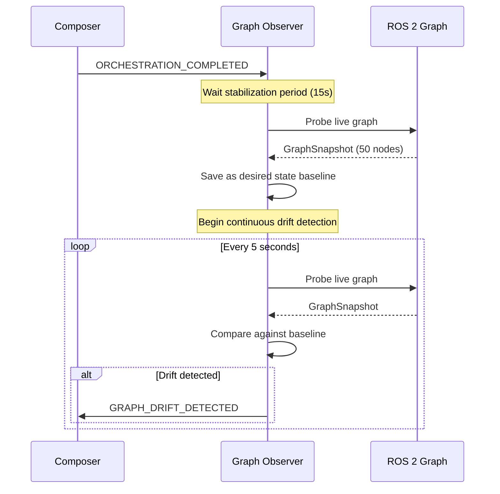
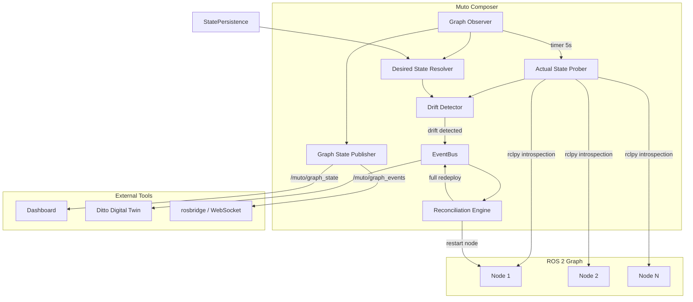

# MEP-0001: Live ROS Graph Orchestration

- **Author(s):** Ibrahim Sel \<ibrahim.sel\@eteration.com\>
- **Status:** Draft
- **Created:** 2026-02-13
- **Updated:** 2026-02-13

## Summary

Extend Eclipse Muto from a one-shot stack deployment system into a continuous graph reconciliation orchestrator. After deployment, Muto will continuously observe the live ROS 2 computational graph, compare it against the declared desired state from the stack manifest, detect drift, and take corrective action. A complete external observability API allows dashboards and third-party tools to subscribe to real-time graph state over standard ROS 2 topics.

This MEP also renames the existing stack content types for clarity, introduces a new `stack/native` type for locally-installed software, and defines a "learn from deployment" strategy for resolving desired state from complex launch hierarchies.

## Motivation

Today, the Muto deployment lifecycle is purely one-shot:

1. Composer receives a `MutoAction`, classifies the stack type, and determines the execution path.
2. The pipeline engine runs compose &rarr; provision &rarr; launch.
3. Stack handlers (`JsonStackHandler`, `ArchiveStackHandler`, `DittoStackHandler`) create `Ros2LaunchParent` instances or shell processes.
4. **After this point, Muto has no visibility into what is actually running.**

This means:

- If a ROS node crashes independently (not the entire process group), Muto may not know.
- There is no comparison between what the manifest declares and what is actually running.
- Dashboards and external tools have no way to visualize the live graph state.
- The only corrective mechanism is full-stack rollback on process crash, with no ability to restart individual nodes.
- Complex software like [Autoware](https://autoware.org/) cannot practically be described node-by-node in a JSON manifest, yet there is no stack type that supports launching locally-installed software with automatic graph tracking.

The existing infrastructure already contains the building blocks needed:

| Existing Component | What it Provides | Current Limitation |
|---|---|---|
| `Stack.get_active_nodes()` | rclpy query for live nodes | Not used after deployment |
| `NodeCommands` (Agent) | Full rclpy graph introspection API | Only on-demand via ROS services |
| `Stack.compare_nodes()` | Diff between two stack manifests | Never compares against live graph |
| `Stack.should_node_run()` | Checks if node is in active list | Only during stack switching |
| Process monitor | Detects shell process crashes | Full-stack rollback only, no individual restart |
| `StatePersistence` | Persists stack state for rollback | No graph state persistence |
| `TwinSynchronizer` | Syncs state to digital twin (Ditto) | No graph state sync |

This MEP closes these gaps by adding a continuous observation and reconciliation loop, new message types for graph state, and a complete external observability API.

## Design

### Stack Type Taxonomy

The current stack content types (`stack/json`, `stack/archive`, `stack/ditto`) are renamed for clarity. A new `stack/native` type is introduced for locally-installed software.

#### Rename Mapping

| Current | Proposed | Rationale |
|---|---|---|
| `stack/json` | `stack/declarative` | Nodes are explicitly declared inline in the manifest. The name describes *what* the manifest contains, not its serialization format. |
| `stack/archive` | `stack/workspace` | A self-contained ROS workspace artifact that is downloaded, extracted, built, and launched. Describes the *content*, not the packaging. |
| `stack/ditto` | `stack/legacy` | Backward-compatible format for older Ditto-style stacks. Marked as deprecated. |
| *(new)* | `stack/native` | Launches locally-installed software via an existing launch file. No provisioning, no inline node declarations &mdash; just a path to a launch file and arguments. |

The old content type strings remain accepted for backward compatibility. The stack handler registry resolves both old and new names to the same handler.

#### `stack/declarative` (formerly `stack/json`)

Nodes and composable nodes are explicitly declared inline in the manifest. Best for lightweight stacks where the operator has full control over the node list.

```json
{
  "metadata": {
    "name": "talker-listener-demo",
    "content_type": "stack/declarative",
    "version": "1.0.0"
  },
  "launch": {
    "node": [
      {
        "name": "talker",
        "pkg": "demo_nodes_cpp",
        "exec": "talker",
        "namespace": "/demo",
        "output": "screen",
        "param": [
          {"name": "frequency", "value": "2.0"}
        ]
      },
      {
        "name": "listener",
        "pkg": "demo_nodes_cpp",
        "exec": "listener",
        "namespace": "/demo",
        "output": "screen"
      }
    ]
  }
}
```

**Desired state resolution:** Nodes are extracted directly from `manifest["launch"]` using `Stack.flatten_nodes()` and `Stack.flatten_composable()`. This is deterministic &mdash; the manifest *is* the desired state.

#### `stack/workspace` (formerly `stack/archive`)

A complete ROS workspace distributed as a compressed artifact. Muto downloads the archive, extracts it, runs `colcon build`, and launches the specified launch file. Best for distributing self-contained applications that need to be built on the target device.

```json
{
  "metadata": {
    "name": "autoware-perception",
    "content_type": "stack/workspace",
    "version": "2024.11.0"
  },
  "artifact": {
    "url": "https://artifacts.example.com/autoware-perception-v2024.11.0.tar.gz",
    "checksum": "sha256:a1b2c3d4e5f6...",
    "flatten": true
  },
  "launch": {
    "file": "autoware_launch/launch/perception.launch.xml",
    "args": {
      "vehicle_model": "sample_vehicle",
      "sensor_model": "sample_sensor_kit",
      "pointcloud_container_name": "pointcloud_container"
    }
  },
  "properties": {
    "ignored_packages": ["autoware_testing", "autoware_lint_common"]
  }
}
```

**Desired state resolution:** Complex launch files (like Autoware's deeply nested includes with conditional logic) cannot be fully resolved by static analysis. This type uses the **learn from deployment** strategy: after the first successful launch, the Graph Observer probes the live graph and snapshots it as the desired state baseline. See [Learn from Deployment](#learn-from-deployment-strategy).

#### `stack/native`

Launches locally-installed software via an existing launch file on the device. No archive download, no workspace build &mdash; the software is already installed (e.g., via `apt`, `colcon build` on the device, or a container mount). Best for large software suites like Autoware or Navigation2 that are pre-installed on the target platform.

```json
{
  "metadata": {
    "name": "autoware-full-stack",
    "content_type": "stack/native",
    "version": "2024.11.0"
  },
  "launch": {
    "file": "/opt/autoware/share/autoware_launch/launch/autoware.launch.xml",
    "args": {
      "map_path": "/data/maps/sample_map",
      "vehicle_model": "sample_vehicle",
      "sensor_model": "sample_sensor_kit"
    }
  },
  "source": {
    "setup_files": [
      "/opt/autoware/setup.bash"
    ]
  }
}
```

**Desired state resolution:** Like `stack/workspace`, this type uses the **learn from deployment** strategy. Writing a node-by-node manifest for a system like Autoware (50+ nodes with conditional includes) would be impractical. Instead, the live graph after first successful launch becomes the desired state baseline.

**Handler implementation:** A new `NativeStackHandler` extends the existing handler pattern:
- `can_handle()` &mdash; matches `content_type == "stack/native"`
- `PROVISION` &mdash; validates that the launch file exists on disk, sources setup files
- `START` &mdash; launches via `ros2 launch` (reuses `LaunchPlugin._launch_via_ros2()`)
- `KILL` &mdash; terminates the launch process
- `APPLY` &mdash; kill then start

#### `stack/legacy` (formerly `stack/ditto`)

Backward-compatible format for older Ditto-style stacks. Supports script-based stacks (`on_start`/`on_kill`) and inline node arrays without explicit `content_type`.

```json
{
  "name": "legacy-gap-follower",
  "stackId": "org.eclipse.muto.sandbox:gap-follower-01",
  "on_start": "ros2 launch gap_follower gap_follower.launch.py",
  "on_kill": "pkill -f gap_follower"
}
```

**Desired state resolution:** For stacks with `node`/`composable` arrays, uses `Stack.flatten_nodes()`. For script-based stacks (`on_start`/`on_kill`), the desired state is opaque &mdash; only process-level health monitoring is possible.

:::note
`stack/legacy` is deprecated. New stacks should use `stack/declarative`, `stack/workspace`, or `stack/native`.
:::

### Learn from Deployment Strategy

For `stack/workspace` and `stack/native` types, the desired state cannot always be determined statically from the manifest. Complex launch files may contain:

- Conditional includes based on arguments or environment variables
- Deeply nested launch hierarchies (Autoware has 10+ levels of includes)
- Dynamic node composition based on runtime configuration
- Python launch files with arbitrary logic

Instead of requiring operators to enumerate every expected node, Muto uses a **learn from deployment** approach:

1. After `ORCHESTRATION_COMPLETED` fires, the Graph Observer waits for a configurable **stabilization period** (default: 15 seconds) to allow all nodes to finish starting.
2. The `ActualStateProber` probes the live graph and captures a full `GraphSnapshot`.
3. This snapshot is saved as the **desired state baseline** at `~/.muto/state/_active/graph_desired.json`.
4. All subsequent drift detection compares the live graph against this learned baseline.
5. If the stack is redeployed (same manifest), the baseline is re-learned after the new deployment succeeds.



The stabilization period is configurable via the `graph_observer_stabilization_sec` ROS parameter (default: 15.0). For `stack/declarative` stacks where the desired state is known from the manifest, the stabilization period is skipped.

### Overview



The system adds four new internal components coordinated by a `GraphObserver`:

1. **Actual State Prober** &mdash; Periodically queries the live ROS 2 graph using rclpy APIs.
2. **Desired State Resolver** &mdash; Extracts the expected node list from the currently deployed stack manifest or learned baseline.
3. **Drift Detector** &mdash; Compares desired vs. actual and produces a `GraphDrift`.
4. **Reconciliation Engine** &mdash; Takes corrective actions based on detected drift.

Plus a **Graph State Publisher** that exposes the state to external tools via ROS topics and services.

### Detailed Design

#### 1. Graph State Model

##### New Message Types (`muto_msgs`)

**`msg/NodeState.msg`** &mdash; Represents a single ROS node:

```
string name
string namespace
string fully_qualified_name
string package_name
string executable
string status
string[] publisher_topics
string[] subscriber_topics
string[] service_names
bool managed_by_muto
```

The `status` field uses the values: `running`, `missing`, `unexpected`, `crashed`.

**`msg/GraphDrift.msg`** &mdash; Diff between desired and actual:

```
string[] missing_nodes
string[] unexpected_nodes
string[] parameter_drifts
builtin_interfaces/Time timestamp
```

**`msg/GraphSnapshot.msg`** &mdash; Complete graph state:

```
builtin_interfaces/Time timestamp
string stack_name
string stack_id
string status
NodeState[] desired_nodes
NodeState[] actual_nodes
GraphDrift drift
```

The `status` field uses: `converged`, `drifted`, `reconciling`, `unknown`.

**`msg/GraphEvent.msg`** &mdash; Published only when state changes:

```
builtin_interfaces/Time timestamp
string event_type
string stack_name
string node_name
string node_namespace
string details
```

Event types: `node_appeared`, `node_disappeared`, `node_crashed`, `drift_detected`, `drift_resolved`, `reconciliation_started`, `reconciliation_completed`.

##### New Service Types

**`srv/GetGraphState.srv`** &mdash; On-demand graph query:

```
string stack_name
---
GraphSnapshot snapshot
bool success
string error_message
```

**`srv/ReconcileNow.srv`** &mdash; Force reconciliation:

```
string stack_name
bool dry_run
---
GraphDrift detected_drift
string[] actions_taken
bool success
string error_message
```

#### 2. Graph Observer Subsystem

The `GraphObserver` is a new subsystem initialized in `MutoComposer._initialize_subsystems()` alongside existing subsystems.

**Probe cycle (every 5 seconds, configurable):**

1. `ActualStateProber.probe()` &mdash; Calls `self._node.get_node_names_and_namespaces()` on the Composer's own ROS node handle, then enriches each discovered node with publisher/subscriber/service information via `get_publisher_names_and_types_by_node()`. This mirrors the approach in `NodeCommands.get_discovered_nodes()` and `get_node_info()` but runs in-process without service calls.

2. `DesiredStateResolver.get_desired()` &mdash; Reads the current desired state from cache. For `stack/declarative`, this is extracted from the manifest. For `stack/workspace` and `stack/native`, this is the learned baseline from the first successful deployment.

3. `DriftDetector.detect()` &mdash; Computes set differences between desired and actual node fully-qualified names. System nodes (`rosout`, `parameter_events`, etc.) are filtered out.

4. If drift detected: emits `GRAPH_DRIFT_DETECTED` on EventBus.

5. Always publishes the full `GraphSnapshot` to `/muto/graph_state` and, if changed since last cycle, a `GraphEvent` to `/muto/graph_events`.

**Out-of-cycle triggers:**
- `ORCHESTRATION_COMPLETED` &mdash; Immediate probe after new deployment (after stabilization period for workspace/native stacks).
- `PROCESS_CRASHED` &mdash; Immediate probe after crash notification.
- `GetGraphState` service call &mdash; On-demand probe.

#### 3. Desired State Source of Truth

The desired state is resolved differently depending on stack type:

| Stack Type | Resolution Strategy | Source |
|---|---|---|
| `stack/declarative` | **Manifest extraction** | `Stack(manifest).flatten_nodes([])` + `flatten_composable([])` from `manifest["launch"]` |
| `stack/workspace` | **Learn from deployment** | Live graph snapshot after first successful launch + stabilization period |
| `stack/native` | **Learn from deployment** | Live graph snapshot after first successful launch + stabilization period |
| `stack/legacy` (with nodes) | **Manifest extraction** | `Stack(manifest).flatten_nodes([])` from `manifest["node"]` + `manifest["composable"]` |
| `stack/legacy` (script-based) | **Process-level only** | Opaque; only process exit code monitoring |

The resolved desired state is persisted at `~/.muto/state/_active/graph_desired.json`. This serves as the source of truth for drift detection and survives Composer restarts.

For `stack/workspace` and `stack/native`, the `Traverser.recursively_extract_entities()` is attempted first as a best-effort static analysis. If the traverser produces results, they are used as the initial desired state. If static analysis fails or produces an incomplete result (fewer nodes than actually running), the learn-from-deployment snapshot takes precedence.

#### 4. Reconciliation Loop

When drift is detected, the `ReconciliationEngine` evaluates severity and selects a response:

| Drift Type | Severity | Action |
|---|---|---|
| Single node missing | Low | Restart individual node via `Ros2LaunchParent.create_launch_description_for_added_nodes()` |
| Multiple nodes missing (&gt;50%) | Critical | Full stack redeploy via `StackRequestEvent` |
| All nodes missing | Critical | Full stack redeploy |
| Unexpected node appeared | Info | Log warning, no action (may be external) |
| Parameter drift | Low | `Stack.change_params_at_runtime()` (uses `ros2 param set`) |

**Stack-type-specific behavior:**

- **`stack/declarative`**: Individual node restart is straightforward because the full `Node(package=..., executable=..., ...)` definition is in the manifest.
- **`stack/workspace` / `stack/native`**: Individual node restart requires knowing the node's package and executable, which may not be in the manifest. If the learned baseline includes this information (from rclpy introspection), restart is attempted. Otherwise, the reconciliation engine escalates to full relaunch of the launch file.
- **`stack/legacy`**: For script-based stacks, reconciliation is limited to re-running the `on_start` script.

**Configurable policy (ROS parameters):**

| Parameter | Default | Description |
|---|---|---|
| `reconciliation_enabled` | `true` | Master switch |
| `reconciliation_mode` | `"auto"` | `auto` / `notify_only` / `disabled` |
| `graph_observer_interval` | `5.0` | Seconds between probes |
| `graph_observer_stabilization_sec` | `15.0` | Seconds to wait after deployment before learning desired state |
| `reconciliation_max_retries` | `3` | Max restart attempts per node before escalating |
| `reconciliation_cooldown_sec` | `30.0` | Minimum time between reconciliation attempts |

In `notify_only` mode, drift is detected and published but no corrective action is taken. This is useful for monitoring-only deployments and initial rollout.

**Interaction with existing rollback:** Reconciliation is distinct from rollback. Rollback restores the *previous* stack when a deployment *fails*. Reconciliation corrects drift in a *running* stack. If reconciliation exhausts its retries, it emits `RECONCILIATION_FAILED`, which `DeploymentOrchestrator` can handle to trigger rollback.

#### 5. New EventBus Event Types

Added to the `EventType` enum in `events.py`:

```python
# Graph Observation Events
GRAPH_STATE_UPDATED = "graph.state.updated"
GRAPH_DRIFT_DETECTED = "graph.drift.detected"
GRAPH_DRIFT_RESOLVED = "graph.drift.resolved"

# Reconciliation Events
RECONCILIATION_STARTED = "reconciliation.started"
RECONCILIATION_ACTION_TAKEN = "reconciliation.action.taken"
RECONCILIATION_COMPLETED = "reconciliation.completed"
RECONCILIATION_FAILED = "reconciliation.failed"

# Node Lifecycle Events
NODE_APPEARED = "node.appeared"
NODE_DISAPPEARED = "node.disappeared"
NODE_RESTARTED = "node.restarted"
```

#### 6. External Observability API

##### ROS Topics

| Topic | Message Type | QoS | Description |
|---|---|---|---|
| `/muto/graph_state` | `muto_msgs/GraphSnapshot` | Reliable, Transient Local, depth=1 | Full snapshot every probe cycle. Late joiners get last snapshot immediately. |
| `/muto/graph_events` | `muto_msgs/GraphEvent` | Reliable, Keep Last 50 | Published only when state changes. Primary topic for event-driven UIs. |
| `/muto/graph_drift` | `muto_msgs/GraphDrift` | Reliable, Transient Local, depth=1 | Current drift status. Empty lists when converged. |
| `/muto/graph_state_json` | `std_msgs/String` | Reliable, Transient Local, depth=1 | JSON-stringified snapshot for web dashboard consumption. |

**QoS rationale:** Transient Local durability ensures a dashboard connecting after startup immediately receives the last known state. Keep Last 50 on events allows replaying recent history.

##### ROS Services

| Service | Type | Description |
|---|---|---|
| `/muto/get_graph_state` | `muto_msgs/GetGraphState` | On-demand full graph query. Triggers an immediate probe. |
| `/muto/reconcile_now` | `muto_msgs/ReconcileNow` | Force reconciliation. Supports `dry_run` for observing planned actions. |

##### JSON Format for Web Dashboards

The `/muto/graph_state_json` topic publishes a `std_msgs/String` with the following JSON schema:

```json
{
  "timestamp": "2026-02-13T10:30:00Z",
  "stack_name": "autoware-full-stack",
  "stack_id": "org.eclipse.muto.sandbox:autoware-01",
  "status": "converged",
  "desired_nodes": [
    {
      "name": "pointcloud_preprocessor",
      "namespace": "/perception",
      "fully_qualified_name": "/perception/pointcloud_preprocessor",
      "package_name": "pointcloud_preprocessor",
      "executable": "pointcloud_preprocessor_node",
      "status": "running",
      "publisher_topics": ["/perception/filtered_points"],
      "subscriber_topics": ["/sensing/lidar/points_raw"],
      "service_names": [],
      "managed_by_muto": true
    }
  ],
  "actual_nodes": [],
  "drift": {
    "missing_nodes": [],
    "unexpected_nodes": [],
    "parameter_drifts": [],
    "timestamp": "2026-02-13T10:30:00Z"
  }
}
```

##### Ditto Digital Twin Integration

The existing `TwinSynchronizer` is extended to subscribe to `GRAPH_STATE_UPDATED` events and sync graph state to the device's digital twin in Eclipse Ditto.

A new `graph` feature is added to the device registration:

```python
"features": {
    "context": {"properties": {}},
    "stack": {"properties": {}},
    "telemetry": {"properties": {}},
    "graph": {"properties": {}},  # NEW
}
```

Cloud-side tools can then:
- **HTTP GET** `GET /api/2/things/{thing_id}/features/graph/properties` to read the latest graph state.
- **WebSocket/SSE** Subscribe to Ditto change events to receive real-time graph updates.
- **Search** Query across all devices: `GET /api/2/search/things?filter=not(eq(features/graph/properties/status,"converged"))` to find devices with drift.

### Alternatives Considered

**Alternative 1: Agent-side observation.** The Agent already has rclpy graph introspection (`NodeCommands`). However, placing the observer in the Agent would require cross-node communication for reconciliation, since the Composer owns the launch lifecycle. Keeping observation in the Composer co-locates it with the reconciliation mechanism.

**Alternative 2: ROS 2 lifecycle nodes.** Using managed (lifecycle) nodes would provide built-in state tracking. However, this requires all managed nodes to be lifecycle-aware, which is not a requirement we can impose on arbitrary stacks. The observer-based approach works with any ROS 2 node.

**Alternative 3: External monitoring tool.** Tools like `ros2 node list` could be scripted externally. This loses integration with the EventBus, state persistence, twin synchronization, and reconciliation. Deep integration provides a cohesive experience.

**Alternative 4: Require explicit node manifests for all stack types.** One could require operators to declare every expected node even for complex stacks. This was rejected because writing a 50+ node manifest for Autoware (with conditional nodes that vary by configuration) is impractical and error-prone. The learn-from-deployment approach captures the actual running configuration automatically.

## Compatibility

- **Backward compatibility:** Fully backward compatible. The old content type strings (`stack/json`, `stack/archive`, `stack/ditto`) remain accepted. The stack handler registry resolves both old and new names to the same handler. The Graph Observer is an additive subsystem. New topics and services are additions, not modifications to existing interfaces.
- **Migration path:** No migration needed. Existing stacks with old content types continue to work. Operators can adopt the new names at their own pace. The `notify_only` reconciliation mode allows gradual rollout of graph observation without corrective actions.

## Implementation Plan

### Phase 1: Stack Type Rename and Graph State Model
- Rename content types in handler `can_handle()` methods (accept both old and new names)
- Implement `NativeStackHandler` for `stack/native`
- New message types in `muto_msgs` (`NodeState`, `GraphSnapshot`, `GraphDrift`, `GraphEvent`, `GetGraphState`)
- `ActualStateProber`, `DesiredStateResolver`, `DriftDetector`
- `GraphObserver` with timer, publishing to `/muto/graph_state` and `/muto/graph_events`
- Learn-from-deployment strategy with stabilization period
- New `EventType` members: `GRAPH_STATE_UPDATED`, `GRAPH_DRIFT_DETECTED`
- Tests

**Deliverable:** After deploying any stack type, Muto continuously publishes the live graph state. The `stack/native` type enables launching locally-installed software. External tools can subscribe and see desired vs. actual. No corrective action taken.

### Phase 2: Reconciliation Engine
- `ReconciliationEngine` with individual node restart and full-redeploy escalation
- Stack-type-aware reconciliation (declarative: precise restart, workspace/native: launch-file-level)
- Reconciliation ROS parameters and `ReconcileNow` service
- `RECONCILIATION_*` event types
- Tests

**Deliverable:** Muto detects node crashes within 5 seconds and restarts them. Escalates to full redeploy after max retries.

### Phase 3: External Observability and Twin Integration
- `/muto/graph_state_json` topic for web dashboards
- `TwinSynchronizer` graph state sync to Ditto
- `graph` feature in device twin registration
- Graph state persistence for restart recovery
- Documentation pages

**Deliverable:** Cloud dashboards visualize live ROS graph state via Ditto or direct ROS topic subscription.

### Phase 4: Parameter Drift Detection (Optional)
- Extend `ActualStateProber` to query node parameters
- Extend `DriftDetector` for parameter comparison
- Use `Stack.change_params_at_runtime()` for correction

**Deliverable:** Muto detects and corrects runtime parameter drift.

## References

- [Eclipse Muto Composer Architecture](../../muto-edge/composer)
- [Eclipse Ditto Digital Twins](https://eclipse.dev/ditto)
- [ROS 2 rclpy Graph APIs](https://docs.ros2.org/latest/api/rclpy/api/node.html)
- [ROS 2 Quality of Service](https://docs.ros.org/en/humble/Concepts/About-Quality-of-Service-Settings.html)
- [Autoware](https://autoware.org/) &mdash; Reference complex ROS 2 stack
