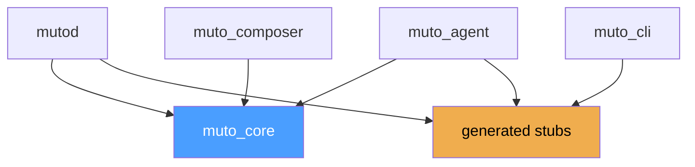

# Project Structure

This page provides a detailed map of the Eclipse Muto codebase — where everything lives, what each file does, and how the modules relate to each other.

## Top-Level Layout

```
muto-2.0/
├── mutod/                  # Daemon — privileged system service
├── muto_agent/             # Agent — ROS 2 runtime manager
├── muto_core/              # Core — shared Python library
├── muto_cli/               # CLI — command-line tool
├── muto_composer/          # Composer — bundle authoring toolkit
├── dashboard/              # Dashboard — React web interface
├── muto_msgs/              # Messages — ROS 2 msg/srv definitions
├── muto-docs/              # Documentation — Docusaurus site
├── proto/                  # Protocol Buffer definitions
├── schemas/                # JSON Schema for manifest validation
├── generated/              # Generated gRPC stubs (gitignored)
├── Makefile                # Build targets
├── demo.sh                 # Interactive demo script
├── CLAUDE.md               # AI coding guidelines
└── .gitignore
```

## Module Details

### mutod/ — Daemon

```
mutod/
├── mutod/
│   ├── __init__.py
│   ├── __main__.py           # Entry point: CLI args, logging, server startup
│   ├── server.py             # Async gRPC server (DaemonService implementation)
│   ├── config.py             # Configuration dataclass
│   ├── bundle/
│   │   ├── __init__.py
│   │   ├── manager.py        # Bundle upload, staging, manifest extraction
│   │   ├── slot.py           # A/B slot management, symlink switching
│   │   └── verify.py         # Schema, signature, and target verification
│   ├── audit/
│   │   ├── __init__.py
│   │   └── appender.py       # Append-only JSONL audit log with hash chain
│   └── process/
│       ├── __init__.py
│       └── supervisor.py     # Process tracking (stub, extensible)
├── tests/
│   └── test_*.py
└── pyproject.toml
```

**Key dependencies:** `grpcio`, `jsonschema`, `cryptography`, `pydantic`, `muto_core`

### muto_agent/ — Agent

```
muto_agent/
├── muto_agent/
│   ├── __init__.py
│   ├── agent_node.py         # Main ROS 2 node, orchestrates everything
│   ├── mode/
│   │   ├── __init__.py
│   │   └── state_machine.py  # Async state machine, transitions, handlers
│   ├── health/
│   │   ├── __init__.py
│   │   ├── engine.py         # 10 Hz probe runner, aggregation, callbacks
│   │   └── probes.py         # Topic staleness, topic frequency, process probes
│   ├── lifecycle/
│   │   ├── __init__.py
│   │   └── controller.py     # ROS 2 lifecycle service clients
│   ├── graph/
│   │   ├── __init__.py
│   │   └── monitor.py        # ROS 2 graph snapshot capture
│   └── grpc/
│       ├── __init__.py
│       └── server.py         # AgentService gRPC implementation
├── tests/
│   └── test_*.py
└── pyproject.toml
```

**Key dependencies:** `rclpy`, `grpcio`, `muto_core`

### muto_core/ — Core Library

```
muto_core/
├── muto_core/
│   ├── __init__.py
│   ├── models/
│   │   ├── __init__.py
│   │   ├── manifest.py       # Pydantic manifest model, canonical hash
│   │   ├── mode.py           # VehicleMode enum, VALID_TRANSITIONS
│   │   ├── stack.py          # Stack model with StackState enum
│   │   ├── component.py      # Component, RestartPolicy, ResourceLimits
│   │   └── health.py         # HealthState enum, ProbeResult, aggregate()
│   └── health/
│       ├── __init__.py
│       ├── probe.py           # Abstract HealthProbe base class
│       ├── engine.py          # Policy engine for health evaluation
│       └── aggregator.py      # Health state aggregation logic
├── tests/
│   └── test_*.py
└── pyproject.toml
```

**Key dependencies:** `pydantic>=2.0`, `cryptography`

### muto_cli/ — CLI

```
muto_cli/
├── muto_cli/
│   ├── __init__.py
│   ├── main.py               # Typer app with all commands
│   ├── client.py             # DaemonClient, AgentClient (gRPC wrappers)
│   ├── config.py             # CLIConfig dataclass, load/save config
│   └── output.py             # OutputFormatter (rich/json modes)
├── tests/
│   └── test_*.py
└── pyproject.toml
```

**Key dependencies:** `typer`, `grpcio`, `rich`, `pyyaml`

### muto_composer/ — Composer

```
muto_composer/
├── muto_composer/
│   ├── __init__.py
│   ├── main.py               # Typer CLI (keygen, build, sign, verify, validate, inspect)
│   ├── builder.py            # YAML → manifest → tar.gz pipeline
│   ├── signer.py             # ECDSA P-256 keygen, sign, verify
│   └── validator.py          # JSON Schema validation
├── examples/
│   └── muto-stack.yaml       # Example stack definition
├── tests/
│   └── test_*.py
└── pyproject.toml
```

**Key dependencies:** `cryptography`, `jsonschema`, `typer`, `pyyaml`, `muto_core`

### dashboard/ — Dashboard

```
dashboard/
├── src/
│   ├── App.tsx               # Root component with router
│   ├── main.tsx              # Entry point
│   ├── pages/
│   │   ├── FleetOverview.tsx  # Fleet dashboard
│   │   ├── VehicleDetail.tsx  # Single vehicle view
│   │   └── Deployment.tsx     # Deployment management
│   ├── components/
│   │   ├── Layout.tsx         # App shell (header, sidebar)
│   │   ├── DataTable.tsx      # Reusable table
│   │   ├── StatusBadge.tsx    # Health/mode badges
│   │   ├── GraphViewer.tsx    # ROS 2 graph visualization
│   │   └── ModeTransitionDialog.tsx
│   ├── types/
│   │   └── index.ts           # TypeScript type definitions
│   ├── store/
│   │   └── index.ts           # Zustand fleet store
│   └── lib/
│       ├── mock-data.ts       # Development mock data
│       └── utils.ts           # Utility functions
├── package.json
├── vite.config.ts
├── tailwind.config.js
└── tsconfig.json
```

**Key dependencies:** `react`, `react-router`, `zustand`, `tailwindcss`, `@radix-ui/*`, `lucide-react`

### proto/ — Protocol Buffer Definitions

```
proto/
└── muto/
    ├── shared/v1/
    │   └── common.proto       # ResultCode, HealthState, VehicleMode, etc.
    ├── daemon/v1/
    │   └── daemon.proto       # DaemonService (16 RPCs)
    └── agent/v1/
        └── agent.proto        # AgentService (11 RPCs)
```

### schemas/ — JSON Schemas

```
schemas/
└── manifest.schema.json      # JSON Schema (Draft 2020-12) for bundle manifests
```

## Dependency Graph



- `muto_core` is imported by daemon, agent, and composer
- Generated proto stubs are imported by daemon, agent, and CLI
- The CLI does not import `muto_core` — it communicates entirely via gRPC
- The composer does not import proto stubs — it only builds bundles, it does not communicate with running services

## Packaging

Each Python module is packaged with `pyproject.toml` using setuptools:

```toml
[build-system]
requires = ["setuptools>=61.0", "wheel"]
build-backend = "setuptools.build_meta"

[project]
name = "mutod"
version = "0.1.0"
license = "EPL-2.0"
requires-python = ">=3.10"
```

All modules can be installed in editable mode with:

```bash
make install      # Production
make install-dev  # With dev extras (pytest, ruff, grpcio-tools)
```
