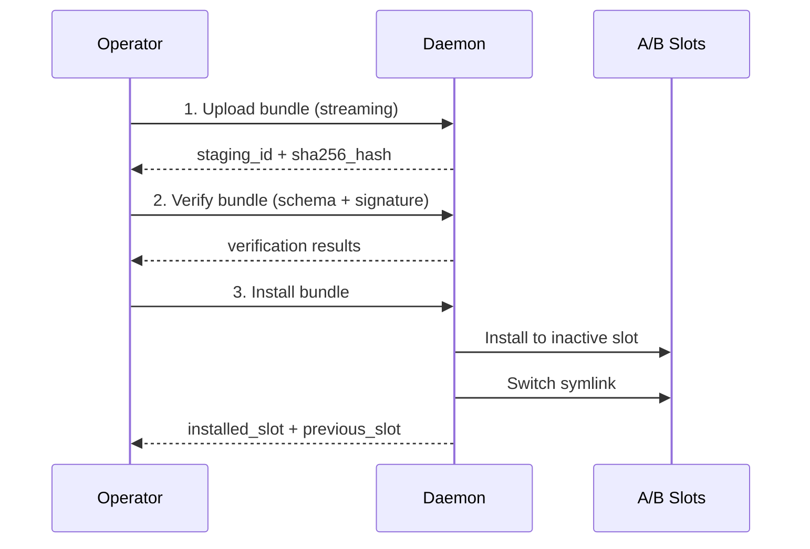

# Deploying Bundles

This guide covers how to upload, verify, and install bundles on a vehicle running the Muto daemon.

## Prerequisites

- A signed bundle (see [Authoring Bundles](authoring-bundles))
- The Muto daemon (`mutod`) running on the target vehicle
- The Muto CLI (`muto`) installed and configured

## The Deployment Pipeline

Deploying a bundle is a three-step process:



### Step 1: Upload

The bundle is streamed to the daemon in 64 KB chunks:

```bash
muto deploy my-stack-1.0.0.tar.gz
```

The daemon:
- Receives chunks and writes them to a staging directory
- Computes the SHA-256 hash incrementally as chunks arrive
- Extracts and parses the manifest from the archive
- Returns a `staging_id` (used to reference this upload in subsequent steps) and the `sha256_hash`

### Step 2: Verify

The daemon performs three independent verification checks:

| Check | What It Does | Pass Condition |
|-------|-------------|----------------|
| **Schema validation** | Validates manifest against JSON Schema | All required fields present, types correct, values in range |
| **Signature verification** | Verifies ECDSA P-256 signature against public key | Signature matches manifest hash |
| **Target compatibility** | Checks ros_distro, arch, os against current vehicle | At least one value matches in each category |

Each check is reported independently. This is intentional — you may want to deploy an unsigned bundle during development, or a bundle built for a different platform during testing.

### Step 3: Install

The install step is where the A/B slot magic happens:

1. The daemon identifies the **inactive slot** (the one not currently pointed to by the `current` symlink)
2. The bundle contents are extracted into that slot
3. A `slot_meta.json` is written with the bundle ID, version, and timestamp
4. The `current` symlink is **atomically renamed** to point to the new slot

```
Before install:
  current → slots/A (active, v1.0.0)
  slots/B (empty or old)

After install:
  current → slots/B (active, v2.0.0)
  slots/A (inactive, v1.0.0)
```

## Deployment via gRPC (Programmatic)

For automation or custom tooling, you can drive the deployment pipeline directly via gRPC:

```python
import grpc
from muto.daemon.v1 import daemon_pb2, daemon_pb2_grpc

CHUNK_SIZE = 64 * 1024

def deploy_bundle(target: str, bundle_path: str):
    channel = grpc.insecure_channel(target)
    stub = daemon_pb2_grpc.DaemonServiceStub(channel)

    # Read bundle data
    data = open(bundle_path, "rb").read()
    total = len(data)
    name = bundle_path.split("/")[-1]

    # Step 1: Upload
    def chunk_iter():
        offset = 0
        while offset < total:
            end = min(offset + CHUNK_SIZE, total)
            yield daemon_pb2.UploadBundleChunk(
                bundle_name=name,
                total_size=total,
                offset=offset,
                data=data[offset:end],
            )
            offset = end

    upload_resp = stub.UploadBundle(chunk_iter())
    staging_id = upload_resp.staging_id
    print(f"Uploaded: staging_id={staging_id}")

    # Step 2: Verify
    verify_resp = stub.VerifyBundle(
        daemon_pb2.VerifyBundleRequest(staging_id=staging_id)
    )
    print(f"Schema: {verify_resp.schema_valid}")
    print(f"Signature: {verify_resp.signature_valid}")
    print(f"Compatible: {verify_resp.target_compatible}")

    # Step 3: Install
    install_resp = stub.InstallBundle(
        daemon_pb2.InstallBundleRequest(staging_id=staging_id)
    )
    print(f"Installed to slot {install_resp.installed_slot}")

    channel.close()

deploy_bundle("localhost:50051", "my-stack-1.0.0.tar.gz")
```

## Checking Deployment Status

After deploying, verify the deployment:

```bash
# Show both A/B slots
muto status

# List all installed bundles
muto bundles
```

The `status` command shows:
- Active slot (A or B) with bundle ID, version, and install time
- Inactive slot (A or B) with the same details
- Whether each slot is `active`, `inactive`, or `empty`

## Force Install

If verification fails but you need to deploy anyway (e.g., deploying a fix during an emergency), use the `force` flag:

```python
install_resp = stub.InstallBundle(
    daemon_pb2.InstallBundleRequest(staging_id=staging_id, force=True)
)
```

:::warning
Force installs bypass verification checks. Use this only when you understand the risks. The force install is still recorded in the audit log.
:::

## Monitoring After Deployment

After deploying, monitor the vehicle's health:

```bash
# Check overall health
muto health

# Stream health events in real-time
muto logs --follow

# Check the ROS 2 graph
muto graph
```

If something goes wrong, see [Rollback & Recovery](rollback-recovery).

## Next Steps

- [Managing Vehicle Modes](managing-modes) — Control what runs after deployment
- [Rollback & Recovery](rollback-recovery) — Recover from bad deployments
