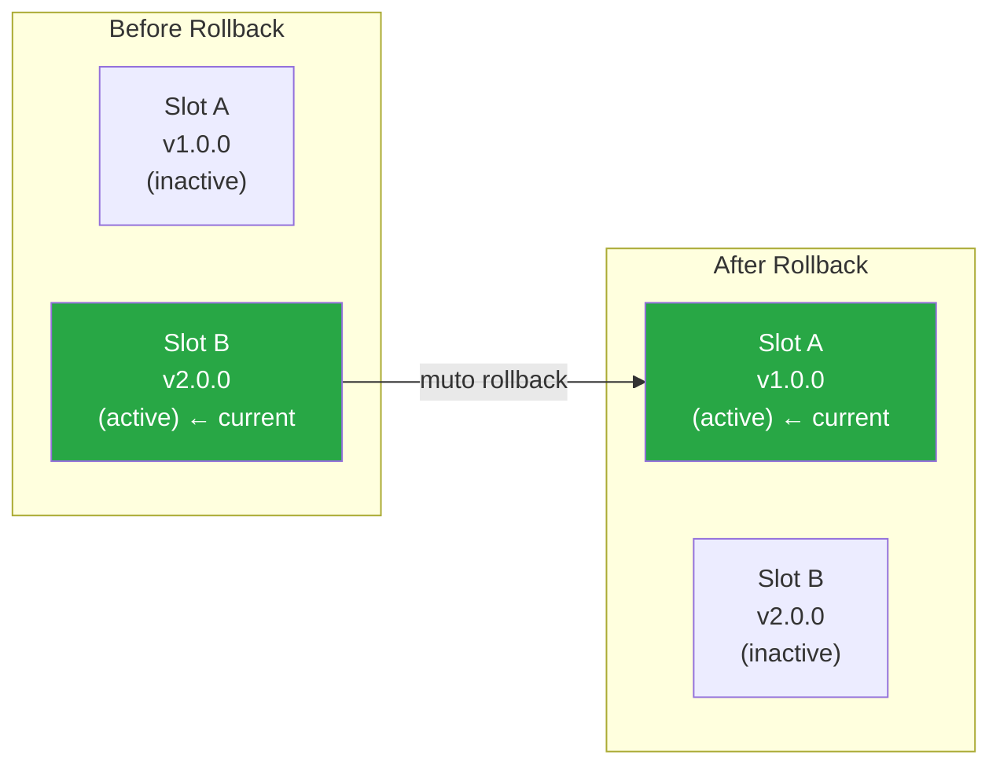

# Rollback & Recovery

One of Muto's most important safety features is instant rollback. If a deployment causes problems, you can revert to the previous version in milliseconds. This guide covers how rollback works, when to use it, and how to recover from various failure scenarios.

## How Rollback Works

Rollback switches the active A/B slot back to the previously active slot:



The operation is:
1. The daemon switches the `current` symlink from Slot B to Slot A
2. The switch is **atomic** (symlink rename) — there is no moment where neither slot is active
3. The rollback reason and details are recorded in the audit log
4. The total operation takes **milliseconds**

## Triggering a Rollback

### Via CLI

```bash
muto rollback --reason "v2.0.0 causing perception failures"
```

Always provide a meaningful reason — it is recorded in the audit log and helps with post-incident analysis.

### Via gRPC

```python
response = stub.Rollback(
    daemon_pb2.RollbackRequest(reason="v2.0.0 causing perception failures")
)
print(f"Rolled back to: {response.rolled_back_to_slot}")
```

## Prerequisites for Rollback

Rollback requires **both A/B slots to be occupied**. If only one slot has been used (first deployment ever), there is nothing to roll back to:

```bash
muto rollback --reason "testing"
# Error: Cannot rollback: slot A is empty
```

After your first deployment to Slot B, you need at least one more deployment (which goes to Slot A) before rollback becomes available.

| Slot A | Slot B | Rollback Available? |
|--------|--------|-------------------|
| empty | empty | No |
| empty | v1.0.0 | No |
| v2.0.0 | v1.0.0 | Yes |
| v1.0.0 | v2.0.0 | Yes |

## Recovery Scenarios

### Scenario 1: Bad Deployment (Stacks Fail to Start)

**Symptoms:** After deploying v2.0.0, stacks fail to start. Health probes report FAILED.

```bash
# 1. Check what happened
muto status
muto health

# 2. Roll back immediately
muto rollback --reason "v2.0.0 stacks failed to start"

# 3. Verify recovery
muto status
muto health
```

### Scenario 2: Performance Regression

**Symptoms:** v2.0.0 runs but perception is slower. Health probes show DEGRADED.

```bash
# 1. Confirm the degradation
muto health
# perception_health: DEGRADED (15 Hz, expected 25 Hz)

# 2. Decide whether to roll back or monitor
# If DEGRADED is acceptable temporarily, you might keep it
# If it is causing safety concerns:
muto rollback --reason "perception regression, 15Hz vs 25Hz"
```

### Scenario 3: Vehicle Enters SAFE_STOP After Deployment

**Symptoms:** Health failure triggers automatic SAFE_STOP shortly after deployment.

```bash
# 1. The vehicle is now in SAFE_STOP — check what triggered it
muto mode get
muto health

# 2. Roll back the deployment
muto rollback --reason "v2.0.0 triggered SAFE_STOP via controller_health"

# 3. Clear the SAFE_STOP fault
muto mode set STANDBY --reason "rolled back, system verified"

# 4. Verify everything is healthy
muto health
```

### Scenario 4: Daemon Still Running, ROS Stack Crashed

**Symptoms:** The ROS 2 stack is down but the daemon is still accessible.

This is where the daemon/agent separation pays off:

```bash
# Daemon is still reachable — you can still deploy and roll back
muto info      # Works — daemon is up
muto health    # Fails — agent is down (ROS stack crashed)

# Roll back to the previous known-good version
muto rollback --reason "ROS stack crash, reverting to stable version"
```

### Scenario 5: Everything is Down

**Symptoms:** Cannot reach daemon or agent.

If neither the daemon nor agent is reachable:

1. **SSH into the vehicle** (if possible)
2. **Check daemon status:** `systemctl status mutod`
3. **Restart daemon:** `systemctl restart mutod`
4. **Check what slot is active:** `ls -la /var/lib/mutod/current`
5. **Manual rollback if needed:** Update the symlink manually

```bash
# Manual symlink switch (last resort)
cd /var/lib/mutod
ln -sfn slots/A current
```

## Audit Trail

Every rollback is fully audited:

```bash
# View recent audit events
muto logs --source audit --tail 20
```

The audit entry includes:
- **Who** triggered the rollback (actor)
- **When** it happened (timestamp)
- **Why** (the reason string you provided)
- **From/to** which slots the switch occurred
- **Result** (success or failure)

## Best Practices

1. **Roll back early** — If you suspect a problem, roll back immediately. Investigating later is safer with a known-good version running.
2. **Always deploy twice before testing rollback** — The first deployment fills one slot. You need a second to fill the other, enabling rollback.
3. **Include the reason** — Future you (or your team) will want to know why the rollback happened.
4. **Verify after rollback** — Always run `muto status` and `muto health` after rolling back.
5. **Keep the audit log** — The audit trail is your incident timeline. Do not delete it.
