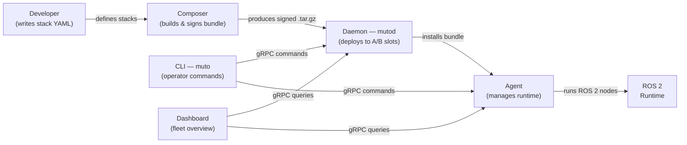

# Eclipse Muto

**Eclipse Muto** is an open-source platform for managing, deploying, and orchestrating software on robots and autonomous vehicles. If you have ever updated an app on your phone, you already understand the core idea — Muto does the same thing, but for the complex software stacks that run on robots.

Robots typically run dozens of interconnected software components: camera drivers, path planners, motor controllers, diagnostic tools, and more. Updating or managing these components — especially across a fleet of hundreds of vehicles — is extraordinarily difficult. Muto solves this by providing a complete toolchain for **authoring**, **signing**, **deploying**, **monitoring**, and **rolling back** software on robotic systems.

## The Problem

Imagine you are responsible for a fleet of 200 autonomous delivery robots. Each robot runs a software stack with 15 different components. You need to:

- Push a critical bug fix to the perception module across all robots
- Ensure the update does not brick any robot if something goes wrong
- Verify that the software package has not been tampered with
- Monitor the health of every component after the update
- Roll back instantly if the new version causes problems
- Do all of this without physically touching a single robot

Traditional approaches — SSH-ing into each machine, manually copying files, running scripts — do not scale. Muto provides a structured, safe, and auditable way to handle all of this.

## How Muto Works — The Big Picture

The workflow has three phases:

1. **Author** — A developer writes a declarative YAML file describing what software should run, on what hardware, in which vehicle modes
2. **Build & Sign** — The **Composer** tool transforms that YAML into a signed, tamper-proof bundle (a `.tar.gz` containing a manifest and signature)
3. **Deploy & Monitor** — The bundle is uploaded to the **Daemon** (`mutod`) running on the target vehicle, which verifies and installs it into an **A/B slot**. The **Agent** then manages the running software, monitoring health and handling mode transitions

## Key Concepts at a Glance

| Concept | What It Means |
|---------|---------------|
| **Bundle** | A signed, versioned package containing everything needed to describe a deployment |
| **Manifest** | A JSON file inside the bundle that declares stacks, components, modes, health probes, and target constraints |
| **A/B Slots** | Two deployment slots on each vehicle. Only one is active at a time, enabling instant rollback |
| **Vehicle Modes** | Operational states like STANDBY, AUTONOMOUS, TELEOP — each mode enables different software stacks |
| **Health Probes** | Automated checks that continuously verify components are functioning correctly |
| **Stacks** | Groups of related software components (e.g., a "perception" stack with camera driver, lidar driver, and detector) |

## System Components

Eclipse Muto is composed of six main components:

### Daemon (`mutod`)
The privileged system service running on each vehicle. It handles bundle uploads, cryptographic verification, A/B slot management, process supervision, and audit logging. It communicates via gRPC and has **no dependency on ROS 2** — making it lightweight and reliable.

### Agent (`muto_agent`)
The ROS 2-aware runtime agent. It manages the vehicle mode state machine, runs health probes, controls component lifecycles, and monitors the ROS 2 computation graph. It bridges the gap between Muto's deployment system and the live ROS 2 environment.

### Core (`muto_core`)
A shared Python library providing data models (manifests, stacks, components, health states), policy logic, and utilities used by both the daemon and agent.

### CLI (`muto`)
A developer-friendly command-line tool for interacting with the daemon and agent. Query status, deploy bundles, trigger rollbacks, manage vehicle modes, and stream logs — all from your terminal.

### Composer (`muto-compose`)
The bundle authoring toolkit. It generates signing keys, builds bundles from stack YAML definitions, signs them with ECDSA P-256, and validates them against the manifest schema.

### Dashboard
A React-based web interface for fleet-wide monitoring. View vehicle health, deployment status, mode transitions, and ROS 2 graph topology across your entire fleet.

## What Makes Muto Different

- **Safety-first design** — A/B slot deployment means a bad update never bricks a vehicle. Rollback is instant and atomic.
- **Cryptographic integrity** — Every bundle is signed with ECDSA P-256. The daemon verifies signatures before installation.
- **Auditable** — Every deployment action is recorded in an append-only, hash-chained audit log.
- **ROS 2 native** — The agent deeply integrates with ROS 2: lifecycle node management, graph monitoring, topic-based health probes.
- **Separation of concerns** — The daemon (system-level, no ROS dependency) and agent (ROS 2-aware) are cleanly separated, improving reliability.
- **Declarative** — You describe *what* should run, not *how* to run it. Muto handles the rest.

## Where to Go Next

- **New to orchestration?** Start with [What is Orchestration?](concepts/what-is-orchestration) in the Concepts section
- **Want to dive in?** Head to [Installation](getting-started/installation) to set up Muto
- **Curious about the design?** Read the [Architecture Overview](architecture/system-overview)
- **Ready to build?** Follow the [Authoring Bundles](guides/authoring-bundles) guide

## License

Eclipse Muto is licensed under the [Eclipse Public License 2.0](https://www.eclipse.org/legal/epl-2.0/).
