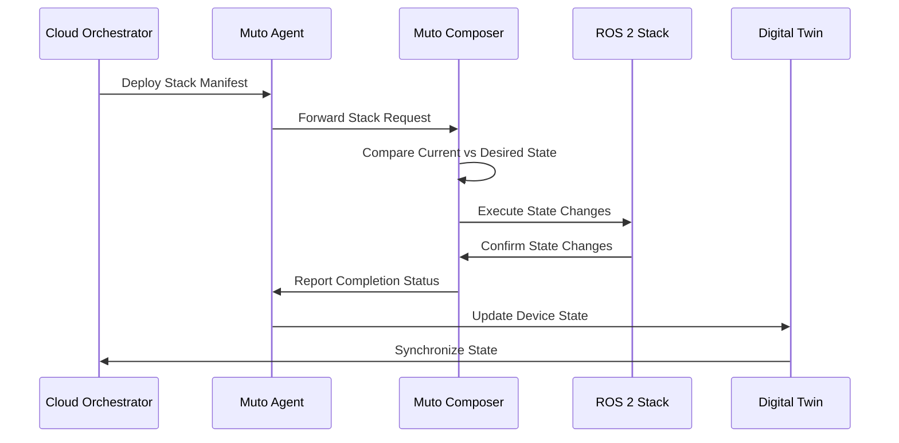

# Muto Edge

Muto Edge encompasses the main components that enable orchestration and adaptation of ROS-based software stacks at runtime on edge devices. The edge runtime consists of two major components—**Agent** and **Composer**—that work together to provide declarative orchestration capabilities.

## Architecture Overview

The Agent and Composer follow a separation of concerns that creates a robust and adaptable system for software-defined vehicles:

- The **Agent** provides the _what_ (the desired state from any backend)
- The **Composer** handles the _how_ (the on-vehicle actions to achieve that state)

## Core Concepts

### Declarative Orchestration

Eclipse Muto transforms the traditional imperative ROS launch system into a **declarative, serializable format**. This allows operators to:

- Define the desired state of robot software systems declaratively
- Deploy configurations remotely across entire fleets
- Maintain version control and configuration management
- Enable automatic state reconciliation and error recovery

### Reconciliation Loop

The Composer operates a continuous reconciliation loop:

1. **Inspect**: Read the current state of the live ROS system
2. **Compare**: Compare live state to the desired state model from the Agent
3. **Act**: Execute precise lifecycle operations to close any gaps

This ensures the vehicle's software configuration is self-healing and always converging towards the intended state.

### Plugin Architecture

Both Agent and Composer are built with extensibility in mind:

- **Command Plugins** (Agent): Handle specific behaviors invoked via MQTT protocol
- **Composer Plugins**: Drive behavior through lightweight flow orchestration definitions
- **Protocol Plugins**: Support for MQTT, HTTP, and future Zenoh/uProtocol

## Edge Components

| Component | Description | Documentation |
|-----------|-------------|---------------|
| **Agent** | Communication bridge and protocol gateway | [Agent Documentation](./agent) |
| **Composer** | State reconciliation and stack lifecycle management | [Composer Documentation](./composer) |
| **Core** | Common library and digital twin connectivity | [Core Documentation](./core) |
| **Graph Observer** | Live ROS graph monitoring and external observability | [Graph Observer Documentation](./graph-observer) |

## Message Flow

### Cloud → Edge

1. Orchestration state (solutions/instances) arrives via MQTT/HTTP protocols
2. Agent validates, authenticates, and routes messages
3. Specialized message handlers process different command types
4. Processed commands forwarded to Composer via ROS topics/services

### Edge → Cloud

1. Composer reports status updates and telemetry
2. Agent collects and routes information back to digital twin
3. Real-time device state synchronized with cloud platform

## Getting Started

Ready to deploy Muto on your edge devices?

- **[Quick Start Guide](./getting-started)**: Deploy Muto with containers or from source
- **[By Example](./getting-started/by-example)**: Walk through practical examples
- **[Blueprints](../blueprint)**: Explore demo implementations

## Muto Edge Guides

- [Getting Started](./getting-started)
- [Core](./core)
- [Agent](./agent)
- [Composer](./composer)
- [Graph Observer](./graph-observer)
